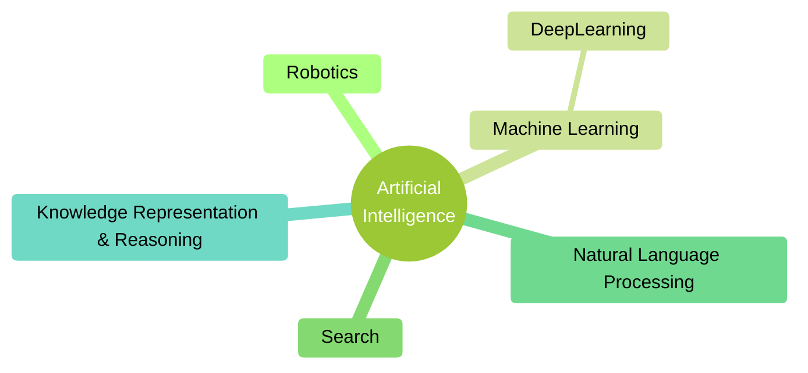

# [Week 1] Introduction to KRR

# Defining Knowledge, Representation, and Reasoning

> OBJECTIVE: Explain basic principles of knowledge representation and reasoning

### Definition of “Intelligence”

- Capacity for:
  - Learning
  - Reasoning
  - Understanding
  - Mental activity
- Aptitude in grasping:
  - Truths
  - Relationships
  - Facts
  - Meanings, etc
- Ability to APPLY KNOWLEDGE to manipulate one’s environment or to THINK ABSTRACTLY as measured by objective criteria
- c.f. (confer) not animal intelligence - cognito ergo sum (I think, therefore I am)

### AI & KRR

- AI: study of INTELLIGENT BEHAVIOUR achieved through COMPUTATIONAL MEANS
- Knowledge representation: study of how to reason (compute) with knowledge in order to decide what to do:
  - Think about KNOWLEDGE rather than DATA
- KRR is the heart of the great challenge of AI:
  - Understand the nature of intelligence and cognition so that computers can be made to exhibit human-like abilities
- Before reasoning with knowledge, it must be represented

### Learning vs. Reasoning

- Learning: learn models/knowledge from data
- Reasoning: manipulate models/knowledge to derive new information
- Currently LARGE GAP between models learned by ML and knowledge required by KRR

#### AI without Knowledge?

- Suppose we train an ANN to recognize cats. When it recognizes a previously unseen cat in an image, it can’t explain to us why or how it did this. And if the ANN fails to recognize a spotted cat, it’s hard for us to fix the problem. We’re not going to tell it something like, “change element 341375’s value from 0.3265 to 0.4271, element 1954236’s value from 0.9218 to 0.8612, …
- When AI systems make bad decisions (as they’ve done before, and inevitably will again), we need to be able to understand why they made those decisions and communicate with them to fix the problem.
- Erik Muller, Wired, 11/13/2015

#### Advances in KRR

- Researchers have
  - Explored GENERAL METHODS of KRR, addressing fundamental issues that cut across application domain
  - Developed SPECIALIZED METHODS of KRR to handle core domains (e.g. time, space, causation, action)
  - Tackled IMPORTANT APPLICATIONS of KRR, including query answering, planning, and the semantic web

### What is Knowledge?

- All kinds of fats about the world
- Necessary for intelligent behaviour (humans, robots)
- Rather than trying to answer what is knowledge, consider REPRESENTATIONS OF KNOWLEDGE

### What is Representation?

- Symbols standing for things in the world

### What is Reasoning?

- Reasoning is a form of calculation over symbols standing for propositions rather than numbers
- While propositions are abstract objects, their representations are concrete objects and can be easily manipulated
- Analogy: arithmetic
- Example:
  - If the train arrives late and there are no taxis at the station, then Apple is late for the meeting
    $$H: TrainLate \land \lnot Taxi \rightarrow AppleLate$$
  - Apple is not late for the meeting
    $$\lnot AppleLate$$
  - Train did arrive late
    $$TrainLate$$
  - True or false? There was a taxi at the station
    $$T:Taxi$$
  - How does a machine know $T$?

### Why is KRR useful?

- Describes/understands the behaviour of systems in terms of the knowledge it has
- Generates the behaviour of a system:
- Declarative knowledge can be separated from its possible usages
- Understanding the behaviour of an intelligent system in terms of the represented knowledge makes debugging and understanding much easier
- Modifications and extensions are also much easier to perform

### Why Reasoning?

- Many facts will be there only implicitly
- Guide: use concept of entailment/logical implication
- Can we compute all implicit (all entailed) facts?
  - May be computationally too expensive

## Different Kinds of Reasoning Problems

> OBJECTIVE: Explain several different kinds of reasoning problems studied in KRR

### Role of Formal Logic

- Formal logic is the field of study of entailment relations, formal languages, truth conditions, semantics and inference
- All propositions are represented as formulas which have semantics according to the logic in question
- Formal logic provides framework to discuss different kinds of reasoning:
  - Deductive reasoning
  - Model finding
  - Abductive reasoning
  - Default reasoning
  - Epistemic reasoning

### Deductive Reasoning

- Usually interested in deriving implicit, entailed facts from a given collection of explicitly represented facts that are
  - Logically sound - derived proposition must be true, given that the premises are true
  - Logically complete - all true consequences can be derived
- Sometimes we want logically unsound derivations - e.g. reasoning based on assumptions, reasoning under uncertainty
- Sometimes we want to give up completeness - e.g. for efficiency reasons, computability/complexity
- Example: 3 boxes in order: A, B, C
  - A is green, C is blue, color of B unstated
  - Is there a green block next to a block that is not green?
    - Case 1: B is green - yes, B (green) next to C (blue, not green)
    - Case 2: B is not green - yes, A (green) next to B (not green)

### Model Finding and Satisfiability

- In planning and configuration tasks, often get a set of constraints and a goal specification
  - We then have to find a solution satisfying all the constraints
- Example:
  1. Either round or square
  2. Either red or blue
  3. If read and round, or if blue and square, then wood
  4. If blue then metallic
  5. If square then not metallic
  6. If red then square
- Which object is it?
  - Square/round
  - Metallic/wood
  - Red/blue
- Consider:
  - Round, wood, red - does not satisfy (vi), cannot be square
  - Square, wood, red - satisfies all constraints

### Abductive Reasoning

- Given a background theory, a set of explanations and an observation, find the most likely explanation
  - Earthquake implies alarm
  - Burglar implies alarm
  - {earthquake, burglar} is the set of abducibles
  - Alarm is observed
  - One explanation is earthquake
- There can be many possible explanation
- Not a sound inference

### Default Reasoning

- Jumping to conclusions
- Often we do not have enough information but nevertheless want to reach a conclusion (that is likely to be true)
- In absence of evidence to the contrary, we jump to a conclusion
  - Birds are USUALLY able to fly
  - Tweety is a bird
  - So, you’d expect that tweety is able to flow
- Unsound conclusion
- Might be necessary to withdraw conclusions when evidence to the contrary becomes available

### Epistemic Reasoning

- Reasoning about knowledge
- Example: muddy children puzzle
  1. 10 children playing together outside. After playing the come inside and their parent says to them, “At least one of you has mud on your forehead”
  2. Each child can see mud on others but cannot see his or her own forehead
  3. Parent asks “Do you know if you have mud on your forehead?”
  4. Children respond “No”
  5. Then they ask the same question again, then some children answer that they could tell.
  6. How many children answered?
- Consider:
  - If only 1 child, has mud forehead, this child would have been able to answer “yes” at step (iii) since:
    - This child can see that all other children do not have mud on their foreheads (ii)
    - This child knows at least one child has mud on their forehead (i)
  - If 2 children Apple and Banana have mud on forehead
    - Neither can answer at step (iii) since:
      - Apple can see Banana has mud on their forehead
      - Apple knows one (Banana) OR MORE children has mud on their forehead (i)
      - Apple does not know whether or not they have mud on their forehead
      - (vice versa for Banana)
    - Both children can answer at step (vi) since:
      - Apple can see Banana has mud on their forehead
      - Apple knows one (Banana) OR MORE children has mud on their forehead (i)
      - Apple knows Banana did not answer “yes” at step (iii) - meaning Banana also did not know to answer “yes” because Banana saw a child with mud on their forehead
      - Apple now knows there are at least 2 children with mud on their forehead: Banana, and the child that Banana saw with mud on their forehead
      - Since Apple does not see any children other than Banana with mud on their forehead, Apple knows their own forehead has mud
      - (vice versa for Banana)

### Many KRR Formalisms

- General methods
  - SAT
  - Description logics
  - Constraint programming
  - Conceptual graphs
  - Nonmonotonic logics
  - Answer set programming
  - Belief revision
- Specialized methods: time space causation, action
  - Temporal reasoning
  - Knowledge and belief
  - Action and formalisms
- Applications
  - Query answering
  - Semantic web
  - Planning
  - Cognitive robotics
  - Multiagent systems

# Introduction to Propositional Logic

- Semantics and notions in propositional logic
  - Satisfiability
  - Tautology
  - Equivalence
  - Entailments and Reductions

## Propositional Logic: Syntax

> OBJECTIVE: Explain INTUITION behind the propositional logic and SYNTAX of propositional logic

### Propositional Logic and KR

- Propositional logic is the simplest mathematical logic
- Study of declarative sentences, statements about the world which can be given a truth value
- Deals well with sentence components like: not, and, or, if… then…
- Compositional - meaning of $F \land G$ derived from meaning of $F$ and meaning of $G$
- Satisfiability in propositional logic is NP-complete
- Many efficient SAT solvers developed and actively used in many real-world problems

#### Rough Idea of Propositional Logic

- In propositional logic, an atom represents a proposition, which is either true or false
  - Sum of numbers 3 and 5 equals 8
  - Apple reacted defensively to Banana’s accusations
  - Every even number greater than is the sum of two prime numbers (Goldbach’s conjecture)
- Examples where truth value cannot be assigned:
  - Could you please pass the salt
  - Ready, steady, go
  - May the force be with you
- Propositional connectives are used to compose the meaning
  - If number is divisible by 4, it is divisible by 2

#### Reasoning Example 1

- If the train arrives late and there are no taxis at the station, then Apple is late for the meeting
  $$H: TrainLate \land \lnot Taxi \rightarrow AppleLate$$
- Apple is not late for the meeting - $\lnot AppleLate$
- Train did arrive late - $TrainLate$
- True or false? There was a taxi at the station - $T:Taxi$

#### Reasoning Example 2

- If it is raining and Banana does not have an umbrella, then Banana will get wet
  $$H: Rain \land \lnot Umbrella \rightarrow Wet$$
- Banana is not wet - $\lnot Wet$
- It is raining - $Rain$
- True or false? Banana has an umbrella - $T: Umbrella$

#### Comparing the Two Examples

- Same structure:

  | Atom | Example 1 | Example 2 |
  |---|---|---|
  | $p$ | Train is late | It is raining |
  | $q$ | Taxis at the station | Banana has an umbrella |
  | $r$ | Apple late for meeting | Banana gets wet |
- Reasoning
  - If $p$ and not $q$, then $r$
  - Not $r$
  - $p$
  - Therefore, $q$
- It does not matter what $p$, $q$, $r$ stand for

### Alphabet of Propositional Logic

- Propositional SIGNATURE is set of symbols called ATOMS: $TrainLate$, $Taxi$, $AppleLate$, $p$, $q$, $r$
- Propositional CONNECTIVES
  - 2-place (binary): $\land$ (conjunction), $\lor$ (disjunction), $\rightarrow$ (implication)
  - 1-place (unary): $\lnot$ (negation)
  - 0-place: $\bot$ (bottom) and $\top$ (top)
- ALPHABET of propositional logic consists of
  - Atoms from the signature
  - Propositional connectives
  - Parentheses

### Definition of Propositional Formula

- Propositional formula for signature σ is defined recursively as follows:
  - Every atom is a formula
  - Both 0-place connectives ($\bot$ and $\top$) are formulas
  - If $F$ is a formula then $\lnot F$ is a formula
  - For any binary connective $\odot$ if $F$ and $G$ are formulas, then $(F \odot G)$ is a formula
  - Example: $((\lnot p \land q) \rightarrow (q \lor \lnot r))$

#### Subformulas

- Subformulas of $\phi$ are the formulas corresponding to the subtrees of the parse tree of $\phi$
- Q: Is formula a subformula of itself? yes
- Q: How many subformulas are there? many

#### Binding Precedence

- Allows us to avoid many parentheses
- In priority order: $\lnot$, $\land$, $\lor$, $\rightarrow$, $\leftrightarrow$

## Propositional Logic: Semantics

> OBJECTIVE: Explain the semantics of propositional logic

### Interpretation

- Propositional signature is a set of symbols called atoms, such as $p$, $q$, $r$
- Symbols $f$ and $t$ are called truth values
- Interpretation of a propositional signature $\sigma$ is a function from $\sigma$ into $\{f,t\}$
- If $\sigma$ is finite, an interpretation can be defined by the truth table
- How many interpretations for $\{p,q,r\}$? $2^3$
$$
\begin{array}{c|c|c}
  p & q & r \\ \hline
  f & f & f \\
  f & f & t \\
  f & t & f \\
  f & t & t \\
  t & f & f \\
  t & f & t \\
  t & t & f \\
  t & t & t \\
\end{array}
$$
- table for unary propositional connective
$$
\begin{array}{c|c}
  p   & \lnot p \\ \hline
  f   & t \\
  t   & f \\
\end{array}
$$
- table for binary propositional connectives
$$
\begin{array}{c|c|c|c|c|c}
  p   & q   & \land (p, q)  & \lor (p, q)   & \rightarrow (p, q)  & \leftrightarrow (p, q) \\ \hline
  f   & f   & f             & f             & t                   & t \\
  f   & t   & f             & t             & t                   & f \\
  t   & f   & f             & t             & f                   & f \\
t   & t   & t             & t               & t                   & t \\
\end{array}
$$

### Evaluation of a Formula and Satisfaction

- For any formula $F$ and any interpretation $I$, the truth value $F^I$ that is assigned to $F$ by $I$ is defined recursively, as follows:
  - For any atom $F$, $F^I = I(F)$
  - $\bot^I = f$, $\top^I = t$
  - $(\lnot F^I) = \lnot (F^I)$
  - $(F \odot G)^I = \odot(F^I, G^I)$ for every binary connective $\odot$
- If $F^I = t$ then we say taht the interpretation $I$ SATISFIES $F$ (symbolically $I \vDash F$)
- Consider:
  - $p^I = I(p) = f$
  - $(\lnot p)^I = \lnot(p^I) = \lnot (f) = t$
  - $(p \land r)^I = \land(p^I, r^I) = \land (p \land (q \lor \lnot r))$
  - Truth value of the formula
    - If $I(p) = t$, $I(q) = t$, $I(r) = t$? yes
    - If $I(p) = f$, $I(q) = t$, $I(r) = f$? no

## Notions in Propositional Logic

> OBJECTIVE: Explain the concepts of satisfiability, tautology, equivalence, entailment in propositional logic and explain how they are related to each other

### Satisfiability

- Propositional formula $F$ is satisfiable if some interpretation satisfies $F$
- Which are satisfiable?
  - $(p \rightarrow (q \rightarrow p))$ - satisfiable for $p=f$, $q=f$
  - $(p \rightarrow (p \rightarrow q))$ - satisfiable for $p=f$, $q=t$
  - $(p \rightarrow q) \land (p \land \lnot q)$ - not satisfiable for any $p$, $q$
- A set of propositional formulas is satisfiable if some interpretation satisfies all formulas in the set
  - $\{p \lor q, \lnot p \lor \lnot q\}$

### Tautology

- Propositional formula $F$ is tautology if every interpretation satisfies $F$
- Which are tautology?
  - $(p \rightarrow q) \rightarrow (\lnot p \lor q)$ - tautology
  - $(p \rightarrow (p \rightarrow q))$ - tautology
  - $(p \rightarrow q) \land (p \land \lnot q)$ - not tautology, not satisfiable for $p=t$, $q=f$

<!-- ---------------------------------- COME BACK TO REVIEW THESE ---------------------------------- -->

### Equivalence

- $F$ is equivalent to $G$ (symbolically $F \leftrightarrow G$) if for every interpretation $I$, $F^I = G^I$
  - $F \leftrightarrow G$ is a tautology
- Which formulas are equivalent to each other?
  - $(p \rightarrow (q \rightarrow p))$ and $(p \lor \lnot p)$ - equivalent
  - $(p \rightarrow (p \rightarrow q))$ and $p$ - not equivalent for $p=f$, $q=f$
  - $(p \rightarrow q)$ and $(q \rightarrow p)$ - not equivalent for $p=f$, $q=t$
  - $(p \rightarrow q) \rightarrow (p \land \lnot q)$ and $\bot$ - not equivalent for $p=f$, $q=f$
- More examples
  - $(p \rightarrow q) \Leftrightarrow (\lnot q \rightarrow \lnot p)$ - CONTRAPOSITIVE
  - $(p \rightarrow q) \Leftrightarrow (\lnot p \lor q)$
  - $\lnot (p \rightarrow q) \Leftrightarrow (p \land \lnot q)$
  - $(p \land q) \rightarrow r \Leftrightarrow p \rightarrow (q \rightarrow r)$
- Useful equivalence
  - $F \rightarrow G \Leftrightarrow \lnot F \lor G$
  - $F \leftrightarrow G \Leftrightarrow (F \rightarrow G) \land (G \rightarrow F)$ - by definition
  - $\lnot \lnot F \Leftrightarrow F$ - not always true for other forms of KRR
  - $\lnot (F \land G) \Leftrightarrow \lnot F \lor \lnot G$ - DeMorgan's law
  - $\lnot (F \lor G) \Leftrightarrow \lnot F \land \lnot G$ - DeMorgan's law
  - $(F \lor (G \land H)) \Leftrightarrow (F \lor G) \land (F \lor H)$ - distributing disjuction over conjuction
  - $(F \land (G \lor H)) \Leftrightarrow (F \land G) \lor (F \land H)$ - distribute conjunction over disjunction

### Entailment

- A set $\Gamma$ of formulas ENTAILS a formula $F$ (symbolically $\Gamma \vDash F$) if every interpretations that satisfies all formulas in $\Gamma$ also satisfies $F$
  - c. f. Entailment uses the same symbol as satisfaction, the difference being what appears on the left of $\vDash$
  - True or False?
    - $\{A,B\} \vDash A \lor B $ - true
    - $\{A, A \rightarrow B\} \vDash B $ - true, $A=t$ so $B=t$ to satisfy $A \rightarrow B$
    - $\{A\} \vDash A \lor B $ - true, $A=t$ so $A \lor X$ for any $X$ is always true
    - $\{A\} \vDash A \land B $ - false, $B=f$ satisfies $A$ but $A \land B = f$
    - $\emptyset \vDash B $ - false, anything satiesfies empty set including $B=f$
    - $\{\bot\} \vDash B$ - true, nothing satisfies $\bot$ so no need to check satisfying $B$
- Formulas entailed by $\Gamma$ are also called the LOGICAL CONSEQUENCES of $\Gamma$ - if $\Gamma \vDash F$ then $F$ is the logical consequence of $\Gamma$

### Algorithm for Entailment Checking

- To check a set $\Gamma$ of formulas ENTAILS a formula $F$
- For each interpretation $I$,
  - For each formula $G$ in $\Gamma$, check if $I$ satisfies $G$:
    - If no: continue to the next interpretaion
    - If yes: check if $I$ satisfies $F$
      - If no: exit and report "NOT Entailed"
      - If yes: continue to next interpretaion
  - (when all checking all interpretations are done)
    - Report "Entailed"

$$ \Gamma = \{ \underbrace{TL \land \lnot T \rightarrow AL}_{(1)}, \underbrace{TL}_{(2)}, \underbrace{\lnot AL}_{(3)} \} \vDash \underbrace{T}_{(4)} $$

$$
\begin{array}{c|c|c|c|c}
  TL  & T   & AL  & \Gamma              & T (4)\\ \hline
  f   & f   & f   & (TL=f) \nvDash (2)  & - \\
  f   & f   & t   & (TL=f) \nvDash (2)  & - \\
  f   & t   & f   & (TL=f) \nvDash (2)  & - \\
  f   & t   & t   & (TL=f) \nvDash (2)  & - \\
  t   & f   & f   & I \nvDash (1)       & - \\
  t   & f   & t   & (AL=t) \nvDash (3)  & - \\
  t   & t   & f   & I \vDash (1, 2, 3)  & t \\
  t   & t   & t   & (AL=t) \nvDash (3)  & - \\
\end{array}
$$

### Reductions between Problems - Starting Points

- Intuitively, these problems are strongly related
- A REDUCTION from problem $P_1$ to $P_2$ is a function $f$ such that:
  - For each input $x$ to $P_1$, the answer of $P_1$ for input $x$ coincides with the answer of $P_2$ for input $f(x)$
  - Given $x$, the input $f(x)$ can be efficiently computed
- These (and many other) problems can be reduced to (un)satisfiability
- Satisfiability solvers are a useful tool for KR

### How are Tautology and Satisfiability related?

- $F$ is a tautology iff $\lnot F$ is unsatisfiable
- Example: $(p \lor \lnot p)$ is a tautology iff $\lnot(p \lor \lnot p)$ is unsatisfiable

### How are Equivalence an Tautology related?

- $F$ is equivalent to $G$ iff $F \leftrightarrow G$ is a tautology
- Example: $(p \rightarrow q)$ is equivalent to $(\lnot p \lor q)$ iff $(p \rightarrow q) \leftrightarrow (\lnot p \lor q)$ is a tautology

### How are Equivalence an Entailment related?

- $F$ is equivalent to $G$ iff
  - $F$ entails $G$ and
  - $G$ entails $F$
- Example: $(p \rightarrow q)$ is equivalent to $(\lnot p \lor q)$ iff
  - $(p \rightarrow q)$ entails $(\lnot p \lor q)$ and
  - $(\lnot p \lor q)$ entails $(p \rightarrow q)$

### How are Entailment and Tautology related?

- $\{F_1, ..., F_n\} \vDash G$ iff $(F_1 \land ... \land F_n) \rightarrow G$ is a tautology
- Example: $\{p \lor \lnot q, \lnot p \lor q\} \vDash q$ iff  $(p \lor \lnot q) \land (\lnot p \lor q) \rightarrow q$ is unsatisfiable
- $\emptyset \vDash G$ iff $G$ is a tautology

### How are Entailment and Satisfiability related?

- $F \vDash G$ iff $F \land \lnot G$ is unsatisfiable
- Example: $\{p \lor \lnot q, \lnot p \lor q\} \vDash q$ iff  $\{p \lor \lnot q, \lnot p \lor q, \lnot q\}$ is unsatisfiable

## Foundations of Propositional Logic and KR

> OBJECTIVE: Explain how to use propositional logic for KR

### Getting started

- We might consider using propositional logic for repesenting knowledge
- One of the simplest logics
- Can be used to write simple representations of a domain
- There exists reasoning algorithms that exhibit excellent performance in practice

### Using Propositional Logic for KR

- Propositional logic provides a simple KR language
- To write dow n a representation of our domain, do the following:
  1. Identify the relevant propositions
  - $Full$: the cat is full
  - $Meows$: the cat meows for food
  - $Hungry$: the cat is hungry
  2. Express our knowledge usin aset of formulas (knowledge base)
  - If the cat is full, the cat does not meow for food: $Full \rightarrow \lnot Meow$
  - The cat is hungry iff the cat is not full: $Hungry \leftrightarrow \lnot Full$
  - If the cat is given food, the food is either kibble, canned or treats: $Food \rightarrow Kibble \lor Canned \lor Treats$

### Reasoning with a Knowledge Base

- Knowledge Bases:

| K1 | K2 |
| :---: | :---: |
| $Full \land Hungry$ | $Full$ |
| $Full \leftrightarrow \lnot Meow $ |  $Full \leftrightarrow \lnot Meows$ |
| $Hungry \rightarrow Meows$ | $Hungry \rightarrow Meows$ |

- Do our KBs make sense?
  - K1 seems contradictory
  - K1 is UNSATISFIABLE
- What is the implicit knowledge we can derive from our KBs?
  - K2 seems to imply the formula $\lnot Hungry$
    - $Full = t$ and $ t \leftrightarrow \lnot Meows$ so $Meows = f$
    - $Meows = f$ and $Hungry \rightarrow f$ so $\lnot Hungry$
  - K2 ENTAILS $\lnot Hungry$

#### Expressivity vs. Complexity

- Propositional satisfiability is (famousely) NP-complete
- Should we just give up? Reasoning is intractable!
- No!
  - Algorithms such as DPLL are effective in practice
  - Highly optiimzed SAT solvers can deal with problems obtaining millions of propositional atoms

## Computing Propositional Logic

### SAT Solver

- Prosotional satisfiability problem (SAT) is the problem of deciding whether a given finite set of propositional formulas is satisfiable
- SAT solver is a software tool for solving SAT
- Many existing SAT solvers are based on the Davis-Putnam-Logemann-Loveland procedure (DPLL), invented in 1962
- Most SAT solvers accepts CNF as input

### Conjunctive Normal Form

- LITERAL is either an ataom $p$ or its negation $\lnot p$
- CLAUSE is of the form $L_1 \lor ... \lor L_n \ (n \geq 1)$ where each $L_i$ is a literal
- Formula is in CONJUCTIVE NORMAL FORM (CNF) if it is one of the form
  $$F_1 \land ... \land F_m \ (m \geq 1)$$
  where each $F_i$ is a CLAUSE
- Are these in CNF?
  - $(\lnot q \lor p \lor r) \land (\lnot q \lor r) \land q$ - yes
  - $(\lnot(q \lor p) \lor r) \land (\lnot p \lor r) \land q$ - no, $(q \lor p)$ is not a literal
  - $(\lnot q \lor q \lor r)$ - yes
- Any formula can be transformed into CNF

### Clausify

- Clausify($F$)
  - Eliminate from $F$ all connectives other than $\lnot,\ \land,\ \lor$;
  - Distribute $\lnot$ over $\land,\ \lor$ until it applies to atoms only;
  - Distribute $\lor$ over $\land$ until it applies to literals only;
  - Retrun the set of conjuective terms of the resulting formula
- Examples:

$$
\begin{array}{rl}
Cl(F = (p \lor \lnot q)\rightarrow r)
& \Leftrightarrow (\lnot (p \lor \lnot q)) \lor r \\
& \Leftrightarrow (\lnot p \land q) \lor r \\
& \Leftrightarrow (\lnot p \lor r) \land (q \lor r) \\
\\
Cl(F = u \leftrightarrow p \land q)
& \Leftrightarrow (u \rightarrow (p \land q)) \land ((p \land q) \rightarrow u) \\
& \Leftrightarrow (\lnot u \lor (p \land q)) \land (\lnot (p \land q) \lor u) \\
& \Leftrightarrow (\lnot u \lor (p \land q)) \land ((\lnot p \lor \lnot q) \lor u) \\
& \Leftrightarrow ((\lnot u \lor p) \land (\lnot u \lor q)) \land (\lnot p \lor \lnot q \lor u) \\
& \Leftrightarrow (\lnot u \lor p) \land (\lnot u \lor q) \land (\lnot p \lor \lnot q \lor u)
\end{array}
$$

- Q: How many clauses will be generated by Clausify($F$) if $F = (p_1 \land q_1) \lor ... \lor (p_n \land q_n)$? $2^n$

### How Do We Avoid Blow-up?

- Propositional formula $F$ can be transformed into a "small" set of clauses $\Gamma$ so that:
  - $\Gamma$ is satisfiable iff $F$ is satisfiable
  - Given an interpretation satisfying $\Gamma$, its projection onto the signature of $F$ is an interpretation satisfying $F$
- Example:
$$
\boxed{ \begin{array}{c} F \\ (p \lor q) \land r \end{array} }
\Large\xrightarrow{\quad Tr\quad}\normalsize
\boxed{ \begin{array}{c} \Gamma \\ \{ u \leftrightarrow p \lor q, u \land r \} \end{array} }
$$

### Clausify*

- Clausify*($F,\ \Gamma$)
  - If $F$ is a conjunction of clauses $C_1 \land ... \land C_k$
    - Then exit with $\{C_1, ..., C_k\} \ \cup \ \Gamma$;
  - $G$ := a minimal non-literal subformula of $F$;
  - $u$ := a new atom;
  - $F'$ := the result of replacing $G$ in $F$ by $u$;
  - $\Gamma'$ := $\{$ $\Gamma \ \cup$ Clausify($u \leftrightarrow G$) $\}$;
  - Clausify*($F',\ \Gamma'$)

- Example: Apply Clausify* to $(p_1 \land q_1) \lor ... \lor (p_n \land q_n)$

$$
\begin{array}{rcll}\
Cl^*((p_1 \land q_1) \lor ... \lor (p_n \land q_n),\ \emptyset):
&G_1 &= p_1 \land q_1 \\
&F_1 &= u_1 \lor (p_2 \land q_2) \lor ... \lor (p_n \land q_n) \\
&\Gamma_1 &= \{\ \emptyset\ \cup \ Cl(u_1 \leftrightarrow p_1 \land q_1)\ \} \\
&&= \{\ Cl((u_1 \rightarrow p_1 \land q_1) \land (p_1 \land q_1 \rightarrow u_1))\ \} \\
&&= \{\ Cl((\lnot u_1 \lor (p_1 \land q_1)) \land (\lnot(p_1 \land q_1) \lor u_1))\ \} \\
&&= \{\ Cl((\lnot u_1 \lor p_1) \land (\lnot u_1 \lor q_1) \land (\lnot p_1 \lor \lnot q_1 \lor u_1))\ \} \\
&&= \{\ \lnot u_1 \lor p_1, \lnot u_1 \lor q_1, \lnot p_1 \lor \lnot q_1 \lor u_1 \} \\
\\
Cl^*(F_1,\ \Gamma_1):
&G_2 &= p_2 \land q_2 \\
&F_2 &= u_1 \lor u_2 \lor (p_3 \land q_3) \lor ... \lor (p_n \land q_n) \\
&\Gamma_2 &= \{\ \Gamma_1\ \cup \ Cl(u_2 \leftrightarrow p_2 \land q_2)\ \} \\
&&= \{\ \Gamma_1\ \cup \ Cl((u_2 \rightarrow p_2 \land q_2) \land (p_2 \land q_2 \rightarrow u_2))\ \} \\
&&= \{\ \Gamma_1\ \cup \ Cl((\lnot u_2 \lor (p_2 \land q_2)) \land (\lnot(p_2 \land q_2) \lor u_2))\ \} \\
&&= \{\ \Gamma_1\ \cup \ Cl((\lnot u_2 \lor p_2) \land (\lnot u_2 \lor q_2) \land (\lnot p_2 \lor \lnot q_2 \lor u_2))\ \}\\
&&= \{\ \Gamma_1\ \cup \ \{\lnot u_2 \lor p_2, \lnot u_2 \lor q_2, \lnot p_2 \lor \lnot q_2 \lor u_2\}\ \}\\
&\cdots \\
Cl^*(F_n,\ \Gamma_n):
&F_n &= u_1 \lor ... \lor u_n \\
&\Gamma_n &= \{\ \Gamma_1\ \cup ... \cup \Gamma_{n}\}
\end{array}
$$

- Compare Clausify to Clausify*

$$
\begin{array}{c|c|c}
n & Cl  & Cl* \\ \hline
2 & 2^2 = 4 & 1+3+3 = 7 \\
3 & 2^3 = 8 & 1+3+3+3 = 10 \\
4 & 2^4 = 16 & 1+3+3+3+3 = 13 \\
\cdots \\
n & 2^n & 1+3n \\
\end{array}
$$

### Unit Propagation

- Sometimes satisfiability can be easily checked by "unit propagation"
  - Example: $p \land (\lnot p \lor \lnot q) \land (\lnot q \lor r)$
- If a CNF formula contains a unit clause (a clause consisting of single literal), the formula can be simplified
- For any CNF $F$ and atom $A$, $F|_A$ is obtained from $F$ by replacing all occurrences of $A$ by $\top$ and simplifying the result by removing:
  - all clauses containing the disjunctive term T, and
  - the disjunctive terms $\lnot \top$ in all remaining clauses
- Example:

$$
\begin{array}{ll}
(p \land (\lnot p \lor \lnot q) \land (\lnot q \lor r))|_p
& = \cancel{\top \land}\ (\lnot \top \lor \lnot q) \land (\lnot q \lor r)\\
& = (\cancel{\bot \lor}\ \lnot q) \land (\lnot q \lor r)\\
& = \lnot q \land (\lnot q \lor r)\\
\end{array}
$$

- Similarly, $F|_{\lnot A}$ is the result of replacing all occurences of $A$ by $\bot$ and simplying the result by removing:
  - all clauses containing the disjuctive term $\lnot \bot$, and
  - the discjunctive terms $\bot$ in all remaining clauses
- Examples:

$$
\begin{array}{ll}
((p \lor q \lor \lnot r) \land (\lnot p \lor r))|_{\lnot p}
& = (\cancel{\bot \lor}\ q \lor \lnot r) \land (\lnot \bot \lor r) \\
& = (q \lor \lnot r) \land \cancel{(\top \lor r)} \\
& = q \lor \lnot r \\
\\
(p \land (\lnot p \lor \lnot q) \land (\lnot q \lor r))|_{\lnot p}
& = \bot \land (\lnot \bot \lor \lnot q) \land (\lnot q \lor r) \\
& = \bot \\
\end{array}
$$

- Unit-Propagate ($F,U$)
  - While $F$ contains no empty clause but has a unit clause $L$
    - $F \leftarrow F|_L$;
    - $U \leftarrow U \cup {L}$
  - end
- After every execution of the body of the loop, the conjuction of $F$ with the literals $U$ remains equivalent to $F_0$
- Example: Unit-Propagate $(p \land (\lnot p \lor \lnot q) \land (\lnot q \lor r) \land (q \lor \lnot r))$

$$
\begin{array}{lll}
F
& = {\color{red}p} \land (\lnot p \lor \lnot q) \land (\lnot q \lor r) \land (q \lor \lnot r),
& U = \emptyset\\
F \leftarrow F|_{p}
& = \cancel{\top \land}\ (\lnot \top \lor \lnot q) \land (\lnot q \lor r) \land (q \lor \lnot r),
& U = \{{\color{red}p}\}\\
F
& = (\cancel{\bot \lor}\ \lnot q) \land (\lnot q \lor r) \land (q \lor \lnot r),
& U = \{p\} \\

& = \lnot {\color{red}q} \land (\lnot q \lor r) \land (q \lor \lnot r),
& U = \{p\} \\
F \leftarrow F|_{\lnot q}
& = \lnot \bot \land (\lnot \bot \lor r) \land (\bot \lor \lnot r),
& U = \{p,{\color{red}\lnot q}\} \\
F
& = \cancel{\top \land}\ \cancel{(\top \lor r)} \land (\cancel{\bot \lor}\ \lnot r),
& U = \{p,\lnot q\} \\

& = \lnot {\color{red}r},
& U = \{p,\lnot q\} \\
F \leftarrow F|_{\lnot r}
& = \cancel{\lnot \bot\ },
& U = \{p,\lnot q,{\color{red}\lnot r}\} \\
F
& = \top,
& U = \{p,\lnot q,\lnot r\} \\
\end{array}
$$

- Q: What if there is no unit clause?
- Example: $F = (\lnot p \lor q) \land (\lnot p \lor r) \land (\lnot q \lor \lnot r)$

$$
\begin{array}{llll}
\text{if}\ \ {\color{red}p}=t:
&F
& = (\cancel{\lnot \top}\ \lor q) \land (\cancel{\lnot \top}\ \lor r) \land (\lnot q \lor \lnot r), & U = \{{\color{red}p}\} \\
&& = (\cancel{\bot \lor}\ q) \land (\cancel{\bot \lor}\ r) \land (\lnot q \lor \lnot r), & U = \{p\} \\
&& = {\color{red}q} \land {\color{red}r} \land (\lnot q \lor \lnot r), & U = \{p\} \\
&F|_{q,r}
& = \cancel{\top \land} \cancel{\top \land} (\cancel{\lnot \top} \lor \cancel{\lnot \top}), & U = \{p, {\color{red}q}, {\color{red}r}\}\\
&F & = \bot \lor \bot = \bot, & U = \{p, q, r\}\\
\\
\text{if}\ \ {\color{red}p}=f:
&F
& = (\cancel{\lnot \bot}\ \lor q) \land (\cancel{\lnot \bot}\ \lor r) \land (\lnot q \lor \lnot r), & U = \{\lnot p\} \\
&& = \cancel{(\top \lor q)} \land \cancel{(\top \lor r)} \land (\lnot q \lor \lnot r), & U = \{\lnot p\} \\
&& = \lnot {\color{red}q} \lor \lnot {\color{red}r} , & U = \{\lnot p\} \\
&F|_{\lnot q, \lnot r}
& = \cancel{\lnot \bot} \lor \cancel{\lnot \bot}, & U = \{\lnot p, {\color{red}\lnot q}, {\color{red}\lnot r}\}\\
&F
& = \top \lor \top = \top, & U = \{\lnot p, \lnot q, \lnot r\}\\
\end{array}
$$

### DPLL

- DPLL($F,\ U$)
  - UNIT-PROPGAGATE($F,\ U$);
  - If $F$ contains the empty clause then return;
  - If $F = \top$ then exit with a model of $U$;
  - $L \leftarrow$ a literal containing an atom from $F$;
  - DPLL($F|_{L}, U \cup \{L\}$);
  - DPLL($F|_{\lnot L}, U \cup \{\lnot L\}$)
- Q: Apply DPLL to $F = (\lnot p \lor q) \land (\lnot p \lor r) \land (q \lor r) \land (\lnot q \lor \lnot r)$

$$
\begin{array}{llr}
  DPLL(F = (\lnot p \lor q) \land (\lnot p \lor r) \land (q \lor r) \land (\lnot q \lor \lnot r), & U = \emptyset) \\
  \quad UP(F,\ U = \emptyset) \\
  \quad *\ \text{try}\quad L := p \\
  \quad F|_{p} := (\cancel{\lnot \top \lor}\ q) \land (\cancel{\lnot \top \lor}\ r) \land (q \lor r) \land (\lnot q \lor \lnot r) \\
  \quad DPLL(F|_{p} = q \land r \land (q \lor r) \land (\lnot q \lor \lnot r) & , U = \{p\}) \\
  \quad \quad UP(F|_{p}, U = \{p\}) \\
  \quad \quad L := q \\
  \quad \quad F|_{p,q} := \cancel{\top \land}\ r \land \cancel{(\top \lor r)}\ \land (\cancel{\lnot \top \lor}\ \lnot r) \\
  \quad \quad DPLL(F|_{p,q} = r \land \lnot r &, U = \{p, q\})\\
  \quad \quad \quad UP(F|_{p,q},\ U = \{p, q\}) \\
  \quad \quad \quad L := r \\
  \quad \quad \quad F|_{p,q,r} := \top \land \lnot \top  \\
  \quad \quad \quad DPLL(F|_{p,q,r} = \bot \quad *\ \text{return - try different p} &, U = \{p, q, r\}) &\\
  \quad **\ \text{try}\quad  L := \lnot p \\
  \quad F|_{\lnot p} := (\cancel{\lnot \bot \lor q}) \land (\cancel{\lnot \bot \lor r}) \land (q \lor r) \land (\lnot q \lor \lnot r) \\
  \quad DPLL(F|_{\lnot p} = (q \lor r) \land (\lnot q \lor \lnot r) & , U = \{\lnot p\}) \\
  \quad \quad UP(F|_{\lnot p},\ U = \{\lnot p\}) \\
  \quad \quad L := q \\
  \quad \quad F|_{\lnot p,q} := (\cancel{\top \lor r}) \land (\cancel{\lnot \top} \lor \lnot r) \\
  \quad \quad DPLL(F|_{\lnot p,q} = \lnot r &, U = \{\lnot p, q\})\\
  \quad \quad \quad UP(F|_{\lnot p,q}, U = \{p, q\})\\
  \quad \quad \quad L := \lnot r\\
  \quad \quad \quad F|_{\lnot p,q, \lnot r} := \lnot \bot \\
  \quad \quad \quad DPLL(F|_{\lnot p,q, \lnot r} = \top) \quad **\ \text{exit} &, U = \{\lnot p,q, \lnot r\}
\end{array}
$$

### QUIZ LEARNINGS

- pay attention to prop formula, don't mix $\lor, \land$
- $\{F \rightarrow G, G \rightarrow H\} \nvDash H \rightarrow F$
- $\{F \rightarrow G, G \rightarrow H\} \nvDash H \rightarrow F$
- $F \land (F \lor G) \land (\lnot F \lor \lnot G) \land (G \lor H) \land (\lnot G \lor \lnot H)$ IS satisfiable
- $\{\bot\} \vDash F$, not necessary for $F$ to be a tautology
- $F \lor (G\leftrightarrow H) \Leftrightarrow (F \lor G)\leftrightarrow (F\lor H)$
- For tautology $F\lor G$, not necessary for neither $F$ or $G$ to be tautology
- $\{p \lor q\}$ does not nevessarily entail $p$ or $q$
- $\emptyset \nvDash p$

## Leading Voices from the Field

Dr. Torsten Schaub

*What is Answer Set Programming and what is its role in knowledge representation?*

- an approach to declarative problem-solving
- pose the problem (represent the knowledge) and AST solver can solve problems in a universal way
- specifically for solving knowledge intense combinatorial optimization problems

*What are some possible applications of these techniques? For example, where does your system utilize the combinatorial optimization problem?*

- decisions under constraints, e.g. logistics, schedules, timetables, music composition, sudoku

*Your group invented one of the best answer set software tools in the world, clingo system. How was it developed, how does it work, and what is the main idea behind it—and what are you doing now?*

- contract-driven constraint learning - system learns from its mistakes
- eager to discover a conflict, analyzes itlearns where actually this conflict occurred
- jumps up to where the origin of this conflict and resumes search at that point
- added this new knowledge that it gathered from the conflict, and make other decisions and doesn't make the same mistakes again

*What is the current capability of answer set software, and what might it be able to do in the future that it cannot do now?*

- more modular for enhancing reasoning capability
- problem with some constraints where ASP is effective, and others constraints where ASP not effective - plug in a dedicated reasoning module that solves latter

*You consult with industry partners on how they can adopt answer set programming technology to advance their efforts. What do industry partners tell you they’re looking for, and how long does it take them to be able to utilize Answer Set Programming in their applications?*

- industry has knowledge as market advantage - formalize to solve problems
- experiments, less control, intuitively declare knowledge, concentrate on problem and how to communicate to the machine - learn quickly

*You also collaborate with researchers across disciplines, including biology. What is the best way for researchers outside of computer science to learn about and develop proficiency in Answer Set Programming?*

- clarify thoughts, think about proble, flesh it out
- solve problems on a high level to compliment programming

What would you say to students who are skeptical about learning Answer Set Programming. For example, how is it different from other procedural programming?

- writing programs that are as efficient as the solution of a general solver is hard
- when problem modeled on high level - easily maintainable, flexible, adaptable

How do you see Answer Set Programming, along with other related fields such as machine learning, being integrated into the overall AI system?

- ASP provides repesentation that a human can read and gain knowledge
- ML techniques gives no knowledge to humain - black box
- ideally learning that gives representation of what has been learned

The Questions Dr. Ian Horrocks Answers

*What is the field of knowledge representation, and how do you view its role in artificial intelligence?*

- crisp knowledge - direct question
- almost like database, but more powerful and flexible

*What is an ontology?*

- knowledge graph, structure of the world
- basic facts and knowledge rules to combine facts

*How can we teach computers to understand knowledge?*

- very precise and explicit - easy for basic facts
- specifying structural rules is more complicated - use logic to formalism knowledge in a precise way

*What are description logics and web ontology languages, and how were they developed?*

- computing with arbitraility complex logic and large fact set is very hard - does not scale well
- balance between saying powerful things about strucutre of the world (complicated), and remain reasonbly easy to compute (polynomial time or better)
- description logic - divide logic into different kinds of contruction to be more expressive

*How do industries utilize semantic web technology?*

- powerful ways of dealing with large data sets
- ontology language - basis for description logic, standardized logic with expressive power and computability

*How might students benefit from learning the concepts and technology of description logics and knowledge representation?*

- fun, lots of tools like protege, high demand

*How do you expect knowledge representation to grow and evolve in the field of artificial intelligence?*

- hybrid models combining KR (symbolic, logical AI) with statistical ML approach to AI
