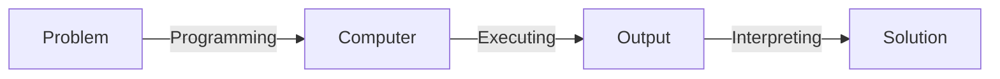
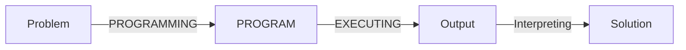
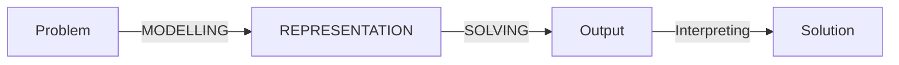
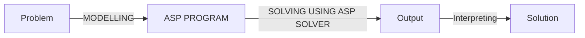

# [Week 3] Theory of Answer Set Programming

## Introduction to Answer Set Programming

> OBJECTIVE: Explain the difference between declarative programming and traditional programming. Explain Answer Set Programming as a declarative programming method.

### Problem Solving

- "What is the problem?" vs. "How to solve the problem?"

- Traditional programming:

- Declarative programming:

### What is Answer Set Programming

- Declarative programming paradigm suitable for knowledge intensive and combinatorial search problems
- Theoretical basisL stable model semantics (Gelfond and Lifschitz, 1988)
- Expressive representation language
  - defaults
  - negation as failure
  - recursive definitions
  - aggregates
  - preferences
  - etc.
- ASP solvers
  - smodels (Helsinki University of Technology, 1996)
  - dlv (Vienna University of Technology, 1997)
  - cmodels (University of Texas at Austin, 2002)
  - phmodels (University of Kentucky, 2005)
  - Clasp/clingo (University of Potsdam, 2006) - winning several first places at ASP, SAT, Max-SAT, PB, CADE competitions
  - Wasp (University of Cabria, 2013)
  - dlv-hex for computing HEX programs
  - oClingo for reactive answer set programming
  - ...
- ASP Core 2: Standard language
- Annual ASP Competition

### Declarative Problem Solving using ASP

- The basic idea is:
  - to presnet the given problem by a set of rules,
  - to find answer sets for the program using an ASP solver,
  - and to extract the solutions from the answer sets

### N-Queens Puzzle

- No two queense can share the same row, column, or diagonal.

$$
\begin{array}{c|c}
  n & \text{\# solutions} \\ \hline
  3 & 0 \\
  4 & 2 \\
  5 & 20 \\
  6 & 4 \\
  7 & 40 \\
  8 & 92
\end{array}
$$

## Stable Models of Definite/Positive Programs

> OBJECTIVE:

## Definite/Positive Programs in the Language of Clingo

> OBJECTIVE:

## Definite/Positive Programs in the Language of Clingo Allowing Intervals

> OBJECTIVE:

## Negation as Failure

> OBJECTIVE:

