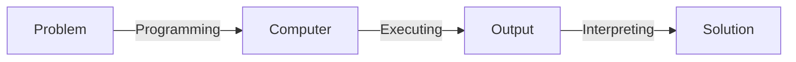
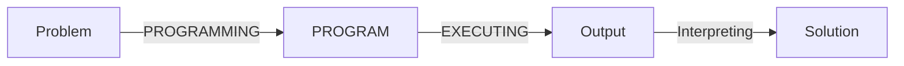
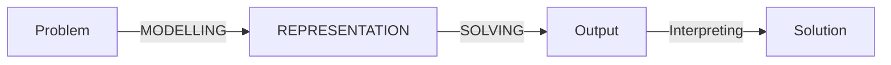
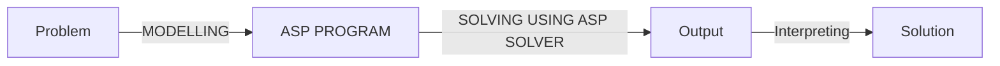

# [Week 3] Theory of Answer Set Programming

## Introduction to Answer Set Programming

> OBJECTIVE: Explain the difference between declarative programming and traditional programming. Explain Answer Set Programming as a declarative programming method.

### Problem Solving

- "What is the problem?" vs. "How to solve the problem?"



- Traditional programming:



- Declarative programming:



### What is Answer Set Programming

- Declarative programming paradigm suitable for knowledge intensive and combinatorial search problems
- Theoretical basisL stable model semantics (Gelfond and Lifschitz, 1988)
- Expressive representation language
  - defaults
  - negation as failure
  - recursive definitions
  - aggregates
  - preferences
  - etc.
- ASP solvers
  - smodels (Helsinki University of Technology, 1996)
  - dlv (Vienna University of Technology, 1997)
  - cmodels (University of Texas at Austin, 2002)
  - phmodels (University of Kentucky, 2005)
  - Clasp/clingo (University of Potsdam, 2006) - winning several first places at ASP, SAT, Max-SAT, PB, CADE competitions
  - Wasp (University of Cabria, 2013)
  - dlv-hex for computing HEX programs
  - oClingo for reactive answer set programming
  - ...
- ASP Core 2: Standard language
- Annual ASP Competition

### Declarative Problem Solving using ASP

- The basic idea is:
  - to presnet the given problem by a set of rules,
  - to find answer sets for the program using an ASP solver,
  - and to extract the solutions from the answer sets



### N-Queens Puzzle

- No two queense can share the same row, column, or diagonal.

$$
\begin{array}{c|c}
  n & \text{\# solutions} \\ \hline
  3 & 0 \\
  4 & 2 \\
  5 & 20 \\
  6 & 4 \\
  7 & 40 \\
  8 & 92
\end{array}
$$

```clingo
% each row has exactly one queen
1 {queen(R,1..n)} 1 :- R=1..n.

% no two queens are on the same column
:- queen(R1,C), queen(R2,C), R1!=R2.

% no two queens are on the same diagonal
:- queen(R1,C1), queen(R2,C2), R1!=R2, |R1-R2|=|C1-C2|
```

```cmd
youmi@Youmis-MBP-M1 n_queens % clingo queens.lp -c n=8
youmi@Youmis-MBP-M1 n_queens % clingo queens.lp -c n=8 0
```

## Stable Models of Definite/Positive Programs

> OBJECTIVE: compute stable models of definite and positive programs by hand

### Syntax of Propositional Rules

- We consider rules as the restriced form of formulas in which implications occur in a limied way
  - we write $F \leftarrow G$ to denote $G \rightarrow F$
- A (propositional) rule is a formula of the form $F \leftarrow G$ where $F$ and $G$ are implication-free ($\bot$, $\top$, $\lnot$, $\lor$, $\land$ are allowed in $F$ and $G$)
  - we often write $F \leftarrow \top$ simply as $F$
- Example: Is each of teh following a propositional rule?
  - $p \leftarrow (q\lor \lnot r)$, yes
  - $p \rightarrow (q\rightarrow r)$, no
  - $(p\lor q)\land \lnot r \Leftrightarrow (p\lor q)\land \lnot r \leftarrow F$, yes
- A PROPOSITIONAL PROGRAM is a set of propositional rules

### Representing Intrepretaion as Sets

- We identify an interpretation with teh set of atoms that are true in it
- Example: interpretations of signature ${p, q}$

$$
\begin{array}{c|c|c}
p & q & I \\ \hline
f & f & \emptyset \\
f & t & \{q\} \\
t & f & \{p\} \\
t & t & \{p, q\} \\
\end{array}
$$

- Example: for signature $\{p,q\}$ the formulat $p \lor q$ has three models: $\{q\}, \{p\}, \{p, q\} $

### Minimal Models: Definition

About a model $I$ and formula $F$, we say that it is MINIMAL if no other model of $F$ is a subset of $I$

- Example: for signature $\{p,q\}$ the formulat $p \lor q$ has three models: $\{q\}, \{p\}, \{p, q\}$
  - the minimal models are: $\{q\}, \{p\}$
- Exercise: find all minimal models of the program $\{p \leftarrow q, q\lor r\}$
  - $\{r\}$

### Minimal Models: Question

- Statement: If two formulas are equivalent under propositional logic, then they have the same minimal models
  - True:
    - equivalence means that both have same models, i.e. the same setof interpretations that make the formula true
    - taking the minimal model of each will be the same
- Question: Is the converse true, that two formulas having the same minimal models are equivalent?
  - False:
    - e.g. $p \leftarrow q$ and $q \leftarrow p$ both have minimal model $\emptyset$ but $\{p\} \vDash p \leftarrow q$ whereas $\emptyset$ but $\{p\} \nvDash q \leftarrow p$

### Definite Propositional Rule: Definition

A propositional rule is DEFINITE if:

- its head is an ATOM, and
- its body (if it has one) does not contain negation

Examples: what is the minimal model of each program?

- $p \Leftrightarrow p \leftarrow \top$, $r \leftarrow p \land q$
  - minimal model: $\{p\}$
- $p \Leftrightarrow p \leftarrow \top$, $q \leftarrow p \land r$, $r \leftarrow p \lor t$, $s \leftarrow r \land t$
  - minimal model:  $\{p, r, q\}$

### Definite Propositional Rule: An Algorithm

An algorithm to find a minimal mode of a definite propositional program

- $S = \emptyset$
- Repeat for each rule $head \leftarrow Body$ in $\Pi$ until there is no change in $S$
  - if $S \vDash B$, then $S:= S \cup \{head\}$

### Definite Propositional Rule: An Exercise

Let $\Gamma$ be the program $ \{p_1 \leftarrow p_2 \land p_3, p_2 \leftarrow p_3 \land p_4, ... , p_8 \leftarrow p_9 \land p_{10} \}$
For each of the following programs, describe the step-by-step process of construction its minimal model:

- $\Gamma$ - minimal model $\emptyset$
- $\Gamma \cup \{p_5\}$ - minimal model $\{p_5\}$

$$
\begin{array}{ll}
p_5 \leftarrow p_6 \land p_7 & p_5 = \top \leftarrow p_6 \land p_7 \text{\ for any\ } p_6, p_7 \\
p_4 \leftarrow p_5 \land p_6 \\
p_3 \leftarrow p_4 \land p_5 \\
\end{array}
$$

- $\Gamma \cup \{p_5, p_6\}$ - minimal model $\{p_5\}$

$$
\begin{array}{ll}
p_5 \leftarrow p_6 \land p_7 & p_5 = \top \leftarrow p_6 \land p_7 \text{\ for any\ } p_6, p_7 \\
p_4 \leftarrow p_5 \land p_6 & p_5 \land p_6 = \top \text{\ add }\ p_4 \text{\ to model\ }\\
p_3 \leftarrow p_4 \land p_5 & p_4 \land p_5 = \top \text{\ add }\ p_3 \text{\ to model\ }\\
p_2 \leftarrow p_3 \land p_4 & p_3 \land p_4 = \top \text{\ add }\ p_2 \text{\ to model\ }\\
p_1 \leftarrow p_2 \land p_3 & p_2 \land p_3 = \top \text{\ add }\ p_1 \text{\ to model\ }\\
\end{array}
$$

### Definite Propositional Rule: A Proposition

A DEFINITE PROGRAM has a UNIQUE minimal mode

- Q: Find a counter example to the proposition if "definite" is dropped from the statement? No
  - $p\lor q \Leftrightarrow p \lor q \leftarrow \top$, minimal models: $\{p\}$,$\{q\}$
  - $p \leftarrow \lnot q$, minimal models: $\{p\}$,$\{q\}$
  - these are equivalent under propositional logic
  - equivalent programs have the same minimal models
A STABLE MODEL of a definite program $\Pi$ is THE minimal model of $\Pi$

- Q: Is every stable model of $\Pi$ a model of $\Pi$? Yes
  - every stable model is a minimal model, and every minimal model is a model

### Rationality Principle

Informally, program $\Pi$ can be viewed as a specification for stable models - sets of beliefs that could be held by a rational reasoner associated with $\Pi$

- Satisfy the rules of $\Pi$, i.e. if one believes in the body of a rule, one must also believe in its head
- Ahere to "the rationality principle" which says "believe nothing you are not forced to believe"

### Positive Programs

- A rule/program is POSITIVE, if it doesn't contain negation
  - Example: $p \leftarrow q$ is positive; $p \leftarrow \lnot q$ is not positive
- Q: True or False? Every definite program is positive. True (by definition)
- For positive programs, stable models are defined as minimal models
- Q: Does every positive program have a unique minimal mode? No
  - $p \lor q$ positive program, but has 3 minimal models: $\{p\}$,$\{q\}$
- A stable model of a definite program $\Pi$ is <u>THE minimal model</u>  of $\Pi$
- A stable model of a positive program $\Pi$ is <u>A minimal model</u> of $\Pi$

## Definite/Positive Programs in the Language of `clingo`

> OBJECTIVE: represent definite and positive programs in the language of `clingo` and using `clingo` to find the stable models

> OBJECTIVE: represent definitions in the language of `clingo`

### Terms in `clingo`

- Integers, symbolic constants (lowercase), and variables (uppercase)
  - `1, 2, 3, a, b, X, Y`
- $t_1 \odot t_2$ where $\odot$ is an arithmetic operation, and $t_1$, $t_2$ are terms
  - `3*4, 3+4, 3**x + 2*3`
- $|t|$ where $t$ is a term
  - `|-3|`
- terms that do not contian variables are called GROUND

### Value of Ground Term

The VALUE of a ground term is defined recurisively

- if $t$ is an integer or a symbolic constant then the only value of $t$ is $t$ itself
- if $t$ is $t_1 \odot t_2$ where $\odot$ is an arthmetic operation, then the value of $t$ is the integer $n_1 \odot n_2$, where the integer value $n_1$ is the value of $t_1$ and the integer $n_2$ is a value of $t_2$
  - in herbrand models, (3+4) is the value of the term
  - in clingo, (7) is the value of the term
- if $t$ is $|t_1|$ then the value of $t$ is the integer $|n_1|$, where the integer $n_1$ is a value of $t_1$

| `clingo` term | algebraic notation |
| :--: | :--: |
| `m*n` | $m \cdot n$ |
| `m/n` | $\lfloor m/n \rfloor$ |
| `m\n` | $m-n \cdot \lfloor m/n \rfloor$ |
| `m**n` | $\lfloor m^n \rfloor$ |

### Positive `clingo` Program

- an ATOM in a `clingo` program is a symbolic constant followed by a list of terms
- a COMPARISON is a pair of terms separated by comparison operators `=,!=, <, >, <=, >=`
  - True: `10 > 7, a > 7, c > a` (unicode)
- Positive clingo rules are either:
  - $H_1, ..., H_m\ (m \geq 1)$ or
  - $H_1, ..., H_m :- B_1, ..., B_n\ (m, n \geq 0)$
  where $H_1, ..., H_m, B_1, ..., B_n$ are atoms and comparisons

### Simple Example

- Data

| country | france | germany | italy | uk |
| :--: | :--: |  :--: |  :--: | :--: |
population (mm) | 65 | 83 | 61 | 64 |

```clingo
size(france, 65). size(germany, 83). size(italy, 61). size(uk, 64).
```

- Rule
  - a country $C$ is large if the population size of $C$ is $S_1$, the population size of the UK is $S_2$, amd $S_1 >S_2$
  - `:-` denotes IF
  - This is not a command; it is a declarative sentence explaining how we understand "large country"

```clingo
large(C) :- size(C, S1), size(uk, S2), S1 > S2.
```

- Stable model (a.k.a. answer set):

```clingo
size(france, 65) size(germany, 83) size(italy, 61) size(uk, 64) large(france) large(germany)
```

### Rule Instance

- An INSTANCE of a rule is obtained from the rule by substituting specific values for all its variables
  - the values come from the set $S$ of symbolic constants and the set $Z$ of integers

- Example 1:
  - Rule: `size(france, 65). size(germany, 83). size(italy, 61). size(uk, 64).`
  - Instances: `size(france, 65). size(germany, 83). size(italy, 61). size(uk, 64).`

- Example 2:
  - Rule: `large(C) :- size(C,S1), size(uk,S2), S1 > S2.`
  - Instances: $\forall v_0, v_1, v_2 \in S \cup Z$ where $S$ = {france, germany, italy, uk, large, size}
  $$\texttt{large($v_0$) :- size($v_0$,$v_1$), size(uk,$v_2$), $v_1$ > $v_2$.}$$

### Propositional Image of `clingo` Programs: Definition

The PROPOSITIONAL IMAGE of a clingo program consists of the instances of its rules rewritten as propositional formulas.

To rewrite a ground rule as a formula,

- replace the symbol `:-` and all commas in the head and the body by propositional connectives as in the table show;

| `clingo` term | propositional al notation |
| :--: | :--: |
| `:-` | $\leftarrow$ |
| comma in the body | $\land$ |
| comma in the head | $\lor$ |
| `not` | $\lnot$ |
| `#false` | $\bot$ |
| `#true` | $\top$ |

- replace each comparison $t_1 < t_2$ in the head and in the body by $\top$ if is true, and by $\bot$ if it is false; and
- replace the head of the rule by $\bot$ if it is empty, and replace the body by $\top$ if it is empty.

#### Example

Propositional image of:

```clingo
size(france, 65). size(germany, 83). size(italy, 61). size(uk, 64).
large(C) :- size(C, S1), size(uk, S2), S1 > S2.
```

is:
$$
\begin{align*}
  \texttt{size(france, 65), size(germany, 83), size(italy, 61), size(uk, 64).}  \tag{1} \\
  \texttt{large($v_0$)$\leftarrow$size($v_0$,$v_1$)$\land$ size(uk,$v_2$)$\land \top \quad$ if  $v_1$ > $v_2$} \tag{2}\\
  \texttt{large($v_0$)$\leftarrow$size($v_0$,$v_1$)$\land$ size(uk,$v_2$)$\land \bot \quad$ otherwise} \tag{3}\\
  \texttt{for all $v_0$, $v_1$, $v_2$ in $S\cup Z$}
\end{align*}
$$

simplify to below since (3) is always false and we are generating minimal models (tautological rule):
$$
\begin{align*}
  \texttt{size(france, 65), size(germany, 83), size(italy, 61), size(uk, 64).}  \tag{1} \\
  \texttt{large($v_0$)$\leftarrow$size($v_0$,$v_1$)$\land$ size(uk,$v_2$)$\land \top \quad$ if  $v_1$ > $v_2$} \tag{2}\\
  \texttt{for all $v_0$, $v_1$, $v_2$ in $S\cup Z$}
\end{align*}
$$

and reduce further since $v_1 < v_2 = 64$ (uk) can be $65$ (france) or $83$ (germany)

$$
\begin{align*}
  \texttt{size(france, 65), size(germany, 83), size(italy, 61), size(uk, 64).}  \tag{1} \\
  \texttt{large(france)$\leftarrow$size(france, 65)$\land$ size(uk, 64)} \\
  \texttt{large(germany)$\leftarrow$size(germany, 83)$\land$ size(uk, 64)}
\end{align*}
$$

#### Example

Consider the rule `child(X,Y) :- parent(Y,X).`

- translated into English: $X$ is a child of $Y$ if $Y$ is the parent of $X$
- run `clingo` on program consisting of the above and below rules, what is the stable model?

```clingo
parent(apple,banana). parent(banana,cat), parent(banana,dog).
```

- define precicate `grandparent/2` in terms of `parent/2`?

```clingo
grandparent(X,Z) :- parent(X,Y), parent(Y,Z).
```

- define predicate `siblings/2` in terms of `parent/2`?

```clingo
siblings(X,Y) :- parent(Z,X), parent(Z,Y), X != Y.
```

- sometimes the definition of apredicate consist of several rules.
  - e.g. below defines `parent/2` interns of `father/2` and `mother/2`.

```clingo
parent(X,Y) :- father(X,Y).
parent(X,Y) :- mother(X,Y).
```

- A predicate can be defined recursively. In a recusive definition, the defined predicate occurs not only in the heads of rules, but also in some of the bodies.
  - e.g. definition of `ancestor/2` in terms of `parent/2`

```clingo
ancestor(X,Y) :- parent(X,Y).
ancestor(X,Z) :- ancestor(X,Y), ancestor(Y,Z).
```

## Definite/Positive Programs in the Language of `clingo` Allowing Intervals

> OBJECTIVE: represent definite and positive programs allowing internavls in the language of `clingo`.

### Terms in `clingo` language [Allowing Intervals]

- the input language of `clingo` allows the notion of TERMS
- terms in `clingo` language are:
  - Integers, symbolic constants (lowercase), and variables (uppercase)
    - `1, 2, 3, a, b, X, Y`
  - $t_1 \odot t_2$ where $\odot$ is an arithmetic operation, and $t_1$, $t_2$ are terms
    - `3*4, 3+4, 3**x + 2*3`
  - $|t|$ where $t$ is a term
    - `|-3|`
- terms that do not contian variables are called GROUND

### Values of Ground Terms [Allowing Intervals]

The SET OF VALUES of a ground terms is defined recursively

- if $t$ is an integer or a symbolic constant then the only value of $t$ is $t$ itself
- if $t$ is $t_1 \odot t_2$ where $\odot$ is an arthmetic operation, then the <u>values of $t$</u> is the integer $n_1 \odot n_2$, where the integer value $n_1$ is the value of $t_1$ and the integer $n_2$ is a value of $t_2$
  - in herbrand models, (3+4) is the value of the term
  - in clingo, (7) is the value of the term
- if $t$ is $|t_1|$ then the <u>values of $t$</u> is the integer $|n_1|$, where the integer $n_1$ is a value of $t_1$

<span style="color:red">

-  if $t$ is $t_1 .. t_2$ then the values of $t$ are the integers $n$ for which there exists integers $n_1$ and $n_2$ such that:**
    - $n_1$ is a value of $t_1$ and $n_2$ is a value of $t_2$,
    - $n_1 \leq n \leq n_2$
    - e.g. $1..10 = \{1,2,3,...,10\}$ and $1..10 + 1 = \{2,3,...,11\}$

</span>

| term | value | reasoning |
| :--: | :--: | :-- |
| $2*2$ | $\{4\}$ | value set containing only $4$ |
| $2/0$ | $\emptyset$ | undefined |
| $2*a$ | $\emptyset$ | can't multiply integer with symbolic constant |
| $(2..4)*(2..4)$ | $\{4, 6, 8, 9, 12, 16\}$ | distributive, no duplicate values in sets |
| $6..5$ | $\emptyset$ | undefinded since $n_1 \nleq n_2$ |
| $a..(a+1)$ | $\emptyset$ | symbolic constant cannot be evaluated to integer values |
| $2**(-2)$ | $\{ \lfloor \frac{1}{4} \rfloor = 0\}$| no fractions in clingo, take floor |

- Find a ground term with values $\{1, 3, 9\}$: $3**(0..2)$

### Propositional Image of Head and Body Expressions

| expression | propositional image |
| :--: | :-- |
| atom $p(t_1,...,t_k)$ in the HEAD | CONJUCTION of all forumlas of the form $p(v_1, ..., v_k)$ where $v_i$ is a value of $t_i (i=1,...,k)$ |
| atom $p(t_1,...,t_k)$ in the BODY | DISJUNCTION of all forumlas of the form $p(v_1, ..., v_k)$ where $v_i$ is a value of $t_i (i=1,...,k)$ |
| comparison $t_1 \leq t_2$ in the HEAD | $\begin{cases} \top &\texttt{if }  \forall v_1 \sim t_1 \texttt{ and } \forall v_2 \sim t_2:&v_1 < v_2\\ \bot &\text{otherwise} \end{cases}$ |
| comparison $t_1 \leq t_2$ in the BODY | $\begin{cases} \top &\texttt{if }  \exists v_1 \sim t_1 \texttt{ and } \exists v_2 \sim t_2  \texttt{ such that }&v_1 < v_2\\ \bot &\text{otherwise} \end{cases}$ |

- $p(1..2)$ in the head: $p(1) \land p(2)$
- $p(1..2)$ in the body: $p(1) \lor p(2)$
- $1..2 = 2..3$ in the head: $\{\overbrace{1=2}^{\color{red}{\bot}},\overbrace{2=3}^{\color{red}{\bot}},\overbrace{2=2}^{\top},\overbrace{2=3}^{\color{red}{\bot}}\} \Leftrightarrow {\color{red}{\bot}}$
- $1..2 = 2..3$ in the body: $\{\overbrace{1=2}^{\bot},\overbrace{2=3}^{\bot},\overbrace{2=2}^{{\color{blue}{\top}}},\overbrace{2=3}^{\bot}\} \Leftrightarrow {\color{blue}{\top}}$

### Propositional Image of `clingo` Programs: Definition [Alloqing Intervals]

The PROPOSITIONAL IMAGE of a `clingo` program consists of the instances of its rule rewritten as propositional formulas. To rewrite a ground rule as a formula:

- replace the symbol `:-` and all commas in the head and the body by propositional connectives as in the table shown
- <span style="color:red">replace each of the expressions in the head and the body by its porpositional image as shown above</span>
- replace the head of the rule by $\bot$ if it is empty, and replace the body by $\top$ if it is

#### Examples

| `clingo` | propositional image |
| :--: | :-- |
| `square(1..2,1..2)` | $ \Leftrightarrow sq(1..2,1..2) \leftarrow \top \\ \Leftrightarrow sq(\{1,2\},\{1,2\}) \leftarrow \top \\ \Leftrightarrow sq(1,1) \land sq(1,2) \land sq(2,1) \land sq(2,2) \leftarrow \top$ |
| `p(1..3).` | $\Leftrightarrow p(1..3) \leftarrow \top \\ \Leftrightarrow p(\{1,2,3\}) \leftarrow \top \\ \Leftrightarrow p(1) \land p(2) \land p(3) \leftarrow \top$ |
| `X=1 :- p(X).` | $\Leftrightarrow X=1 \leftarrow p(X) \\ \Leftrightarrow \begin{cases} \top \leftarrow p(1) &\texttt{if } X=1 \\ \bot \leftarrow p(v) &\forall v \in S\cup Z \backslash \{1\} \end{cases}$ |
| `p(1), p(2), p(3).` | $\Leftrightarrow  p(1),\ p(2),\ p(3) \leftarrow \top \\ \Leftrightarrow p(1) \land p(2) \land p(3) \leftarrow \top$ |
| `:- p(X), X>2.` | $\Leftrightarrow \bot \leftarrow p(X) \lor X>2 \\ \Leftrightarrow \begin{cases} \cancel{\bot \leftarrow} \cancel{p(v)\ \lor}\ \top  &\forall v > 2,\ v \in S\cup Z  \\ \bot \leftarrow p(v)\ \cancel{\lor\ \bot} &\forall v \leq 2, \ v \in S\cup Z \end{cases}$ |

## More about `clingo` Program

> OBJECTIVE: use several directives of `clingo` programs

> OBJECTIVE: represente definitions related to artihmetic in the lanague of `clingo`

### `clingo` Directives

- comments - any text between the symbol % and the end of a line is a comment, disregarded by `clingo`

```clingo
% This is a comment, blah, blah, blah
```

- `#show` directive instructs clingo to show some elements of the stable model and suppress the others
- `/n` refres to the arity of the predicate symbol

```clingo
#show large/1.

p. p(a). p(a,b).
#show p/0. #show p/1. #show p/2.
```

- `#const` directive allows us to use a symbolic constant as a placeholder

```clingo
large(C) :- size(C,S1), size(uk,S2), S1 > S2

#const c0=uk.
large(C) :- size(C,S1), size(c0,S2), S1 > S2
```

- alternatively, the command line option `-c` can be used. add in the command line: `-c c0=uk`

```clingo
% large.lp
large(C) :- size(C,S1), size(c0,S2), S1 > S2
#show large/1.

% large_input.lp
#const c0=uk.
size(france,65; germany,83; italy,61; uk,64).
```

- multiple input files to `clingo` are concatenated, in the command line: `clingo large.lp large_input.lp`
- alternatively include another file using `#include`: `#include "large_input.lp"`

### Arithmetic

- compelx terms can be built from constants and variables using the symbols

| addition | multiplication | exponentiation | integer division | remainder | absolute value |
| :--: | :--: | :--: | :--: | :--: | :--: |
| `+` | `*` | `**` | `/` | `\` | `\|..\|` |

```clingo
p(N, N*N+ N+ 41) :- N=0..3.
```

- reads: $N$ and $N^2 + N + 41$ are in the relation $p/2$ if $N$ is one of the numbers $0,...,3$
- command: `clingo quadratic.lp`
- stable models: `p(0,41) p(1,43) p(2,47) p(3,53)`

### Placeholders

```clingo
p(N, a*N*N+ b*N+ c) :- N=0..n.
```

- reads: $N$ and $aN^2 + bN + c$ are in the relation $p/2$ if $N$ is one of the numbers $0,...,n$
- $a,b,c,n$ are placeholders for any values that can be specified in the command
- command: `clingo -c a=1 -c b=1 -c c=41 -c n=10 quadratic.lp`
- alternatively, put it in the file: `#const a=1. #const b=1. #const c=41. #const n=10.`

### Integer Arithmetic

The numbers that `clingo` knows about are integers. Find the stable models for `p(M, N) :- N=1..4, N=2*M.`

| `N` | `M` | `clingo` |
| :-: | :- | :- |
| $1$ | $\frac{1}{2}$ | fraction, ignore |
| $2$ | $\frac{2}{2} = 1$ | both integers, ok |
| $3$ | $\frac{3}{2}$ | fraction, ignore |
| $2$ | $\frac{4}{2} = 2$ | both integers, ok |

- stable models: $\{p(1,2),\ p(2,4)\}$

### Intervals in Head

- intervals may be used not only in the bodies of rules but in the heads as well, e.g. `p(0..3).`
- which has the same meaning as the set of 4 facts: `p(0). p(1). p(2). p(3).`
- this group of facts can be also abbreviated using POOLING: `p(0; 1; 2; 3).`
- one-rule program that does not contain pooling and has the same model as `p(1,2; 2,4; 4,8; 8,16).`
  - `p(2**N, 2**(N+1)) :- N=0..3`
- one-rule program that has the stable model below
  - `p(M,N) :- M=1..4, N=1..4, M>=N`

```clingo
p(1,1)
p(2,1) p(2,2)
p(3,1) p(3,2) p(3,3)
p(4,1) p(4,2) p(4,3) p(4,4)
```

### Composite Numbers

An integer $N$ is composite if it is divisible by some numbers from $\{2, ..., N-1\}$

```clingo
composite(N) :- N=1..n, M=2..N-1, N\M=0
#const n=10.
```

### Fibonacci Numbers

Fibonacci numbers follow the recursive format $Fib(t_{i+2}) = Fib(t_i) + Fib(t_{i+1})$

```clingo
% fib(i, m): i-th fibonacci number is m
fib(0, 0).
fib(1, 1).
fib(N+2, F0+F1) :- fib(N, F0), fib(N+1, F1), N=0..(n-2).
```

### Factorials

```clingo
% fac(i, m): i-th factorial is m
fac(0,1).
fac(N+1, F*(N+1)) :- fac(N, F), N=0..n.

fac(F) :- fac(N, F).
#show fac/1.
```

## Negation as Failure

> OBJECTIVE: explain the intuitive meaning of negation as failure


