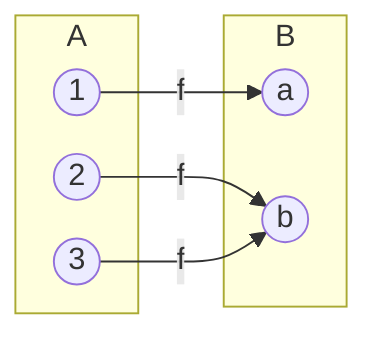
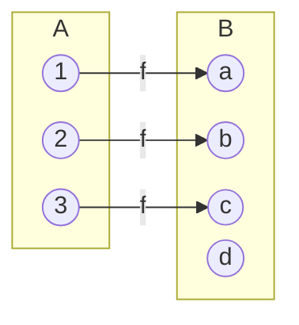
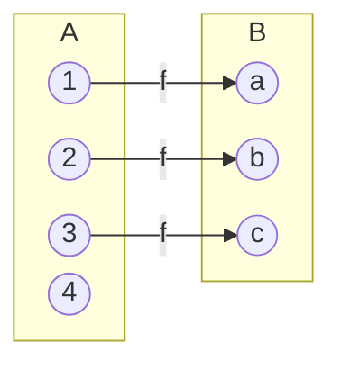
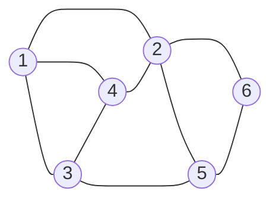
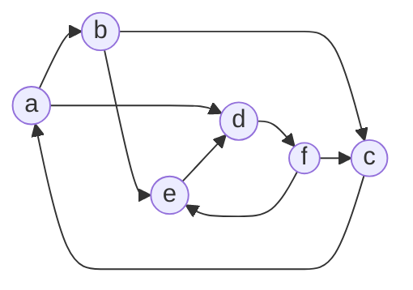
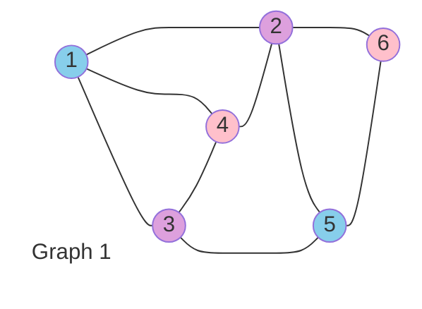
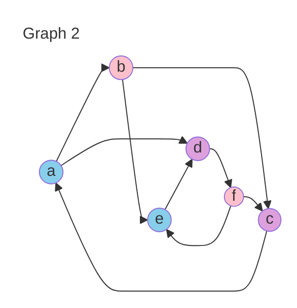
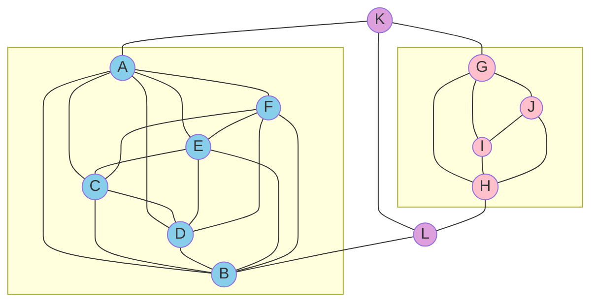

# [Week 4] Practice of Answer Set Programming

$$
\gdef\T{\top}
\gdef\F{\bot}
\gdef\NOT{\lnot}
\gdef\OR{\lor}
\gdef\AND{\land}
\gdef\IF{\leftarrow}
\gdef\THEN{\rightarrow}
\gdef\EQ{\leftrightarrow}

\gdef\satisfy{\vDash}
\gdef\unsatisfy{\nvDash}
\gdef\crit{\neg H}

\gdef\so{\blacktriangleright}
\gdef\img{\imageof}
\gdef\rm#1{~\cancel{#1}~}
\gdef\xrm#1{~\xcancel{#1}~}
\gdef\srm#1{~\sout{#1}~}

\gdef\txt#1{\texttt{#1}}

\gdef\R#1{{\color{red}{#1}}}
\gdef\G#1{{\color{green}{#1}}}
\gdef\B#1{{\color{blue}{#1}}}
\gdef\P#1{{\color{deeppink}{#1}}}
\gdef\V#1{{\color{darkviolet}{#1}}}

\gdef\Rtxt#1{{\color{red}{\texttt{#1}}}}
\gdef\Gtxt#1{{\color{green}{\texttt{#1}}}}
\gdef\Btxt#1{{\color{blue}{\texttt{#1}}}}
\gdef\Ptxt#1{{\color{deeppink}{\texttt{#1}}}}
\gdef\Vtxt#1{{\color{darkviolet}{\texttt{#1}}}}

\gdef\Rbox#1{~{\colorbox{salmon}{$#1$}}~}
\gdef\Gbox#1{~{\colorbox{lightgreen}{$#1$}}~}
\gdef\Bbox#1{~{\colorbox{skyblue}{$#1$}}~}
\gdef\Pbox#1{~{\colorbox{pink}{$#1$}}~}
\gdef\Vbox#1{~{\colorbox{plum}{$#1$}}~}

\gdef\CHOOSE#1#2{(#1\ \mathbf{C}\ #2)}

$$

## Choice Rules & Constraints

> OBJECTIVE: compute stable models of programs containing choice rules and constraints by hand

> OBJECTIVE: compute stable models of programs containing choice rules and constraints using clingo

### Choice Rule


- stable models of $p \OR \NOT p$

$$
\begin{array}{clllr}
  \empty&: &\Pi^\empty = p \OR \T &\iff \T &\so \empty \txt{ stable model}\\
  \set{p}&: &\Pi^{\set{p}} = p \OR \T &\iff p &\so \set{p} \txt{ stable model}\\
\end{array}
$$

- stable models of $\Pi = (p \OR \NOT p) \AND (q \OR \NOT q)$

$$
\begin{array}{clllr}
  \empty&: &\Pi^\empty = (p \OR \T) \AND (q \OR \T) &\iff \T &\so \empty \txt{ stable model}\\
  \set{p}&: &\Pi^{\set{p}} =(p \OR \F) \AND (q \OR \T) &\iff p &\so \set{p} \txt{ stable model}\\
  \set{q}&: &\Pi^{\set{q}} = (p \OR \T) \AND (q \OR \F) &\iff q &\so \set{q} \txt{ stable model}\\
  \set{p,q}&: &\Pi^{\set{p,q}} =(p \OR \F) \AND (q \OR \F) &\iff p \AND q &\so \set{p,q} \txt{ stable model}\\
\end{array}
$$

- generalized: stable models of $(p_1 \OR \NOT p_1) \AND (p_2 \OR \NOT p_2) \AND ... \AND (p_n \OR \NOT p_n)$ are all subsets of $\set{ p_1, ... , p_n}$
- abbreviate the formula  $(p_1 \OR \NOT p_1) \AND (p_2 \OR \NOT p_2) \AND ... \AND (p_n \OR \NOT p_n)$ as $\set{p_1;~...~;p_n}$ and call it CHOICE RULE

### Choice Rules in Clingo

- choice rule: $\set{p(t_1,...,t_k)}$
- its propositional image is the conjuction of all formulas of the form: $p(v_1,...,v_k) \OR \NOT p(v_1,...,v_k)$ where $v_i$ is a value of $t_i$
- Examples
  - `{p(1)}.` $\iff p(1) \OR \NOT p(1)$
  - `{p(1..3)}.` $\iff (p(1) \OR \NOT p(1)) \AND (p(2) \OR \NOT p(2)) \AND (p(3) \OR \NOT p(3))$
  - `{p(a); q(b)}.` stands for $(p(a) \OR \NOT p(a)) \AND (q(b) \OR \NOT q(b))$
    ```clingo
    Solving...
    Answer: 1

    Answer: 2
    q(b)
    Answer: 3
    p(a)
    Answer: 4
    p(a) q(b)
    SATISFIABLE

    Models       : 4
    ```

### Choice Rules with Intervals and Pools

- `{p(1..3)}.` has the same meaning as `{p(1); p(2); p(3)}.`
- `{p(a;b;c)}.` has the same meaning as `{p(a); p(b); p(c)}.`
- number of stable modeles for each program:
  - `{p(1..3)}. q{(1..3)}.`
    - `{p(1..3)}` $\iff$ `{p(1); p(2); p(3)}` has $2^3=8$ stable models
    - `{q(1..3)}` $\iff$ `{q(1); q(2); q(3)}` has $2^3=8$ stable models
    - $8*8=64$ stable models
  - `{p(1..3, 1..3)}.` $\iff$ `{p(1,1); p(1,2); p(1,3); p(2,1); p(2,2); p(2,3); p(3,1); p(3,2); p(3,3)}.`
    - $|\set{1..3}|=3$ and $|\set{1..3, 1..3}| = 3^2 = 9$
    - `{p(1..3, 1..3)}.` has $2^9 = 512$ stable models

### Choice Rules with Cardinality Bounds

`1 {p(1..3)} 2.` describes the subset of $\set{1,2,3}$ that consists of 1 or 2 elements (i.e. $1\leq$ cardinality $\leq 2$)
- number of stable modeles for each program:
  - `1{p(1..6)}.`: $2^6 - 1 = 63$
  - `3{p(1..6)}3.`: $\dbinom{6}{3} = \cfrac{6!}{(6-3)!} = \cfrac{6*5*4}{3*2} = 20$
- for each of the given rules find simpler rule with same meaning
  - `0{p(a)}.` $\iff$ `{p(a)}`
  - `1{p(a)}.` $\iff$ `p(a)`
  - `{p(a)}1.` $\iff$ `{p(a)}`

### Choice Rules with Variables

`1 {p(X);q(X)} 1 :- X=1..2.`
- for `X=1`: `1 {p(1);q(1)} 1`, only 2 subsets of cardinality 1 (`{p(1)}` and `{q(1)}`)
- for `X=2`: `1 {p(2);q(12)} 1`, only 2 subsets of cardinality 1 (`{p(2}` and `{q(2)}`)
- `X` is a global variable

```clingo
Solving...
Answer: 1
p(1) q(2)
Answer: 2
p(1) p(2)
Answer: 3
q(1) q(2)
Answer: 4
q(1) p(2)
SATISFIABLE

Models       : 4
```

### Local vs. Global Variables

#### `{p(I): I=1..7}.`
- `I` is local variable
- a local variable is a variable such that all its occurrences in the rule are IN BETWEEN `{ ... }`
- other variables are global cariables
- the rule expands into: `{p(1); p(2); p(3); p(4); p(5); p(6); p(7)}.`
- how many stable models are there? $2^7 = 128$

#### `{p(I)} :- I=1..7.`
- `I` is global variable beacuse it has an occurence OUTSIDE `{ ... }`
- the rule expands into:
  ```clingo
  {p(1)}.
  {p(2)}.
  {p(3)}.
  {p(4)}.
  {p(5)}.
  {p(6)}.
  {p(7)}.
  ```
- how many stable models are there? $2^7 = 128$


#### `{q(I,J): J=1..3} :- I=1..2.`
- for `I = 1`, `{q(I,1): J=1..3}.` $\iff$ `{q(1,1); q(1,2); q(1,3)}.`
- for `I = 2`, `{q(I,2): J=1..3}.` $\iff$ `{q(2,1); q(2,2); q(2,3)}.`
- expands to:
  ```clingo
  {q(1,1); q(1,2); q(1,3)}.
  {q(2,1); q(2,2); q(2,3)}.
  ```
- number of stable models? $2 * 2^3 = 64$

### Constraints

- a CONSTRAINT is a rule that has no head, e.g., `:- p(1)` which can be understood as $\F \IF p(1)$
- constraints are often used with choice rule sto weed out "undesireable" stable models, for which the constraint is "violated"
- examples:
  ```clingo
  {p(X): X=1..3}.
  :- p(1).
  ```
  - stable model violates constraint if it contains `p(1)`
  > stable models: $\empty, ~\xrm{\set{p(1)}}, ~\set{p(2)}, ~\set{p(3)}, ~\xrm{\set{p(1);~p(2)}}, ~\xrm{\set{p(1);~p(3)}}, ~\set{p(2),~p(3)}, ~\xrm{\set{p(1);~p(2);~p(3)}}$

  ```clingo
  {p(X): X=1..3}.
  :- not p(1).
  ```
  - stable model violates constraint if it does not contain `p(1)` ($\iff$ stable model must contain `p(1)`)
  > stable models: $\xrm{\empty}, ~\set{p(1)}, ~\xrm{\set{p(2)}}, ~\xrm{\set{p(3)}}, ~\set{p(1);~p(2)}, ~\set{p(1);~p(3)}, ~\xrm{\set{p(2),~p(3)}}, ~\set{p(1);~p(2);~p(3)}$

  ```clingo
  {p(X): X=1..3}.
  :- not p(1), not p(2).
  ```
  - stable model violates constraint if it does not contain `p(1)` and also does not contain `p(2)` ($\iff$ stable model must contain `p(1)` or `p(2)`)
  > stable models: $\xrm{\empty}, ~\set{p(1)}, ~\set{p(2)}, ~\xrm{\set{p(3)}}, ~\set{p(1);~p(2)}, ~\set{p(1);~p(3)}, ~\set{p(2);~p(3)}, ~\set{p(1);~p(2);~p(3)}$
  ```clingo
  {p(X): X=1..3}.
  :- p(1), not p(2).
  ```
  - stable model violates constraint if it contains `p(1)` and also does not contain `p(2)`
  > stable models: $\empty, ~\xrm{\set{p(1)}}, ~\set{p(2)}, ~\set{p(3)}, ~\set{p(1);~p(2)}, ~\xrm{\set{p(1);~p(3)}}, ~\set{p(2),~p(3)}, ~\set{p(1);~p(2);~p(3)}$

### Cardinality Bounds vs. Constraints

Cardinality bounds in a choice rule can be sometimes replaced by constraints
- `{p(a); q(b)}1.` has the same meaning as the pair of rules:
  ```clingo
  {p(a);q(b)}.
  :- p(a), q(b).
  ```
- `{p(a); q(b)}1.` has the same meaning as:
  ```clingo
  1{p(a);q(b)}.
  :- not p(a), not q(b).
  ```

## Methodology of ASP

> OBJECTIVE: use Generate-(Define)-Test method of organizing ASP rules

### Generate-(Define)-Test

A way to organize rules in ASP
- GENERATE - generates a "search space" - a set of potential solutions
- DEFINE - defines new atoms in terms of other atoms
- TEST - weed out the elements of the search space that do not represent solutions

### N-Queens Puzzle

No two queens can share the same row, column or diagonal

```clingo
% each row has exactly one queen
1 {queen(R, 1..n)} 1 :- R=1..n.

% or
{queen(R, 1..n)}=1 :- R=1..n.
```

- given `n=3`, expanded:
  ```clingo
  {queen(1, 1..3)}=1. % R=1
  {queen(2, 1..3)}=1. % R=2
  {queen(3, 1..3)}=1. % R=3
  ```
- expanded further:
  ```clingo
  {q(1,1); q(1,2); q(1,3)}=1. % R=1
  {q(2,1); q(2,2); q(2,3)}=1. % R=2
  {q(3,1); q(3,2); q(3,3)}=1. % R=3
  ```
- cardinality potential solutions: $3^3=27$ since there are 3 lines, s.t. each line has 3 choices (each subset must have cardinality 1)


```clingo
% each row has exactly one queen (generate)
{queen(R, 1..n)}=1 :- R=1..n.

% No two queens are on the same column
:- queen(R1,C), queen(R2,C), R1!=R2.

% No two queens are on the same diagonal
:- queen(R1,C1), queen(R2,C2), R1!=R2, |R1-R2|=|C1-C2|.
```

### Schur Numbers

- set $A$ of integers are called SUM-FREE if there are no numbers $x,y \in A$ such that $x+y$ is in $A$ also.
  - $A = \set{1,2}$ not sum-free since $1+1=2 \in A$
  - $A = \set{1,3}$ is sum-free
- the SCHUR NUMBER $S(k)$ is the largest integer n for which the interval $\set{1,...,n}$ can be partitioned into $k$ sun-free sets.
  - $S(1) = 1$: $\set{1}$
  - $S(2) = 4$: $\set{1,4}, ~\set{2,3}$
  - $S(3) = 13$: $\set{1,4,7,10,13}, ~\set{2,3,11,12}, ~\set{5,6,8,9}$
  - $S(4) = 44$ (Baumert 1965, Abbott and Hanson 1972)
  - $160 \leq S(5) \leq 315$ (Fredriksen 1979), $S(5) = 160$ (Heule 2017)
  - $S(6) \geq 536$
  - $S(7) \geq 536$ (Fredriksen and Sweet 2000)
  - $S(n) \leq R(n)-2$, $R$ Ramsey number


```clingo
% Partition {1,..,n} into k sum-free sets

% input: positive integers n, k.

% partition set {1,...,n} into k subsets
% in(I,S) means number I is in set S
{in(I,1..k)}=1 :- I=1..n.

% these subsets are sum-free.
:- in(I,S), in(J,S), in(I+J,S).

% Command: clingo –c k=3 -c n=13 schur.lp [–t4]
```

## Representing Functions in ASP

> OBJECTIVE: Represent functions, 1-1 functions, onto functions, 1-1 correspondence in ASP

### Function

A function from a set $A$ to a set $B$ is a relation $f$ from $A \times B$ such that for every element $x \in A$, there is exactly one element $y \in B$ such that $(x,y)$ is in $f$



How many functions are there?
- $A=\set{1,2,3},~ B=\set{a,b}$. $n^m$ where $|A|=m,~ |B|=n$

```clingo
% function.lp

domain(1;2;3).
codomain(a;b).

{f(X,Y): codomain(Y)} = 1 :- domain(X).

#show f/2.
```

### One-to-One (1-1) (a.k.a. Injective)

A function $f$ from $A$ to $B$ is called one-to-one (1-1) if for any elements $(x,y)$ in $f$ and $(x1, y)$ in $f$, it is the case that $x=x1$.



How many one-to-one functions?
- $A = \set{1,2,3},~ B=\set{a,b}.$ 0 since $|A| > |B|$
- $A = \set{1,2,3},~ B=\set{a,b,c,d,e}. ~60 = ~\overbrace{\underbrace{5}_{\substack{|B|\\\txt{choices}}}*\underbrace{4}_{\substack{|B|-1\\\txt{choices}}}*\underbrace{3}_{\substack{|B|-2\\\txt{choices}}}}^{|A| = 3 ~\txt{elements}}$
```clingo
% function.lp

domain(1;2;3).
codomain(a;b).

{f(X,Y): codomain(Y)} = 1 :- domain(X).
X=X1 :- f(X,Y), f(X1,Y).

#show f/2.
```

### Onto (a.k.a. Surjective)

A function $f$ from $A$ to $B$ is called ONTO if for each element $y \in B$, there is an element $x \in A$ such that $(x,y) \in f$


How many onto fucntions are there when
- $A = \set{1,2,3},~ B=\set{a}.$ 1
- $A = \set{1,2,3},~ B=\set{a,b}.$ $6 = 2^3 - 2$ since $|A|=3,~ |B|=2$ and less $2$ for the cases where
  1. all elements in $A$ are mapped to $a\in B$ ($b$ doesn't have $x \in A: (x,b)\in f$), and
  2. all elements in $A$ are mapped to $b\in B$ ($a$ doesn't have $x \in A: (x,a)\in f$).
- $A = \set{1,2,3},~ B = \set{a,b,c}.$ $6 = \underbrace{3^3}_{(i)} - \underbrace{\dbinom{3}{2}}_{(ii)} *\underbrace{6}_{(iii)} - \underbrace{\dbinom{3}{1}}_{(iv)}*\underbrace{1}_{(v)}$
  1. $|B|^{|A|}= 3^3$ all possible functions (then prune non-surjective cases)
  2. from $|B|=3$ select only $2$ elements to map from $A$, $\dbinom{3}{2} = 3$
  3. 6 ways to map $A$ to exactly 2 elements (no less), $2^3 - 2$ (subtracting for the case when domain maps $a$ only, or $b$ only)
  4. from $|B|=3$ select only $1$ elements to map from $A$, $\dbinom{3}{1} = 3$
  5. 1 way to map $A$ to exactly 1 element
- $A = \set{1,2,3},~ B=\set{a,b,c,d}.$ 0, no functions $A \mapsto$ (every element in $B$) if $|B| > |A|$
- $A = \set{1,2,3},~ B=\set{a,b,c,d,e}.$ 0, no functions $A \mapsto$ (every element in $B$) if $|B| > |A|$

```clingo
% function.lp

domain(1;2;3).
codomain(a;b).

{f(X,Y): codomain(Y)}=1 :- domain(X).
:- {f(X,Y): domain(X)}=0, codomain(Y).
% {f(X,Y): domain(X)}!=0 :- codomain(Y). % equivalent to above

#show f/2.
```

#### Proof for generalized number of surjective functions

Consider $g:[m] \mapsto [n]$, such that for $\empty \sub [k] \sube [n]$, every element of $[k]$ has preimage in $[m]$. So $[k] \sube Range(g)$.

Principle of Inclusion/Exclusion:

$$
\Bigg| \bigcup^n_{i=1} A_i \Bigg| = \sum^{n}_{i=1} \Bigg[ (-1)^{i+1} \sum_{\substack{J\sube[n]\\|J|=i~}} \Bigg| \bigcap_{j \in J} A_j \Bigg| \Bigg]
$$

Let $F_i$ be the numner of functions $g:[m] \mapsto [n]$ such that $g$ misses $i$, that is $i \notin Range(g)$.

$$\begin{array}{llllll}
n^m - \Bigg| \bigcup^k_{i=1} F_i \Bigg|
&= n^m - \displaystyle\sum^{k}_{i=1} \Bigg[ (-1)^{i+1} \displaystyle\sum_{\substack{J\sube[n]\\|J|=i~}} \Bigg| \bigcap_{j \in J} F_j \Bigg| \Bigg] \\
&= n^m + \displaystyle\sum^{k}_{i=1} \Bigg[ (-1)^i \sum_{\substack{J\sube[n]\\|J|=i~}} (n-i)^m\Bigg] \\
&= n^m + \displaystyle\sum^{k}_{i=1} (-1)^i \binom{k}{i} (n-i)^m \\
&= \displaystyle\sum^{k}_{i=0} (-1)^i \binom{k}{i} (n-i)^m
\end{array}$$


### 1-1 Correspondence (a.k.a. Bijective)

A fucntion is called 1-1 CORRESPONDENCE if it is both 1-1 and ONTO

How many onto functions are there when
- $A = \set{1,2,3},~ B=\set{a,b}.$ 0 since it cannot be 1-1
- $A = \set{1,2,3},~ B=\set{a,b,c}.$ $3*2*1 = 6$
- $A = \set{1,2,3},~ B=\set{a,b,c,d}.$ 0 since it cannot be onto

```clingo
% function.lp

domain(1;2;3).
codomain(a;b).

{f(X,Y): codomain(Y)}=1 :- domain(X).
X = X1 :- f(X,Y), f(X1,Y).
:- {f(X,Y): domain(X)} = 0, codomain(Y).

#show f/2.
```

## Combinatorial Search

> OBJECTIVE: apply Generate-Test and Function Representation in ASP to combinatorial search problems.

### Seating Arrangements

There are $n$ chairs around a table. Choose a chair for each of $n$ guests so that guests who like eachother sit next to eachother, and guests who don't like eachother sit at least one chair away.

Sample input:
```clingo
% seating_input.lp

#const n=6.

like(1,2; 3,4).
dislike(2,3; 1,3).
```

```clingo
% seating.lp

% at(G,C) means that guest G is assigned chair C.
% each guest is assigned a chair. n^n
{at(G,1..n)}=1 :- G=1..n.

% different guests are assigned different chairs. n!
G1=G2 :- at(G1,C), at(G2,c).

% adj(X,Y) iff chair X is adjacent to chair Y. n!
adj(X,Y) :- X=1..n, Y=1..n, |X - Y|=1.
adj(n,1; 1,n).

% guests who like each other sit next to each other.
:- like(G1,G2), at(G1,C1), at(G2,C2), not adj(C1,C2).
% at(G1,C1), at(G2,C2), adj(C1,C2) :- like(G1,G2).

% guests who don’t like each other don’t sit to each other.
:- dislike(G1,G2), at(G1,C1), at(G2,C2), adj(C1,C2).
% at(G1,C1), at(G2,C2), adj(C1,C2) :- like(G1,G2).

#show at/2.
```

### Logic Puzzle

Each of four men owns a different species of exotic pet.
1. Mr.Engels (whose pet is named Sparky), Abner and Mr. Foster all belong to a club for owners of unusual pets.
2. The iguana is not owned by either Chuck or Duane.
3. Neither the jackal nor the king cobra is owned by Mr. Foster.
4. The llama does not be long to Duane (whose pet is named Waggles).
5. Abner, who does not own the king cobra, is not Mr. Gunter.
6. Bruce and Mr.Foster are neighbors
7. Mr.Halevy is afraid of iguanas.

Q: Who owns the jackal?


```clingo
first_name(abner; bruce; chuck; duane).
last_name(engels; foster; gunter; halevy).
pet(iguana; jackal; king_cobra; llama).

% a unique last name and unique pet species are chosen for
each first name.
{full_name(F, L): last_name(L)}=1 :- first_name(F).
{owns(F, P): pet(P)}=1 :- first_name(F).

% the chosen names and pets are pairwise
F1=F2 :- full_name(F1, L), full_name(F2, L).
% L1=L2 :- full_name(F, L1), full_name(F, L2).
F1=F2 :- owns(F1, P), owns(F2, P).

% Abner’s last name is neither Engels nor Foster.
:- full_name(abner,engels).
:- full_name(abner,foster).

% iguana belongs neither to Chuck nor to Duane
:- owns(chuck,iguana).
:- owns(duane,iguana).

% Mr.Foster owns neither jackal nor king cobra.
:- full_name(F,foster), owns(F,jackal).
:- full_name(F,foster), owns(F,king_cobra).

% Duane’s pet is not llama
:- owns(duane,llama).

% Duane’s last name is not Engels.
:- full_name(duane,engels).

% Abner’s pet is not king cobra.
:- owns(abner,king_cobra).

% Abner’s last name is not Gunter.
:- full_name(abner,gunter).

% Bruce’s last name is not Foster.
:- full_name(bruce,foster).

% Mr. Halevy’s pet is not iguana.
:- full_name(F,halevy), owns(F,iguana).

answer(F, L) :- full_name(F,L), owns(F,jackel).
#show answer/2.
```

#### Practice: each of the four animals eat a different type of food at a picnic.

animal(alpaca; bear; cat; dog).
name(eva; fred; george; hana).
food(icecream; jam; kiwi; lime).

1. Eva, the alpaca, and Fred are dancing.
2. The icecream is not being eaten by the cat or the dog.
3. Neither jam nor kiwi is being eaten by Fred.
4. The lime is not being eaten by the dog.
5. The alpaca, who is not eating the kiwi, is not George.
6. The bear and Fred are best friends.
7. Hana hates icecream.

## Graph Problems in ASP

> OBJECTIVE: use ASP to solve graph-related problems

### Graph Representation



```clingo
% graph1.lp

% Nodes
vertex(1..6).

% Edges
edge(1,(2;3;4)). edge(4,(1;2)).
edge(2,(4;5;6)). edge(5,(3;4;6)).
edge(3,(1;4;5)). edge(6,(2;3;5)).
```



```clingo
% graph2.lp

vertex(a; b; c; d; e; f).
edge(a,b; b,c; c,a; d,f; f,e; e,d; a,d; f,c; b,e).
```

### Graph Coloring

An $n$-colouring of a graph $G$ Is a function $f$ from its set of vertices to $\set{1,...,n}$ such that $f(x)\neq f(y)$ for each pair of adjacent vertices $x,y$.

#### Job Scheduling Application

- a given set of jobs need to be assigned to time slots, each job requires one such spot
- jobs can be scheduled in any order, but pairs of jobs may be in CONFLICT in the sense that they may not be assigned to the same time slot
  - e.g. because they both rely on a shared resource
- the corresponding graph continas a vertex for every job and and edge for every conflicting pair of jobs

#### Exam Scheduling Application

- suppose we want to make an exam schedule for a university; we have a list of different subjects and students enrolled in every subject
  - how do we schedule the exam so no two exames with a common student are scheduled at the same time?
  - how many minimum time slots are needed to schedule all exams?
- this problem can be represented as a graph where every vertex is a subject and and edge between two vertices means there exists a common student

### Graph Colouring in ASP

The stable models of the following program are in a 1-1 correspondence with the $n$-colourings

```clingo
% colour.lp

% each vertex is mapped to a colour
{colour(X,C): C=1..n}=1 :- vertex(X).

% the adjacent vertices should be of different colour
:- edge(V1, V2), colour(V1, C), colour(V2, C).
```





### Cliques

A CLIQUE in a graph $G$ is a set of pairwise adjacent vertices of $G$



#### Maximum Clique Application

- social network analysis: "Clique models idealize three important structural propoerties that are expected of a cohesive subgroup, namely, familiarity (each vertex has many neighbors and only a few strangers in the group), reachability (a low diameter, facilitating fast communication between the group members) and robustness (high connectivity, making it difficult to destroy the group by removing members).”
- patterns in telecommunications traffic
- bioinformatics: “identify common substructures between a collection of molecules known to possess certain pharmacological properties”
- fault diagnosis on large multiprocessor systems
- computer vision and pattern recognition

### Cliques in ASP

The stable models of the following program are in a 1-1 correspondence with cliques of cadinalities $n$

```clingo
% clique.lp

% in/1 is a set consisting of n vertices of G
{in(V): vertex(V)}=n.

% there must be an edge between the chosen vertices
:- in(V1), in(V2), V1!=V2, not edge(V1, V2), not edge(V2, V1)
```

### Vertex Cover

A VERTEX COVER of a graph is a set of vertices such that every edge of the graph has at least one endpoint in that set. We would like to gind a vertex cover of size $n$.

```clingo
% vertex_cover.lp

% in/1 is a set consisting of n vertices of G
{in(V): vertex(V)}=n.

% covered/2 is the set of edges of G that have an endpoint in in/1
covered(V1, V2) :- edge(V1,V2), in(V1).
covered(V1, V2) :- edge(V1,V2), in(V2).

% every edge of G is in covered/2
:- edge(V1, V2), not covered(V1, V2)

```

### Hamiltonian Cycle

A HAMILTONIAN CYCLE in a graph $G$ is a subgraph $C$ of $G$ that has the same set $V $of vertices as $G$ and satisfies two conditions:
1. Every vertex has only one incoming edge and only one outgoing edge in the cycle.
2. Every vertex is reachable in $C$ from some fixed vertex, say 1.

Example: travelling salesman problem, reachability problem

```clingo
% hamiltonian.lp

% in(X,Y) is the set of edges included in the cycle and satisfies Condition 1.
{in(X,Y): edge(X,Y)}=1 :- vertex(X).
{in(X,Y): edge(X,Y)}=1 :- vertex(Y).

% Define reachability recursively
reachable(X) :- in(1, X)
reachable(Y) :- in(X,Y), reachable(X).

% Satisfies Condition 2
:- vertex(X), not reachable(X).

% Display
#show in/2.
```

## Elaborations of Sudoku Puzzle

> OBJECTIVE: solve grid puzzle in ASP

> OBJECTIVE: apply the concept of elaboration tolerance to representing knowledge

### Sudoku in ASP

```clingo
% Each number 1..9 is assigned to one cell in each box
{a(X,Y,N): X=1..9, Y=1..9, X1<=X, X<=X1+2, Y1<=Y, Y<=Y1+2}=1 :- N=1..9, X1=3*(0..2)+1, Y1=3*(0..2)+1.

% no two different numbers given a row and a column

% no two different columns given a row and a number

% no two different rows given a column and a number

```

- global variables: $N \in \set{1,..,9}$, $X_1 \in \set{1,4,7}$, $Y_1 \in \set{1,4,7}$
- rule expands to:
  - for $N=1$, $X_1=1$, $Y_1=1$: `{a(X,Y,1): 1<=X, X<=3, 1<=Y, Y<=3}=1.`
  - for $N=5$, $X_1=4$, $Y_1=7$: `{a(X,Y,5): 4<=X, X<=6, 7<=Y, Y<=9}=1.`

$$
\def\arraystretch{1.5}
  \begin{array}{c|c|c}
  X_1 = 1 & X_1 = 1 & X_1 = 1 \\
  Y_1 = 1 & Y_1 = 4 & Y_1 = 7 \\
  N = 1..9 & N = 1..9 & N = 1..9 \\ \hline
  X_1 = 4 & X_1 = 4 & X_1 = 4 \\
  Y_1 = 1 & Y_1 = 4 & Y_1 = 7 \\
  N = 1..9 & N = 1..9 & N = 1..9 \\ \hline
  X_1 = 7 & X_1 = 7 & X_1 = 7 \\
  Y_1 = 1 & Y_1 = 4 & Y_1 = 7 \\
  N = 1..9 & N = 1..9 & N = 1..9
\end{array}
$$


### Elaboration Tolerance [McCarthy, 2003]

- “A formalism is elaboration tolerant to the extent that it is convenient to modify a set of facts expressed in the formalism to take into account new phenomena or changed circumstances.”
- “Representations of information in natural language have good elaboration tolerance when used with human background knowledge.”
- “Human-level AI will require representations with much more elaboration tolerance than those used by present AI programs, because human-level AI needs to be able to take new phenomena into account.”

### Offset Sudoku

A region is represented by the same color. In addition to the requirement of Sudoku, every region must contain all the digits 1 through 9.

Add to the basic program:
```clingo
:- a(R,C,N), a(R1,C1,N),
  R\3 == R1\3, C\3 == C1\3,
  1{R != R1; C != C1}.
```
or
```clingo
:- a(R,C,N), a(R1,C1,N),
  R\3 == R1\3, C\3 == C1\3,
  R != R1, C != C1.
```

### Anti-Knight Sudoku

Cells that are a chess knight’s move away from each other cannot hold equal values:

Add to the basic program

```clingo
:- a(R,C,N), a(R-2,C-1,N).
:- a(R,C,N), a(R-1,C-2,N).
:- a(R,C,N), a(R+1,C-2,N).
:- a(R,C,N), a(R+2,C-1,N).
:- a(R,C,N), a(R-2,C+1,N).
:- a(R,C,N), a(R-1,C+2,N).
:- a(R,C,N), a(R+1,C+2,N).
:- a(R,C,N), a(R+2,C+1,N).
```
or simply,
```clingo
:- a(R,C,N), a(R1,C1,N), |R1-R|+|C1-C|==3.
```

- Note they are not equivalent - the latter prunes more, but the extra pruning overlaps with previous conditions.

### Greater-Than Sudoku

No numerical clues; Only greater-than relationships.

Let gt(R,C,R1,C1) represent that the number in (R,C) is greater than the number in (R1,C1)

Add to the basic program:

```clingo
:- a(R,C,N), a(R1,C1,N1), gt(R,C,R1,C1), N <= N1.
```

Together with input data:

```clingo
gt(1,2,1,1).   gt(1,3,1,2).   gt(2,1,1,1).
...
```

## Aggregates

> OBJECTIVE: use advanced constructs of aggregates in ASP for representing various knowledge

### Aggregates - Counting

An AGGREGATE is a function that can be applied to sets, such as `#count`, `#sum`, `#min`, `#max`.

```clingo
% counting.lp

#count{Y: edge(X,Y)}.
  outdegree(X,N) :- vertex(X), N=#count{Y: edge(X,Y)}.
  branching_vertex(X) :- vertex(X), #count{Y: edge(X,Y)} > 1.

#count{X,Y: edge(X,Y)}.
  num_edges(N) :- N=#count{X,Y: edge(X,Y)}.

#count(X,Y,Z: edge(X,Y), edge(Y,Z))
  num_legnth2_path(N) :- N=#count{X,Y,Z: edge(X,Y), edge(Y,Z)}.
```

The part of an aggregate expression to the left of the colon may include not only variables, but also more complex terms

What is the value when n=5, 10 for `P(N) :- #count{X*Y: X=2..n, Y=2..n, X*Y \<= n}` (=`N`)

$$
\begin{array}{lllll}
  n=5: &\set{2*2 = 4} \so N=1,~\txt{\#count} =\set{p(1)} \\
  n=10:  &\set{(2*2=4),~ (2*3=6),~ (2*4=8),~ (2*5=10),~ (3*3=9)} \so N=5,~ \txt{\#count} \set{p(5)}
\end{array}
$$

where `P(N)` calculates the number of composite numbers between $1$ and $n$

### Cardinality Constraints and Aggregates

```clingo
% choosing subset of the vertex and put it in predicate, choosing exactly num elements bound by lower/upper bound
n {in(X): vertex(X)} n.
% {in(X): vertex(X)}=n. % equivalent
```

Can be also rewritten with a choice rule and a constraint:
```clingo
% choose any subset of vertex, so if X is belongs to vertex choose arbitrarily whether X is in the predicate
{in(X)} :- vertex(X).
% cardinality of subset should be exactly n
:- #count{X: in(X)} != n.
```

Find similar transformations for the rule `5{p(X): q(X)}7.`

```clingo
{p(X)} :- q(X).
:- #count{X: p(X)} > 7.
:- #count{X: p(X)} < 5.
```

What is the stable model of the below program?
```clingo
p(a,1). p(b,1). p(b,2). p(c,2).
q(N) :- N=#count{A,X: p(A,X)}.
r(N) :- N=#count{A: p(A,X)}.
s(N) :- N=#count{X: p(A,X)}.
```
$$
\begin{array}{rllll}
  \txt{stable models:} &\set{p(a,1), p(b,1), p(b,2), p(c,2), q(4), r(3), s(2)} \\
  q(4) &\because 4 = N = |\set{(a,1),~ (b,1),~ (b,2),~ (c,2)}|\\
  r(3) &\because 3 = N = |\set{a, b, c}|\\
  s(2) &\because 2 = N = |\set{1,2}|
\end{array}
$$

### Summation

- if `#sum` is applied to an expression containing several terms to the left of the colon, then the value of `#sum` can be described in terms of "WEIGHTS"
- the weight of a tuple consisting of integers and symbolic constantsis the first member of the tuple.
- what `#sum` calculates in application to a set of tuples is the sum of the weights of all its elements that have integer weights.

```clingo
p(1,10; 2,20).
q(S) :- S = #sum{X,Y : p(X,Y)}.
r(S) :- S = #sum{Y,X : p(X,Y)}.
```
$$
\begin{array}{rrll}
  q(S): &(\Gbox{X},Y) &= \set{(\Gbox{1},10), (\Gbox{2},20)}&\so S=\Gbox{1+2}=3,~ q(3)\\
  r(S): &(\Gbox{Y},X) &= \set{(\Gbox{10},1), (\Gbox{20},2)}&\so S=\Gbox{10+20}=30,~ r(30)\\
\end{array}
$$

#### Example

What is the stable model of the program

```clingo
p(S) :- S = #sum{N*N, N : N=-2..2}.
q(S) :- S = #sum{N*N : N=-2..2}.
```

$$
\begin{array}{rrll}
  p(S): &(\Gbox{N*N},N) &= \set{(\Gbox{-2*-2},-2), (\Gbox{-1*-1},-1), (\Gbox{0},0), (\Gbox{1*1},1), (\Gbox{2*2},2)} \\
    &&= \set{(\Gbox{4},-2), (\Gbox{1},-1), (\Gbox{0},0), (\Gbox{1},1), (\Gbox{4},2)} &\so S=\Gbox{4+1+0+1+4} = 10,~ p(10) \\
  q(S): &(\Gbox{N*N}) &= \set{\Gbox{4}, \Gbox{1}, \Gbox{0}}  &\so S=\Gbox{4+1+0} = 5,~ q(5)
\end{array}
$$

## Optimization

> OBJECTIVE: use optimization constructs in ASP to find optimal solution

### Recall: Cliques in ASP

Stable models of the following program are in a 1–1 correspondence with cliques of cardinalities n.

```clingo
% clique.lp

% in/1 is a set consisting of n vertices of G
{in(X): vertex(X)}=n.

% there must be an edge between the chosen vertices
:- in(X), in(Y), X!=Y, not edge(X,Y), not edge(Y,X).
```

### Maximal Clique

The directives `#maximize` and `#minimize` instruct clingo to look for the "BEST" stable model of the given program. This syntax is similar to aggregates.

```clingo
% clique.lp

% instead of: in/1 is a set consisting of n vertices of G
% choose any subset of G
{in(X)} :- vertex(X).

% there must be an edge between the chosen vertices
:- in(X), in(Y), X!=Y, not edge(X,Y), not edge(Y,X).

#maximize{1,X: in(X)}.
#show in/1.
```

$$
\begin{array}{rlll}
  \set{in(1), in(2)}: &|\set{(\Gbox{1},1), (\Gbox{1},2)}| = 2 \\
  \set{in(1), in(3), in(5)}: &|\set{(\Gbox{1},1), (\Gbox{1},3), (\Gbox{1},5)}| = 3 &\so \txt{maximal clique}
\end{array}
$$

### Recall: Hamiltonian Cycle in ASP

```clingo
% in(X,Y) is the SET OF EDGES IN CYCLE and every vertex has only ONE incoming edge and only ONE outgoing edge in the cycle.
{in(X,Y): edge(X,Y)}=1 :- vertex(X).
{in(Y,X): edge(Y,X)}=1 :- vertex(Y).

% Define reachability recursively
reachable(X) :- in(1,X).
reachable(Y) :- reachable(X,Y), in(X,Y)

% Every vertex is reachable in cycle from some fixed vertex, say 1.
:- vertex(X), not reachable(X).

% Display
#show in/2
```

### Recall: Graph and Edge Cost

```clingo
% Nodes
vertex(1..6).

% Edges
edge(1,(2;3;4)). edge(4,(1;2)).
edge(2,(4;5;6)). edge(5,(3;4;6)).
edge(3,(1;4;5)). edge(6,(2;3;5)).

% Edge Costs
cost(1,2,2). cost(2,4,2). cost(3,1,3).
cost(1,3,3). cost(2,5,2). cost(3,4,2).
cost(1,4,1). cost(2,6,4). cost(3,5,2).
cost(4,1,1). cost(5,3,2). cost(6,2,4).
cost(4,2,2). cost(5,4,2). cost(6,3,3).
cost(5,6,1). cost(6,5,1).

#minimize{C,X,Y: cost(X,Y,C), in(X,Y)}.
```

### Assigning Papers to Referees: Context

Research papers submitted to a technical conference are usually reviewed by the conference program committee. Every submission is read and discussed by a group of committee members chosen by the chair of the committee, and this group decides if the paper can be accepted for presentation.

### Assigning Papers to Referees: Criteria

To help the chair find a good match between submissions and referees, every committee member submits a bid that classifies all submissions into three categories: “yes” (I want to review this submission), “maybe” (I don’t mind reviewing it), and “no”: (don’t assign it to me). The chair tries to assign each submission for review to a specific number $k$ of committee members so that
- the workloads are approximately equal;
- no committee member is asked to review a submission that he placed in the “no”
group;
- the total number of cases when a submission is assigned to a reviewer who placed it in the “yes” group is as large as possible.

### Assigning Papers to Referees: Process

Input:
- k: number of referees per submission
- referee/1: set of committee members
- submission/1: set of submissions;
- bid/3: set of triples (R,S,B) such that B is the R’s bid for submission S.

```clingo
% every submission is assigned to k referees who don’t mind reviewing it.
{review(R,S): referee(R), not bid(R,S,no)}=k :- submission(S).

% workload(R,N) iff N is the number of submissions assigned to referee R.
workload(R,N) :- referee(R), N=#count{S: review(R,S)}.

% the difference between the workloads of committee members is at most 1.
:- workload(R1,N1), workload(R2,N2), not |N1-N2|>1.

% the number of "yes" cases is maximal.
#maximize {1,R,S : bid(R,S,yes), review(R,S)}.
```
