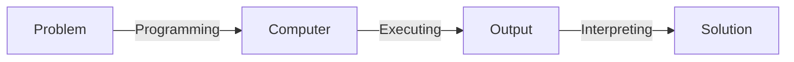
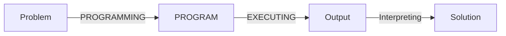
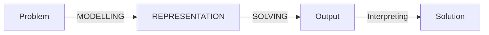
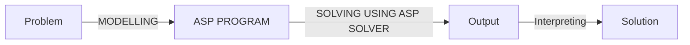

# [Week 3] Theory of Answer Set Programming

$$
\gdef\T{\top}
\gdef\F{\bot}
\gdef\NOT{\lnot}
\gdef\OR{\lor}
\gdef\AND{\land}
\gdef\IF{\leftarrow}
\gdef\THEN{\rightarrow}
\gdef\EQ{\leftrightarrow}

\T ~\F ~\NOT ~\OR ~\AND ~\IF ~\THEN ~\EQ
\\

\gdef\satisfy{\vDash}
\gdef\unsatisfy{\nvDash}
\gdef\crit{\neg H}

\gdef\so{\blacktriangleright}
\gdef\img{\imageof}
\gdef\cancel#1{\texttt{#1}}

\satisfy ~\unsatisfy ~\crit ~\so ~\iff ~\equiv ~\img
\\

\set{s,e,t} ~\Set{S,e,t}
\\

\gdef\txt#1{\texttt{#1}}

\txt{txt - some text inside}
\\

\gdef\R#1{{\color{red}{#1}}}
\gdef\G#1{{\color{green}{#1}}}
\gdef\B#1{{\color{blue}{#1}}}
\gdef\P#1{{\color{deeppink}{#1}}}
\gdef\V#1{{\color{darkviolet}{#1}}}

\R{red~\txt{r}~\AND} ~\B{blue~\txt{b}~\OR} ~\G{green~\txt{g}~\IF} ~\P{pink~\txt{r}~\THEN} ~\V{violet~\txt{r}~\EQ}
\\

\gdef\Rtxt#1{{\color{red}{\texttt{#1}}}}
\gdef\Gtxt#1{{\color{green}{\texttt{#1}}}}
\gdef\Btxt#1{{\color{blue}{\texttt{#1}}}}
\gdef\Ptxt#1{{\color{deeppink}{\texttt{#1}}}}
\gdef\Vtxt#1{{\color{darkviolet}{\texttt{#1}}}}

\Rtxt{tred $r$} ~\Btxt{tblue $b$} ~\Gtxt{tgreen $g$} ~\Ptxt{tpink $p$} ~\Vtxt{tviolet $v$}
\\

\gdef\Rbox#1{~{\colorbox{salmon}{$#1$}}~}
\gdef\Gbox#1{~{\colorbox{lightgreen}{$#1$}}~}
\gdef\Bbox#1{~{\colorbox{skyblue}{$#1$}}~}
\gdef\Pbox#1{~{\colorbox{pink}{$#1$}}~}
\gdef\Vbox#1{~{\colorbox{plum}{$#1$}}~}

\Rbox{bred~\txt{txt}~\AND} ~\Bbox{bblue~\txt{txt}~\OR} ~\Gbox{bgreen~\txt{txt}~\IF} ~\Pbox{bpink~\txt{txt}~\THEN} ~\Vbox{bviolet~\txt{txt}~\EQ}
\\

$$

## Introduction to Answer Set Programming

> OBJECTIVE: Explain the difference between declarative programming and traditional programming. Explain Answer Set Programming as a declarative programming method.

### Problem Solving

- "What is the problem?" vs. "How to solve the problem?"



- Traditional programming:



- Declarative programming:



### What is Answer Set Programming

- Declarative programming paradigm suitable for knowledge intensive and combinatorial search problems
- Theoretical basisL stable model semantics (Gelfond and Lifschitz, 1988)
- Expressive representation language
  - defaults
  - negation as failure
  - recursive definitions
  - aggregates
  - preferences
  - etc.
- ASP solvers
  - smodels (Helsinki University of Technology, 1996)
  - dlv (Vienna University of Technology, 1997)
  - cmodels (University of Texas at Austin, 2002)
  - phmodels (University of Kentucky, 2005)
  - Clasp/clingo (University of Potsdam, 2006) - winning several first places at ASP, SAT, Max-SAT, PB, CADE competitions
  - Wasp (University of Cabria, 2013)
  - dlv-hex for computing HEX programs
  - oClingo for reactive answer set programming
  - ...
- ASP Core 2: Standard language
- Annual ASP Competition

### Declarative Problem Solving using ASP

- The basic idea is:
  - to presnet the given problem by a set of rules,
  - to find answer sets for the program using an ASP solver,
  - and to extract the solutions from the answer sets



### N-Queens Puzzle

- No two queense can share the same row, column, or diagonal.

$$
\begin{array}{c|c}
  n & \text{\# solutions} \\ \hline
  3 & 0 \\
  4 & 2 \\
  5 & 20 \\
  6 & 4 \\
  7 & 40 \\
  8 & 92
\end{array}
$$

```clingo
% each row has exactly one queen
1 {queen(R,1..n)} 1 :- R=1..n.

% no two queens are on the same column
:- queen(R1,C), queen(R2,C), R1!=R2.

% no two queens are on the same diagonal
:- queen(R1,C1), queen(R2,C2), R1!=R2, |R1-R2|=|C1-C2|
```

```cmd
youmi@Youmis-MBP-M1 n_queens % clingo queens.lp -c n=8
youmi@Youmis-MBP-M1 n_queens % clingo queens.lp -c n=8 0
```

## Stable Models of Definite/Positive Programs

> OBJECTIVE: compute stable models of definite and positive programs by hand

### Syntax of Propositional Rules

- We consider rules as the restriced form of formulas in which implications occur in a limied way
  - we write $F \IF G$ to denote $G \THEN F$
- A (propositional) rule is a formula of the form $F \IF G$ where $F$ and $G$ are implication-free ($\F, ~\T, ~\NOT, ~\OR, ~\AND$ are allowed in $F$ and $G$)
  - we often write $F \IF \T$ simply as $F$
- Example: Is each of the following a propositional rule?
  - $p \IF (q\OR \NOT r)$, yes
  - $p \THEN (q\THEN r)$, no
  - $(p \OR q) \AND \NOT r \iff (p \OR q) \AND \NOT r \THEN F$, yes
- A PROPOSITIONAL PROGRAM is a set of propositional rules

### Representing Intrepretaion as Sets

- We identify an interpretation with the set of atoms that are true in it
- Example: interpretations of signature ${p, q}$

$$
\begin{array}{c|c|c}
p & q & I \\ \hline
f & f & \empty \\
f & t & \set{q} \\
t & f & \set{p} \\
t & t & \set{p,q}\\
\end{array}
$$

- Example: for signature $\set{p,q}$ the formulat $p \OR q$ has three models: $\set{q}, \set{p}, \set{p,q}$

### Minimal Models: Definition

About a model $I$ and formula $F$, we say that it is MINIMAL if no other model of $F$ is a subset of $I$

- Example: for signature $\set{p,q}$ the formulat $p \OR q$ has three models: $\set{q}, \set{p}, \set{p,q}$
  - the minimal models are: $\set{q}, \set{p}$
- Exercise: find all minimal models of the program $\{p \IF q, q\OR r\}$
  - $\set{r}$

### Minimal Models: Question

- Statement: If two formulas are equivalent under propositional logic, then they have the same minimal models
  - True:
    - equivalence means that both have same models, i.e. the same setof interpretations that make the formula true
    - taking the minimal model of each will be the same
- Question: Is the converse true, that two formulas having the same minimal models are equivalent?
  - False:
    - e.g. $p \IF q$ and $q \IF p$ both have minimal model $\empty$ but $\set{p} \satisfy p \IF q$ whereas $\empty$ but $\set{p} \unsatisfy q \IF p$

### Definite Propositional Rule: Definition

A propositional rule is DEFINITE if:

- its head is an ATOM, and
- its body (if it has one) does not contain negation

Examples: what is the minimal model of each program?

- $p \equiv p \IF \T$, $r \IF p \AND q$
  - minimal model: $\set{p}$
- $p \equiv p \IF \T$, $q \IF p \AND r$, $r \IF p \OR t$, $s \IF r \AND t$
  - minimal model:  $\{p, r, q\}$

### Definite Propositional Rule: An Algorithm

An algorithm to find a minimal mode of a definite propositional program

- $S = \empty$
- Repeat for each rule $head \IF body$ in $\Pi$ until there is no change in $S$
  - if $S \satisfy B$, then $S:= S \cup \{head\}$

### Definite Propositional Rule: An Exercise

Let $\Gamma$ be the program $ \{p_1 \IF p_2 \AND p_3, p_2 \IF p_3 \AND p_4, ... , p_8 \IF p_9 \AND p_{10} \}$
For each of the following programs, describe the step-by-step process of construction its minimal model:

- $\Gamma$ - minimal model $\empty$
- $\Gamma \cup \{p_5\}$ - minimal model $\{p_5\}$

$$
\begin{array}{ll}
p_5 \IF p_6 \AND p_7 & p_5 = \T \IF p_6 \AND p_7 \text{\ for any\ } p_6, p_7 \\
p_4 \IF p_5 \AND p_6 \\
p_3 \IF p_4 \AND p_5 \\
\end{array}
$$

- $\Gamma \cup \{p_5, p_6\}$ - minimal model $\{p_5\}$

$$
\begin{array}{ll}
p_5 \IF p_6 \AND p_7 & p_5 = \T \IF p_6 \AND p_7 \text{\ for any\ } p_6, p_7 \\
p_4 \IF p_5 \AND p_6 & p_5 \AND p_6 = \T \text{\ add }\ p_4 \text{\ to model\ }\\
p_3 \IF p_4 \AND p_5 & p_4 \AND p_5 = \T \text{\ add }\ p_3 \text{\ to model\ }\\
p_2 \IF p_3 \AND p_4 & p_3 \AND p_4 = \T \text{\ add }\ p_2 \text{\ to model\ }\\
p_1 \IF p_2 \AND p_3 & p_2 \AND p_3 = \T \text{\ add }\ p_1 \text{\ to model\ }\\
\end{array}
$$

### Definite Propositional Rule: A Proposition

A DEFINITE PROGRAM has a UNIQUE minimal mode

- Q: Find a counter example to the proposition if "definite" is dropped from the statement? No
  - $p\OR q \iff p \OR q \IF \T$, minimal models: $\set{p}$,$\set{q}$
  - $p \IF \NOT q$, minimal models: $\set{p}$,$\set{q}$
  - these are equivalent under propositional logic
  - equivalent programs have the same minimal models
A STABLE MODEL of a definite program $\Pi$ is THE minimal model of $\Pi$

- Q: Is every stable model of $\Pi$ a model of $\Pi$? Yes
  - every stable model is a minimal model, and every minimal model is a model

### Rationality Principle

Informally, program $\Pi$ can be viewed as a specification for stable models - sets of beliefs that could be held by a rational reasoner associated with $\Pi$

- Satisfy the rules of $\Pi$, i.e. if one believes in the body of a rule, one must also believe in its head
- Ahere to "the rationality principle" which says "believe nothing you are not forced to believe"

### Positive Programs

- A rule/program is POSITIVE, if it doesn't contain negation
  - Example: $p \IF q$ is positive; $p \IF \NOT q$ is not positive
- Q: True or False? Every definite program is positive. True (by definition)
- For positive programs, stable models are defined as minimal models
- Q: Does every positive program have a unique minimal mode? No
  - $p \OR q$ positive program, but has 3 minimal models: $\set{p}, ~\set{q}$
- A stable model of a definite program $\Pi$ is <u>THE minimal model</u>  of $\Pi$
- A stable model of a positive program $\Pi$ is <u>A minimal model</u> of $\Pi$

## Definite/Positive Programs in the Language of `clingo`

> OBJECTIVE: represent definite and positive programs in the language of `clingo` and using `clingo` to find the stable models

> OBJECTIVE: represent definitions in the language of `clingo`

### Terms in `clingo`

- Integers, symbolic constants (lowercase), and variables (uppercase)
  - `1, 2, 3, a, b, X, Y`
- $t_1 \odot t_2$ where $\odot$ is an arithmetic operation, and $t_1,~ t_2$ are terms
  - `3*4, 3+4, 3**x + 2*3`
- $|t|$ where $t$ is a term
  - `|-3|`
- terms that do not contian variables are called GROUND

### Value of Ground Term

The VALUE of a ground term is defined recurisively

- if $t$ is an integer or a symbolic constant then the only value of $t$ is $t$ itself
- if $t$ is $t_1 \odot t_2$ where $\odot$ is an arthmetic operation, then the value of $t$ is the integer $n_1 \odot n_2$, where the integer value $n_1$ is the value of $t_1$ and the integer $n_2$ is a value of $t_2$
  - in herbrand models, (3+4) is the value of the term
  - in clingo, (7) is the value of the term
- if $t$ is $|t_1|$ then the value of $t$ is the integer $|n_1|$, where the integer $n_1$ is a value of $t_1$

| `clingo` term | algebraic notation |
| :--: | :--: |
| `m*n` | $m \cdot n$ |
| `m/n` | $\lfloor m/n \rfloor$ |
| `m\n` | $m-n \cdot \lfloor m/n \rfloor$ |
| `m**n` | $\lfloor m^n \rfloor$ |

### Positive `clingo` Program

- an ATOM in a `clingo` program is a symbolic constant followed by a list of terms
- a COMPARISON is a pair of terms separated by comparison operators `=,!=, <, >, <=, >=`
  - True: `10 > 7, a > 7, c > a` (unicode)
- Positive clingo rules are either:
  - $H_1, ..., H_m\ (m \geq 1)$ or
  - $H_1, ..., H_m :- B_1, ..., B_n\ (m, n \geq 0)$
  where $H_1, ..., H_m, B_1, ..., B_n$ are atoms and comparisons

### Simple Example

- Data

| country | france | germany | italy | uk |
| :--: | :--: |  :--: |  :--: | :--: |
population (mm) | 65 | 83 | 61 | 64 |

```clingo
size(france, 65). size(germany, 83). size(italy, 61). size(uk, 64).
```

- Rule
  - a country $C$ is large if the population size of $C$ is $S_1$, the population size of the UK is $S_2$, amd $S_1 >S_2$
  - `:-` denotes IF
  - This is not a command; it is a declarative sentence explaining how we understand "large country"

```clingo
large(C) :- size(C, S1), size(uk, S2), S1 > S2.
```

- Stable model (a.k.a. answer set):

```clingo
size(france, 65) size(germany, 83) size(italy, 61) size(uk, 64) large(france) large(germany)
```

### Rule Instance

- An INSTANCE of a rule is obtained from the rule by substituting specific values for all its variables
  - the values come from the set $S$ of symbolic constants and the set $Z$ of integers

- Example 1:
  - Rule: `size(france, 65). size(germany, 83). size(italy, 61). size(uk, 64).`
  - Instances: `size(france, 65). size(germany, 83). size(italy, 61). size(uk, 64).`

- Example 2:
  - Rule: `large(C) :- size(C,S1), size(uk,S2), S1 > S2.`
  - Instances: $\forall v_0, v_1, v_2 \in S \cup Z$ where $S$ = {france, germany, italy, uk, large, size}
  $$\txt{large($v_0$) :- size($v_0$,$v_1$), size(uk,$v_2$), $v_1$ > $v_2$.}$$

### Propositional Image of `clingo` Programs: Definition

The PROPOSITIONAL IMAGE of a clingo program consists of the instances of its rules rewritten as propositional formulas.

To rewrite a ground rule as a formula,

- replace the symbol `:-` and all commas in the head and the body by propositional connectives as in the table show;

| `clingo` term | propositional al notation |
| :--: | :--: |
| `:-` | $\IF$ |
| comma in the body | $\land$ |
| comma in the head | $\lor$ |
| `not` | $\NOT$ |
| `#false` | $\F$ |
| `#true` | $\T$ |

- replace each comparison $t_1 < t_2$ in the head and in the body by $\T$ if is true, and by $\F$ if it is false; and
- replace the head of the rule by $\F$ if it is empty, and replace the body by $\T$ if it is empty.

#### Example

Propositional image of:

```clingo
size(france, 65). size(germany, 83). size(italy, 61). size(uk, 64).
large(C) :- size(C, S1), size(uk, S2), S1 > S2.
```

is:
$$
\begin{align*}
  \txt{size(france, 65), size(germany, 83), size(italy, 61), size(uk, 64).}  \tag{1} \\
  \txt{large($v_0$)$\IF$size($v_0$,$v_1$)$\land$ size(uk,$v_2$)$\AND \T \quad$ if  $v_1$ > $v_2$} \tag{2}\\
  \txt{large($v_0$)$\IF$size($v_0$,$v_1$)$\land$ size(uk,$v_2$)$\AND \F \quad$ otherwise} \tag{3}\\
  \txt{for all $v_0$, $v_1$, $v_2$ in $S\cup Z$}
\end{align*}
$$

simplify to below since (3) is always false and we are generating minimal models (tautological rule):
$$
\begin{align*}
  \txt{size(france, 65), size(germany, 83), size(italy, 61), size(uk, 64).}  \tag{1} \\
  \txt{large($v_0$)$\IF$size($v_0$,$v_1$)$\land$ size(uk,$v_2$)$\AND \T \quad$ if  $v_1$ > $v_2$} \tag{2}\\
  \txt{for all $v_0$, $v_1$, $v_2$ in $S\cup Z$}
\end{align*}
$$

and reduce further since $v_1 < v_2 = 64$ (uk) can be $65$ (france) or $83$ (germany)

$$
\begin{align*}
  \txt{size(france, 65), size(germany, 83), size(italy, 61), size(uk, 64).}  \tag{1} \\
  \txt{large(france)$\IF$size(france, 65)$\land$ size(uk, 64)} \\
  \txt{large(germany)$\IF$size(germany, 83)$\land$ size(uk, 64)}
\end{align*}
$$

#### Example

Consider the rule `child(X,Y) :- parent(Y,X).`

- translated into English: $X$ is a child of $Y$ if $Y$ is the parent of $X$
- run `clingo` on program consisting of the above and below rules, what is the stable model?

```clingo
parent(apple,banana). parent(banana,cat), parent(banana,dog).
```

- define precicate `grandparent/2` in terms of `parent/2`?

```clingo
grandparent(X,Z) :- parent(X,Y), parent(Y,Z).
```

- define predicate `siblings/2` in terms of `parent/2`?

```clingo
siblings(X,Y) :- parent(Z,X), parent(Z,Y), X != Y.
```

- sometimes the definition of apredicate consist of several rules.
  - e.g. below defines `parent/2` interns of `father/2` and `mother/2`.

```clingo
parent(X,Y) :- father(X,Y).
parent(X,Y) :- mother(X,Y).
```

- A predicate can be defined recursively. In a recusive definition, the defined predicate occurs not only in the heads of rules, but also in some of the bodies.
  - e.g. definition of `ancestor/2` in terms of `parent/2`

```clingo
ancestor(X,Y) :- parent(X,Y).
ancestor(X,Z) :- ancestor(X,Y), ancestor(Y,Z).
```

## Definite/Positive Programs in the Language of `clingo` Allowing Intervals

> OBJECTIVE: represent definite and positive programs allowing internavls in the language of `clingo`.

### Terms in `clingo` language [Allowing Intervals]

- the input language of `clingo` allows the notion of TERMS
- terms in `clingo` language are:
  - Integers, symbolic constants (lowercase), and variables (uppercase)
    - `1, 2, 3, a, b, X, Y`
  - $t_1 \odot t_2$ where $\odot$ is an arithmetic operation, and $t_1$, $t_2$ are terms
    - `3*4, 3+4, 3**x + 2*3`
  - $|t|$ where $t$ is a term
    - `|-3|`
- terms that do not contian variables are called GROUND

### Values of Ground Terms [Allowing Intervals]

The SET OF VALUES of a ground terms is defined recursively

- if $t$ is an integer or a symbolic constant then the only value of $t$ is $t$ itself
- if $t$ is $t_1 \odot t_2$ where $\odot$ is an arthmetic operation, then the <u>values of $t$</u> is the integer $n_1 \odot n_2$, where the integer value $n_1$ is the value of $t_1$ and the integer $n_2$ is a value of $t_2$
  - in herbrand models, (3+4) is the value of the term
  - in clingo, (7) is the value of the term
- if $t$ is $|t_1|$ then the <u>values of $t$</u> is the integer $|n_1|$, where the integer $n_1$ is a value of $t_1$

<span style="color:red">

-  if $t$ is $t_1 .. t_2$ then the values of $t$ are the integers $n$ for which there exists integers $n_1$ and $n_2$ such that:**
    - $n_1$ is a value of $t_1$ and $n_2$ is a value of $t_2$,
    - $n_1 \leq n \leq n_2$
    - e.g. $1..10 = \{1,2,3,...,10\}$ and $1..10 + 1 = \{2,3,...,11\}$

</span>

| term | value | reasoning |
| :--: | :--: | :-- |
| `2*2` | $\set{4}$ | value set containing only $4$ |
| `2/0` | $\empty$ | undefined |
| `2*a` | $\empty$ | can't multiply integer with symbolic constant |
| `(2..4)*(2..4)` | $\set{4, 6, 8, 9, 12, 16}$ | distributive, no duplicate values in sets |
| `6..5` | $\empty$ | undefinded since $n_1 \nleq n_2$ |
| `a..(a+1)` | $\empty$ | symbolic constant cannot be evaluated to integer values |
| `2**(-2)` | $\Set{ \lfloor \frac{1}{4} \rfloor = 0}$| no fractions in clingo, take floor |

- Find a ground term with values $\{1, 3, 9\}$: `3**(0..2)`

### Propositional Image of Head and Body Expressions

| expression | propositional image |
| :--: | :-- |
| atom $p(t_1,...,t_k)$ in the HEAD | CONJUCTION of all forumlas of the form $p(v_1, ..., v_k)$ where $v_i$ is a value of $t_i (i=1,...,k)$ |
| atom $p(t_1,...,t_k)$ in the BODY | DISJUNCTION of all forumlas of the form $p(v_1, ..., v_k)$ where $v_i$ is a value of $t_i (i=1,...,k)$ |
| comparison $t_1 \leq t_2$ in the HEAD | $\begin{cases} \T &\txt{if }  \forall v_1 \img t_1 \txt{ and } \forall v_2 \img t_2:&v_1 < v_2\\ \F &\txt{otherwise} \end{cases}$ |
| comparison $t_1 \leq t_2$ in the BODY | $\begin{cases} \T &\txt{if }  \exists v_1 \img t_1 \txt{ and } \exists v_2 \img t_2  \txt{ such that }&v_1 < v_2\\ \F &\txt{otherwise} \end{cases}$ |

- $p(1..2)$ in the head: $p(1) \AND p(2)$
- $p(1..2)$ in the body: $p(1) \OR p(2)$
- $1..2 = 2..3$ in the head: $\set{\overbrace{1=2}^{\R{\F}},~ \overbrace{2=3}^{\R{\F}},~ \overbrace{2=2}^\T,~ \overbrace{2=3}^{\R{\F}}} \equiv \R{\F}$
- $1..2 = 2..3$ in the body: $\set{\overbrace{1=2}^\F,~ \overbrace{2=3}^\F,~ \overbrace{2=2}^{\B{\T}},~ \overbrace{2=3}^\F} \equiv \B{\T}$

### Propositional Image of `clingo` Programs: Definition [Allowing Intervals]

The PROPOSITIONAL IMAGE of a `clingo` program consists of the instances of its rule rewritten as propositional formulas. To rewrite a ground rule as a formula:

- replace the symbol `:-` and all commas in the head and the body by propositional connectives as in the table shown
- $\Rtxt{replace each of the expressions in the head and the body by its propositional image as shown above}$
- replace the head of the rule by $\F$ if it is empty, and replace the body by $\T$ if it is

#### Examples

| `clingo` | propositional image |
| :--: | :-- |
| `square(1..2,1..2)` | $\iff sq(1..2,1..2) \IF \T \\ \iff sq(\set{1,2},\set{1,2}) \IF \T \\ \iff sq(1,1) \AND sq(1,2) \AND sq(2,1) \AND sq(2,2) \IF \T$ |
| `p(1..3).` | $\iff p(1..3) \IF \T \\ \iff p(\set{1,2,3}) \IF \T \\ \iff p(1) \AND p(2) \AND p(3) \IF \T$ |
| `X=1 :- p(X).` | $\iff X=1 \IF p(X) \\ \iff \begin{cases} \T \IF p(1) &\txt{if } X=1 \\ \F \IF p(v) &\forall v \in S\cup Z \backslash \{1\} \end{cases}$ |
| `p(1), p(2), p(3).` | $\iff  p(1),\ p(2),\ p(3) \IF \T \\ \iff p(1) \AND p(2) \AND p(3) \IF \T$ |
| `:- p(X), X>2.` | $\iff \F \IF p(X) \OR X>2 \\ \iff \begin{cases} \cancel{\F \IF} \cancel{p(v)\ \lor}\ \T  &\forall v > 2,\ v \in S\cup Z  \\ \F \IF p(v)\ \cancel{\lor\ \F} &\forall v \leq 2, \ v \in S\cup Z \end{cases}$ |

## More about `clingo` Program

> OBJECTIVE: use several directives of `clingo` programs

> OBJECTIVE: represente definitions related to artihmetic in the lanague of `clingo`

### `clingo` Directives

- comments - any text between the symbol % and the end of a line is a comment, disregarded by `clingo`

```clingo
% This is a comment, blah, blah, blah
```

- `#show` directive instructs clingo to show some elements of the stable model and suppress the others
- `/n` refres to the arity of the predicate symbol

```clingo
#show large/1.

p. p(a). p(a,b).
#show p/0. #show p/1. #show p/2.
```

- `#const` directive allows us to use a symbolic constant as a placeholder

```clingo
large(C) :- size(C,S1), size(uk,S2), S1 > S2

#const c0=uk.
large(C) :- size(C,S1), size(c0,S2), S1 > S2
```

- alternatively, the command line option `-c` can be used. add in the command line: `-c c0=uk`

```clingo
% large.lp
large(C) :- size(C,S1), size(c0,S2), S1 > S2
#show large/1.

% large_input.lp
#const c0=uk.
size(france,65; germany,83; italy,61; uk,64).
```

- multiple input files to `clingo` are concatenated, in the command line: `clingo large.lp large_input.lp`
- alternatively include another file using `#include`: `#include "large_input.lp"`

### Arithmetic

- compelx terms can be built from constants and variables using the symbols

| addition | multiplication | exponentiation | integer division | remainder | absolute value |
| :--: | :--: | :--: | :--: | :--: | :--: |
| `+` | `*` | `**` | `/` | `\` | `\|..\|` |

```clingo
p(N, N*N+ N+ 41) :- N=0..3.
```

- reads: $N$ and $N^2 + N + 41$ are in the relation $p/2$ if $N$ is one of the numbers $0,...,3$
- command: `clingo quadratic.lp`
- stable models: `p(0,41) p(1,43) p(2,47) p(3,53)`

### Placeholders

```clingo
p(N, a*N*N+ b*N+ c) :- N=0..n.
```

- reads: $N$ and $aN^2 + bN + c$ are in the relation $p/2$ if $N$ is one of the numbers $0,...,n$
- $a,b,c,n$ are placeholders for any values that can be specified in the command
- command: `clingo -c a=1 -c b=1 -c c=41 -c n=10 quadratic.lp`
- alternatively, put it in the file: `#const a=1. #const b=1. #const c=41. #const n=10.`

### Integer Arithmetic

The numbers that `clingo` knows about are integers. Find the stable models for `p(M, N) :- N=1..4, N=2*M.`

| `N` | `M` | `clingo` |
| :-: | :- | :- |
| $1$ | $\frac{1}{2}$ | fraction, ignore |
| $2$ | $\frac{2}{2} = 1$ | both integers, ok |
| $3$ | $\frac{3}{2}$ | fraction, ignore |
| $2$ | $\frac{4}{2} = 2$ | both integers, ok |

- stable models: $\Set{p(1,2),\ p(2,4)}$

### Intervals in Head

- intervals may be used not only in the bodies of rules but in the heads as well, e.g. `p(0..3).`
- which has the same meaning as the set of 4 facts: `p(0). p(1). p(2). p(3).`
- this group of facts can be also abbreviated using POOLING: `p(0; 1; 2; 3).`
- one-rule program that does not contain pooling and has the same model as `p(1,2; 2,4; 4,8; 8,16).`
  - `p(2**N, 2**(N+1)) :- N=0..3`
- one-rule program that has the stable model below
  - `p(M,N) :- M=1..4, N=1..4, M>=N`

```clingo
p(1,1)
p(2,1) p(2,2)
p(3,1) p(3,2) p(3,3)
p(4,1) p(4,2) p(4,3) p(4,4)
```

### Composite Numbers

An integer $N$ is composite if it is divisible by some numbers from $\set{2, ..., (N-1)}$

```clingo
composite(N) :- N=1..n, M=2..N-1, N\M=0
#const n=10.
```

### Fibonacci Numbers

Fibonacci numbers follow the recursive format $Fib(t_{i+2}) = Fib(t_i) + Fib(t_{i+1})$

```clingo
% fib(i, m): i-th fibonacci number is m
fib(0, 0).
fib(1, 1).
fib(N+2, F0+F1) :- fib(N, F0), fib(N+1, F1), N=0..(n-2).
```

### Factorials

```clingo
% fac(i, m): i-th factorial is m
fac(0,1).
fac(N+1, F*(N+1)) :- fac(N, F), N=0..n.

fac(F) :- fac(N, F).
#show fac/1.
```

## Negation as Failure: Informal Introduction

> OBJECTIVE: explain the intuitive meaning of negation as failure

### Recall: Syntax of Propositional Rules

- A (propositional) rule is either
  - a propositional formula $F$ that does not contain any implication symbol, or
  - a formula of the form $F \IF G$ where $F$ and $G$ are implication-free
- A propostional program is a set of propositional rules.

### Prolog vs. ASP

| `prolog/clingo` | propositional image |
| :-: | :-: |
| $\txt{p :- not q} \\ \txt{q :- not p}$ | $$p \IF \NOT q \\ q \IF \NOT p$$ |

- `Prolog` does not terminate on query `p` or `q`:

```prolog
? - p.
  ERROR: Out of local stack
    Exception: (729,178)
```
- `clingo` returns:

```clingo
Answer: 1
p
Answer: 2
q
```
- Finite ASP programs are guaranteed to terminate

### Negation as Failure

- Q: How do we extend the definition of a stable model in the presence of negation?

| $$p,\\ q,\\ r \IF p, \\ s\IF q $$ | $$p, \\ q, \\ r \IF p \AND \NOT s, \\ s \IF q $$ | $$p, \\ q, \\ r \IF p \AND \NOT s \\ ~ \\ $$ | $$p, \\ ~ \\ r \IF p \AND \NOT s, \\ s\IF q $$ |
| :-: | :-: | :-: | :-: |
| $\set{p,q,r,s}$ | $\set{p,q,s}$ | $\set{p,q,r}$ | $\set{p,r}$ |

- add $r$ to the model if $p$ is included under the conditional that $s$ is not included in teh model and will not be included in the future

### Informal Reading: Rationality Principle

- informally, program $\Pi$ can be viewed as a specification for stable models -- sets of beliefs that could be held by a rational reasoner associated with $\Pi$
- stable models will be represented by collections of atoms
- in forming such sets the reasoner must be guided by the following informal principles:
  - satisfy the rules of $\Pi$
    - if one believes in the body of a rule, one must also believe in its head
  - Adhere to the "rationality principle"
    - "believe nothing you not forced to believe"

| $$p \IF q$$ | $$p \IF \NOT q$$ | $$p \IF q\\ q \IF \NOT r$$ | $$p \IF \NOT q \\ q \IF \NOT r$$ | $$p \IF \NOT q \\ q\IF \NOT p$$ |
| :-: | :-: | :-: | :-: | :-: |
| $\empty$ | $\set{p}$ | $\set{p,q}$ | $\set{q}$ | $\set{p}$, $\set{q}$ |


## Negation as Failure: Theory

> OBJECTIVES: compute stable models of programs with negation by hand

### Critical Part

- a CRITICAL PART of a propositional rule is a subformula of its head or body taht begins with negation but is not part of another subformula that begins with negation
- example: find the critical parts of the propositional rule
  - $r \IF p \AND \Pbox{\NOT s}$
  - $\Pbox{\NOT p} \IF \Pbox{\neg(q \AND \NOT r)}$
  - $p \IF \Pbox{\NOT \NOT p}$
  - $p \OR \Pbox{\NOT p}$

### Stable Models of Programs with Negation

- the REDUCT $\Pi^X$ of $\Pi$ relative to an interpretation $X$ is the POSITIVE propositional program obtained from $\Pi$ by replacing each critical part $\crit$ of each of its rules
  - by $\T$ if $X$ satisfies $\crit$
  - by $\F$ otherwise
- $X$ is a STABLE MODEL of $\Pi$ if $X$ is a MINIMAL MODEL of the REDUCT $\Pi^X$


$$\Pi^X = \txt{replace critical part $\crit$ with }
\begin{cases}
  \T &\txt{if } X \satisfy \crit \\
  \F &\txt{if } X \unsatisfy \crit \\
\end{cases} \quad \txt{from }\Pi
$$
$$ X \txt{ stable model of } X =\txt{MinModel($\Pi^X$)} $$


$$\Gamma: \Set{p, q, r \IF p \AND \Pbox{\NOT s}, s \IF q} \so \txt{critical part } \crit = \Pbox{\NOT s}$$

| $X$ | Replace | $\Gamma^X$ | MinModel($\Gamma^X$) | $X$ Stable Model of $\Gamma$? |
| :-: | :-: | :-: | :-: | :-: |
| $\{p,q,s\}$ | $s \in X, s=\T \\\so \crit = \NOT s = \F \\\so X \unsatisfy \crit \\\so $ replace with $ \Pbox{\F}$ | $p \\ q \\ r\IF p \AND \Pbox{\F} \\ s \IF q$ | $\{p,q,s\}$ | $X = \{p,q,s\} =$ MinModel($\Gamma^X$) $\\ \so X$ stable model of $\Gamma$ |
| $\set{p,q}$ | $s \notin X, s =\F \\ \so \crit = \NOT s = \T \\ \so X \satisfy \crit \\ \so $ replace with $\Pbox{\T}$ | $p \\ q \\ r \IF p \AND \Pbox{\T} \\ s \IF q$ | $\{p,q,r,s\}$ | $X = \set{p,q} \neq \{p,q,r,s\}=$ MinModel($\Gamma^X$) $\\\so X$ not a stable model of $\Gamma$ |
| $\{p,q,r\}$ | $s \notin X, s =\F \\ \so \crit = \NOT s = \T \\ \so X \satisfy \crit \\ \so $ replace with $\Pbox{\T}$ | $p \\ q \\ r \IF p \AND \Pbox{\T} \\ s \IF q$ | $\{p,q,r,s\}$ | $X = \{p,q,r\} \neq \{p,q,r,s\}=$ MinModel($\Gamma^X$) $\\\so X$ not a stable model of $\Gamma$ |


### Steps to Find Stable Models (Succinct)

Given a propositonal program $\Pi$

1. Guess an interpretation $X$
2. Find the reduct of $\Pi$
3. Check if $X$ is a minimal model of $\Pi^X$ (note that $\Pi^X$ is a positive program; i.e. has no negation)
  - if yes, conclude $X$ is a stable model of $\Pi$
  - if no, conclude $X$ is NOT a stable model of $\Pi$

### Steps to Find Stable Models (Verbose)

Given a propositional program $\Pi$

1. Guess an interpretation $X$
2. Find the reduct of $\Pi$ relative to $X$ (i.e., $\Pi^X$)
3. Check if $X$ satisfies $\Pi^X$ (alternatively, check if $X$ satisifes $\Pi$)
  - if yes, continue
  - if no, conclude $X$ is NOT a stable model of $\Pi$
4. Check if no other interpretation that is smaller than $X$ satisfies $\Vbox{\Pi^X}$ ; i.e., for each interpretation $Y$ that is smaller than $X$,
  - if $Y$ satisfies $\Vbox{\Pi^X}$ , conclude $X$ is NOT a stable model of $\Pi$
  - else continue
5. Conclude $X$ is a stable model of $\Pi$

NOTES:
- every stable models is a model
- $\Vbox{\Pi^X}$  can't be replaced with $\Pi$

#### Example A

Find all stable models of $\Bbox{\Pi} : \Set{ p \IF \Pbox{\NOT q}} \so \crit = (\NOT q)$ critical part

| $X$ | Replace $\\\crit$ | Reduct $\\\Vbox{\Pi^X}$ | Satisfy? $\\X \Gbox{\satisfy} \Vbox{\Pi^X}$ | Minimal? $\\\Gbox{\forall} I \sub X: I \Gbox{\unsatisfy} \Vbox{\Pi^X}$ | $X \Gbox{\txt{STABLE MODEL}}\\$ of $\Bbox{\Pi}$?
| :-: | :-: | :-: | :-: | :-: | :-: |
| $\empty$ | $q \notin X, q = \B \\ \crit = \T \\\so X \satisfy \crit \\\so$ replace $\crit$ with $\T$ | $\Pi^\empty: \\ p \IF \T$ | $X = \empty \Rbox{\unsatisfy} \Pi^\empty$ | N/A | $X = \empty\\ \Rbox{\txt{NOT}}$ stable model of $\Pi$ |
| $\set{p}$ | $q \notin X, q = \B \\ \crit = \T \\\so X \satisfy \crit \\\so$ replace $\crit$ with $\T$ | $\Pi^{\set{p}}: \\ p \IF \T$ | $X = {\set{p}} \Gbox{\satisfy} \Pi^{\set{p}}$ | only $\\\empty \sub \set{p} \so \empty \Gbox{\unsatisfy} \Pi^{\set{p}}$ | $X = \set{p} \\ \Gbox{\txt{STABLE MODEL}}$ OF $\Pi$ |
| $\set{q}$ | $q \in X, q = \T \\ \crit = \F \\\so X\unsatisfy \crit \\\so$ replace $\crit$ with $\F$ | $\Pi^{\set{q}}: \\ p \IF \F \\$ <u>tautology</u> | <u>tautology</u> $\so \\ \forall I: I \Gbox{\satisfy} \Pi^{\set{q}}$ | <u>tautology</u> $\so \\ \empty \sub X \so \empty\ \Rbox{\satisfy} \Pi^X$ | $X = \set{q}\\ \Rbox{\txt{NOT}}$ stable model of $\Pi$ |
| $\set{p,q}$ | $p, q \in X, q = \T \\ \crit = \F \\\so X \unsatisfy \crit \\\so$ replace $\crit$ with $\F$ | $\Pi^{\set{p,q}}: \\ p \IF \F \\$ <u>tautology</u> | <u>tautology</u> $\so \\ \forall I: I \Gbox{\satisfy} \Pi^{\set{p,q}}$ | <u>tautology</u> $\so \\ \empty \sub X \so \empty \Rbox{\satisfy}\Pi^X$ | $X = \set{q}\\ \Rbox{\txt{NOT}}$ stable model of $\Pi$ |

- NOTE: DO NOT skip $X=\set{p,q}$
  - although $\set{p}, \set{q} \sub \set{p,q}: \set{p} \satisfy \Pi^{\set{p}}, \set{q} \satisfy \Pi^{\set{q}}$
  - does not necessarily imply $\set{p} \satisfy \Pi^{X=\set{p,q}}, \set{q} \satisfy \Pi^{X=\set{p,q}}$

#### Example B

Find all stable models of  $\Pi : \Set{ p \AND q, r \IF \NOT p} \so \crit = (\NOT p)$ critical part

| $X$ | Reduct $\Pi^X$ | Satisfy? $X \satisfy \Pi^X$ | Minimal? $ \forall I \sub X: I \unsatisfy \Pi^X$ | $X$ Stable Model of $\Pi$?
| :-: | :-: | :-: | :-: | :-: |
| $\empty$ | $p \OR q \\ r \IF \T \\$ (1) | no | - | ❌ |
| $\set{p}$ | $p \OR q \\ \cancel{r \IF \F}\\$ (2) | yes | yes $\\ \empty \sub X: \empty \unsatisfy$ (2) | ✅ |
| $\set{q}$ | (1) | no | - | ❌ |
| $\set{r}$ | (1) | no | - | ❌ |
| $\set{p,q}$ | (2) | yes | no $\\ \set{p} \sub X: \set{p} \satisfy$ (2) | ❌ |
| $\set{p,r}$ | (2) | yes | no $\\ \set{p} \sub X: \set{p} \satisfy$ (2) | ❌ |
| $\set{q,r}$ | (1) | yes | yes $\\ \empty \sub X: \empty \unsatisfy$ (1) $\\ \set{q} \sub X: \empty \unsatisfy$ (1) $\\ \set{r} \sub X: \empty \unsatisfy$ (1) | ✅ |
| $\set{p,q,r}$ | (2) | yes | no $\\ \set{p} \sub X: \set{p} \satisfy$ (2) $\\ \set{q,r} \sub X: \set{p} \satisfy$ (2) | ❌ |

#### Example C

Find all stable models of each of the following single rule programs:

- $p \IF \NOT p \implies \txt{critical } \crit = (\NOT p) $

| $X$ | $\Pi^X$ | $X \satisfy \Pi^X$? | $X = min(I): I \satisfy \Pi^I$ | $X$ Stable Model of $\Pi$?
| :-: | :-: | :-: | :-: | :-: |
| $\empty$ | $p \IF \T$ | no | - | ❌ |
| $\set{p}$ | $\cancel{p \IF \F} \\$ tautology | yes | no, tautology | ❌ |

- $p \IF \NOT \NOT p \implies \txt{critical } \crit = (\NOT \NOT p) $

| $X$ | $\Pi^X$ | $X \satisfy \Pi^X$? | $X = min(I): I \satisfy \Pi^I$ | $X$ Stable Model of $\Pi$?
| :-: | :-: | :-: | :-: | :-: |
| $\empty$ | $\cancel{p \IF \F} \\$ tautology | yes | yes | ✅ |
| $\set{p}$ | $p \IF \T$ | yes | yes, $\empty \unsatisfy \Pi^{\set{p}}$ | ✅ |

- $p \OR \NOT p \implies \txt{critical } \crit = (\NOT p) $

| $X$ | $\Pi^X$ | $X \satisfy \Pi^X$? | $X = min(I): I \satisfy \Pi^I$ | $X$ Stable Model of $\Pi$?
| :-: | :-: | :-: | :-: | :-: |
| $\empty$ | $\cancel{p \OR \T}\\$ tautology | yes | yes | ✅ |
| $\set{p}$ | $p ~\cancel{\OR \F}$ | yes | yes, $\empty \unsatisfy \Pi^{\set{p}}$ | ✅ |

### Inclusive vs. Exclusive OR

- stable models of $\Pi = \Set{p \OR q}$
  - $\set{p},~ \set{q}$
- stable models of $\Pi = \Set{p \OR q,~ p \IF q}$
  - $\set{p}$
- stable models of $\Pi = \Set{p \OR q,~ p \IF q,~ q \IF p}$
  - $\set{p,~q}$

### Models vs. Stable Models

Equivalent propositional programs (i.e. having same models) may have different stable models:

| $\Pi$ | models | stable models |
| :-: | :-: | :-: |
| $p \IF \NOT q$ | $\set{p},~\set{q},~\set{p,q}$ | $\set{p}$ |
| $q \IF \NOT p$ | $\set{p},~\set{q},~\set{p,q}$ | $\set{q}$ |
| $p \OR q$ | $\set{p},~\set{q},~\set{p,q}$ | $\set{p},~\set{q}$ |

| $\Pi$ | models | stable models |
| :-: | :-: | :-: |
| $p \OR \NOT p$ | tautology, so all interpretations are models | $\empty,~ \set{p}$ |
| $q \OR \NOT q$ | tautology, so all interpretations are models | $\empty,~ \set{q}$ |

### Minimal Models vs. Stable Models

- Are stable models the same as minimal models? NO
- Recall the definition: $X$ Is a stable model of $\Pi$ if $X$ is a minimal model of $\Pi^X$
- FALSE: for any program $\Pi$, $X$ is a stable model of $\Pi$ if $X$ is a minimal model of $\Pi$

## `clingo` programs with Negation

### `clingo` Rules

- clingo rules are either
  - $H_1, ..., H_m~ (m \geq 1)$ or
  -  $H_1, ..., H_m :- B_1,...,B_n~ (m,n \geq 0)$
- where $H_1, ..., H_m, B_1,...,B_n$ are atoms and comparisons
- $\Rtxt{possibly preceded with not } \R{(\txt{for }\NOT)}  $
- example

```clingo
p(a), p(b).
q(a) :- p(X), r(X).
r(X) :- p(X), not q(X).
```
### Recall: Propositional Image of Head and Body Expressions

| expression | propositional image |
| :--: | :-- |
| atom $p(t_1,...,t_k)$ in the HEAD | CONJUCTION of all forumlas of the form $p(v_1, ..., v_k)$ where $v_i$ is a value of $t_i (i=1,...,k)$ |
| atom $p(t_1,...,t_k)$ in the BODY | DISJUNCTION of all forumlas of the form $p(v_1, ..., v_k)$ where $v_i$ is a value of $t_i (i=1,...,k)$ |
| comparison $t_1 \leq t_2$ in the HEAD | $\begin{cases} \T &\txt{if }  \forall v_1 \img t_1 \txt{ and } \forall v_2 \img t_2:&v_1 < v_2\\ \F &\txt{otherwise} \end{cases}$ |
| comparison $t_1 \leq t_2$ in the BODY | $\begin{cases} \T &\txt{if }  \exists v_1 \img t_1 \txt{ and } \exists v_2 \img t_2  \txt{ such that }&v_1 < v_2\\ \F &\txt{otherwise} \end{cases}$ |

- $p(1..2)$ in the head: $p(1) \AND p(2)$
- $p(1..2)$ in the body: $p(1) \OR p(2)$
- $1..2 = 2..3$ in the head: $\set{\overbrace{1=2}^{\R{\F}},~ \overbrace{2=3}^{\R{\F}},~ \overbrace{2=2}^\T,~ \overbrace{2=3}^{\R{\F}}} \equiv \R{\F}$
- $1..2 = 2..3$ in the body: $\set{\overbrace{1=2}^\F,~ \overbrace{2=3}^\F,~ \overbrace{2=2}^{\B{\T}},~ \overbrace{2=3}^\F} \equiv \B{\T}$

### Recall: Propositional Image of `clingo` Programs: Definition [Allowing Intervals]

The PROPOSITIONAL IMAGE of a `clingo` program consists of the instances of its rule rewritten as propositional formulas. To rewrite a ground rule as a formula:

- replace the symbol `:-` and all commas in the head and the body by propositional connectives as in the table shown
- $\Rtxt{replace each of the expressions in the head and the body by its propositional image as shown above}$
- replace the head of the rule by $\F$ if it is empty, and replace the body by $\T$ if it is

#### Exercise:

Check if $Z=\set{p(a),~ q(a)}$ is a stable model of the below program
```clingo
p(a).
q(a).
r(X) :- p(X), not q(X).
```

1. Construct the propositional image: $\Pi = \Set{p(a),~ q(a),~ r(v) \IF p(v) \AND \NOT q(v)} $

2. Find the reduct relative to $Z$

$$ \begin{align*}
\Pi &= \begin{Bmatrix}
  p(a),~ q(a), \\
  r(v) \IF \ p(v) \AND \NOT q(v) & \forall v \in S \cup Z
\end{Bmatrix}  \\
&= \begin{Bmatrix}
  p(a),~ q(a), \\
  r(a) \IF p(a) \AND \NOT q(a), \\
  r(v) \IF p(v) \AND \NOT q(v) & \forall v \in S \cup Z\backslash\set{a}
\end{Bmatrix}
\\
\Pi^Z &= \begin{Bmatrix}
  p(a),~ q(a), \\
  r(a) \IF \cancel{p(a) \AND \F} &\txt{tautology},\\
  r(v) \IF p(v)~ \cancel{\AND ~\T} & \forall v \in S \cup Z\backslash\set{a}
\end{Bmatrix}
\end{align*}
$$

3. Check if $Z$ is a minimal model of the reduct $\Pi^Z$

- rationality priciple: only believe when forced
- $r(v) \IF p(v)~ (v \neq a) \so$ provides no additional info, not forced to believe and does not add to minimal model
- minimal model of $\Pi^Z$: $S = \set{p(a),~ p(b)} = Z$

#### Example

- Find the porpositional image of:

```clingo
p(1..3).
q(X) :- X=2..4, not p(X).
```

$$\begin{align*}
\Pi &= \begin{Bmatrix}
  p(1), p(2), p(3),\\
  q(2) \IF (2=\set{2,3,4}) \AND \NOT p(2) &\iff q(2) \IF \cancel{\T \AND} \NOT p(2),\\
  q(3) \IF (3=\set{2,3,4}) \AND \NOT p(3) &\iff q(3) \IF \cancel{\T \AND} \NOT p(3),\\
  q(4) \IF (4=\set{2,3,4}) \AND \NOT p(4) &\iff q(4) \IF \cancel{\T \AND} \NOT p(4),\\
  q(v) \IF (v=\set{2,3,4}) \AND \NOT p(v) &\iff g(v) \IF \cancel{\F \AND \NOT p(v)} &\forall v \in S \cup Z\backslash\set{2,3,4}
\end{Bmatrix} \\
&=  \begin{Bmatrix}
  p(1), p(2), p(3),\\
  q(2) \IF \NOT p(2) \\
  q(3) \IF \NOT p(3) \\
  q(4) \IF \NOT p(4) \\
  q(v) \IF \F &\txt{tautology}&\forall v \in S \cup Z\backslash\set{2,3,4}
\end{Bmatrix}
\end{align*}
$$

- Find the reduct relative to $Y = \set{p(1),~ p(2),~ p(3),~ q(4)}$

$$
\Pi^Y = \begin{Bmatrix}
  p(1), p(2), p(3),\\
  q(2) \IF \F & \txt{tautology}\\
  q(3) \IF \F & \txt{tautology}\\
  q(4) \IF \T \\
  q(v) \IF \F &\txt{tautology}&\forall v \in S \cup Z\backslash\set{2,3,4}
\end{Bmatrix} = \Set{ p(1),~ p(2),~ p(3),~ q(4) \IF \T }
$$

- Find minimal model of reduct $\Pi^Y$: minimal model =  $\set{p(1),~ p(2),~ p(3),~ q(4)} = Y$

### Definition: Prime

$N$ is a prime number between $1$ and $n$ if
- it is one of the numbers $2,...,n$ and
- there is no evidence that it is composite

```clingo
composite(N) :- N=1..n, I=2..N-1, N\I = 0.
prime(N) :- N=2..n, not composite(N).
```

### Practice quiz:

- If the minimal models of F are exactly the same as the minimal models of G, then the models of F are exactly the same as the models of G.
  - FALSE: $F= p \OR \NOT q$ and $G = p \OR \NOT p$ both have $\empty$ as minimal model, but has different models
- If the minimal models of F are exactly the same as the minimal models of G, then F and G are equivalent under propositional logic.
  - FALSE: $F= p \OR \NOT q$ and $G = p \OR \NOT p$ both have $\empty$ as minimal model, but has different models and thus not equivalent under propositional logic

- If $(F \THEN G) \AND (G \THEN F)$ is a tautology under propositional logic, then the minimal models of $F$ are exactly the same as the minimal models of $G$.
  - TRUE: "$(F \THEN G) \AND (G \THEN F)$ is a tautology" means that it is satisfied by all interpretations. Thus, for any interpretation $I$, $I$ must entail both $F \THEN G$ and $G \THEN F$, in other words, $I$ satisfies $F$ iff $I$ satisfies $G$. It means that the models of $F$ are exactly the models of $G$, consequently, the minimal models of $F$ are exactly the minimal models of $G$.

- If $F$ entails $G$, then the minimal models of $F$ are exactly the same as the minimal models of $G$.
  - FALSE: all models of $F$ are also models of $G$ but not all models of $G$ are models of $F$. Min models may not necessarily be the same.

