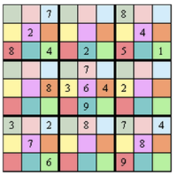

### 1. What are the stable models of the following program?

```clingo
{q} ← ¬p
```
- [ ] ∅,  {p}, {q}
- [ ] ∅
- [ ] ∅, {p}, {q}, {p, q}
- [ ] ∅ and {q}

#### NOTE:
Since there is no rule to derive p, p must be false in any stable model (if it exists). Thus ¬p must be true, and the choice rule {q} must be true. Think about the stable models of {q}.

### 2. How many stable models are there for the following clingo program?

```clingo
p(1..2).
q(1..2).
{r(X,Y): q(X)} :- p(Y).
```
- [ ] 16
- [ ] 8
- [ ] 1
- [ ] 4

#### NOTE:
We first ground the given ASP program into the following program without variable.
```clingo
(1). p(2).
q(1). q(2).
{r(1,1); r(2,1)} :- p(1).
{r(1,2); r(2,2)} :- p(2).
```
This program can be simplified into
```clingo
p(1). p(2).
q(1). q(2).
{r(1,1); r(2,1)}.
{r(1,2); r(2,2)}.
```
Think about how many stable models are there for this program, starting from thinking about how many stable models are there for `{r(1,1); r(2,1)}`.

### 3. Consider the following clingo program. Which option is correct?

```clingo
{p(X)} :- q(X).
```
- [ ] This program has 4 stable models and X is a local variable.
- [ ] This program has 1 stable model and X is a global variable.
- [ ] This program has no stable model and X is a global variable.
- [ ] This program has 2 stable models and X is a local variable.

#### NOTE:

A local variable is a variable such that all its occurrences in the rule are in between { ... }. Other variables are global variables. Obviously, the variable X is not a local variable, thus is a global variable.

Furthermore, since there is no rule to derive q(X), q(X) is always false for any X, the program is equivalent to T (which is always true and can represent the ASP program with no rule). The stable model of T is the empty set ∅.

### 4. The following clingo program represents a function from set A={a,b,c} to set B={1,2}. Which kind of function does it represent?
```clingo
a(a;b;c).
b(1..2).
1{f(X,Y) : b(Y)}1 :- a(X).
:- b(Y), #count{X:f(X,Y)}=0.
```
- [ ] Bijective function
- [ ] Onto function
- [ ] 1-1 function
- [ ] 1-1 correspondence function

#### NOTE:
The 3rd rule `1{f(X,Y) : b(Y)}1 :- a(X).` represents that f is a function from X to Y since for each X, there is exactly one Y that is mapped from X.

The 4th rule `:- b(Y), #count{X:f(X,Y)}=0.` represents that there does not exist a Y such that no X is mapped to Y.

Together is the definition of onto function.

### 5. Which English sentence does the following rule in “Hamiltonian Cycle” problem represent?
```clingo
{in(X,Y) : edge(X,Y)} = 1 :- vertex(X).
```
- [ ] Every vertex is connected to exactly one vertex.
- [ ] Every vertex is reachable in the Hamiltonian Cycle from a vertex Y.
- [ ] Every vertex has only one incoming edge in the cycle.
- [ ] Every vertex has only one outgoing edge in the cycle.

#### NOTE:
Note that edge(X,Y) means that "there is a directed edge from X to Y", thus in(X,Y) means that the directed edge from X to Y is included in the Hamiltonian Cycle. So in(X,Y) is talking about an outgoing edge from X.

### 6. In Offset Sudoku, a region is represented by the same color. In addition to the requirement of Sudoku, every region must contain all the digits 1 through 9.



**Given that position (3,3) is 4, which option ALONE weeds out the possibility of 4 being at position (6,3) in the green region?**
- [ ] :- a(R,C,N), a(R,C1,N), C != C1.
- [ ] :- a(R,C,N), a(R1,C,N), R != R1.
- [ ] :- a(R,C,N), a(R,C+3,N).
- [ ] :- a(R,C,N), a(R1,C1,N), R != R1, C!=C1, R\3 = R1\3, C\3 = C1\3.

#### NOTE:
First, we know a(3,3,4) is true.

Second, we can easily check whether the given constraint is triggered (i.e., the body part of this rule is true) when we assume a(6,3,4) is true. Indeed, the grounded rule (where R=3, C=3, N=4, R1=6, C1=3) as shown below is not triggered since 3!=3 is false.

:- a(3,3,4), a(6,3,4), 3!=6, **3!=3**, 3\3=6\3, 3\3=3\3.


### 7. What is the stable model of the following clingo program?
```clingo
a(X) :- X = #count{M,N : M=1..3, N=1..3}.
```
- [ ] {a(3)}
- [ ] {a(18)}
- [ ] ∅
- [ ] {a(9)}

#### NOTE:
This question is basically asking what is the value of the count aggregate "#count{M,N : M=1..3, N=1..3}". There are 2 steps.

First, generate the set of tuples <M,N> such that M=1..3 is true and N=1..3 is true. Thus M could be any number in {1, 2, 3} and N could be any number in {1, 2, 3}. Then, the set should be as follows.

{<1,1>, <1,2>, <1,3>, <2,1>, <2,2>, <2,3>, <3,1>, <3,2>, <3,3>}

Second, we count the number of elements in the above set, and it is 9.

### 9. Which option is the stable model of the following clingo program with #count aggregate?
```clingo
p(a,1). p(b,1). p(c,2). p(a,1).
q(N) :- N = #count{A,X : p(A,X)}.
```
- [ ] {q(4)}
- [ ] {p(a,1), p(b,1), p(c,2)}
- [ ] {p(a,1), p(b,1), p(c,2), q(3)}
- [ ] {p(a,1), p(b,1), p(c,2), q(4)}

#### NOTE:
First, don't forget to include the given facts in the program into the stable model. The set of given facts is {p(a,1), p(b,1), p(c,2)}.

Second, let's find the derived fact q(N). We need to find the value of the count aggregate "#count{A,X : p(A,X)}". There are 2 steps.

1. Generate the set S of tuples <A,X> such that p(A,X) is true. Set S should be as follows. Note that there cannot be any duplications in a set, thus we do not write <a,1> twice.

    {<a,1>, <b,1>, <c,2>}

2. Count the number of elements in set S, and it is 3.Third, q(3) should also be included in the stable model.

### 10. Consider the following clingo program. Which option is the stable model of this program?
```clingo
a(1,2; -5; -1,-7; -3,9; 1,2).
b(N) :- N = #sum{X,Y : a(X,Y)}.
```
- [ ] {a(1,2), a(-5), a(-1,-7), a(-3,9), a(1,2), b(-2)}
- [ ] {a(1,2), a(-5), a(-1,-7), a(-3,9), b(-3)}
- [ ] {a(1,2), a(-5), a(-1,-7), a(-3,9), b(-8)}
- [ ] {a(1,2), a(-5), a(-1,-7), a(-3,9), b(3)}

#### NOTE:
First, don't forget to include the given facts in the program into the stable model. The set of given facts is {a(1,2), a(-5), a(-1,-7), a(-3,9)}. Note that there cannot be any duplications in a set, thus we cannot write a(1,2) twice in this set of facts.

Second, let's find the derived fact b(N). We need to find the value of the sum aggregate "#sum{X,Y : a(X,Y)}". There are 2 steps.

1. Generate the set S of tuples <X,Y> such that a(X,Y) is true. Set S should be as follows. Note that there cannot be any duplications in a set, thus we do not write <1,2> twice. Also note that <-5> cannot be included since it does not follow the 2 tuple form <X,Y>.

    {<1,2>, <-1,7>, <-3,9>}

2. Accumulate the first element of each tuple in set S, and it is -3. Third, b(-3) should also be included in the stable model.
