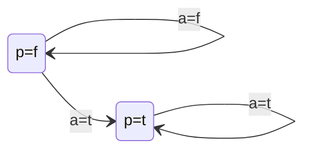

# [Week 5] Reasoning about Actions
$$
\gdef\T{\top}
\gdef\F{\bot}
\gdef\NOT{\lnot}
\gdef\OR{\lor}
\gdef\AND{\land}
\gdef\IF{\leftarrow}
\gdef\THEN{\rightarrow}
\gdef\EQ{\leftrightarrow}

\gdef\satisfy{\vDash}
\gdef\unsatisfy{\nvDash}
\gdef\crit{\neg H}

\gdef\so{\blacktriangleright}
\gdef\img{\imageof}
\gdef\rm#1{~\cancel{#1}~}
\gdef\xrm#1{~\xcancel{#1}~}
\gdef\srm#1{~\sout{#1}~}

\gdef\txt#1{\texttt{#1}}

\gdef\R#1{{\color{red}{#1}}}
\gdef\G#1{{\color{green}{#1}}}
\gdef\B#1{{\color{blue}{#1}}}
\gdef\P#1{{\color{deeppink}{#1}}}
\gdef\V#1{{\color{darkviolet}{#1}}}

\gdef\Rtxt#1{{\color{red}{\texttt{#1}}}}
\gdef\Gtxt#1{{\color{green}{\texttt{#1}}}}
\gdef\Btxt#1{{\color{blue}{\texttt{#1}}}}
\gdef\Ptxt#1{{\color{deeppink}{\texttt{#1}}}}
\gdef\Vtxt#1{{\color{darkviolet}{\texttt{#1}}}}

\gdef\Rbox#1{~{\colorbox{salmon}{$#1$}}~}
\gdef\Gbox#1{~{\colorbox{lightgreen}{$#1$}}~}
\gdef\Bbox#1{~{\colorbox{skyblue}{$#1$}}~}
\gdef\Pbox#1{~{\colorbox{pink}{$#1$}}~}
\gdef\Vbox#1{~{\colorbox{plum}{$#1$}}~}

\gdef\CHOOSE#1#2{(#1\ \mathbf{C}\ #2)}
$$

## Intro to Reasoning about Actions

> OBJECTIVE: explain the idea of reasoning about actions

### What is Reasoning about Actions?

- concerned with developing appropriate formalisms for describing the properties of actions
- an action is anything that can be executed and may change the state of the world:
  - walking to a location
  - buying an item
  - shooting a turkey
  - sending a message in a network - binding of a ligand to a receptor

### Monkey and Bananas

How can the monekey grasp the bananas?


### Action Description Languages

Formal models of parts of natural language that are used for describing the effects of actions. Define “transition systems” as directed graphs whose vertices correspond to states and whose edges are labeled by actions.

### Transition System

A TRANSITION SYSTEM is a directed graph:
- whose vertices correspond to the states of the world
- whose edges are labelled by actions



### Fluents and Commonsense Law of Inertia

- FLUENT: anything that depends on the state of the world
  - whether the monkey has the bananas
  - whether the monkey is on the box
  - locations of the monkey, the bananas and the box (MULTI-VALUED FLUENTS)
- Commonsense law of INERTIA: by default, the values of fluents remain unchanged after executing actions
- The Frame Problem: how to formalize the commonsense law of inertia, that is, how to represent inertial fluents - solved in mid 1990’s

### Yale Shooting Problem (1987)

Fred is initially alive and a gun is initially unloaded. Loading the gun, waiting for a moment, and then shooting the gun at Fred is expected to kill Fred.

$$
\begin{Bmatrix}
  alive(0) \\
  \NOT loaded(0) \\
  load(0) \THEN loaded(1) \\
  loaded(2) \AND shoot(2) \THEN \NOT alive(3)
\end{Bmatrix} \unsatisfy \NOT alive(3)
$$

- Early attempts were based on minimizing the changes:
  - consider only the models that minimize changes in alive and loaded
  - both models have 2 changes, with different results
$$
\begin{array}{ll}
  \begin{Bmatrix}
    alive(0) \\
    \NOT loaded(0) \\
    load(0) \THEN loaded(1) \\
    loaded(2) \AND shoot(2) \THEN \NOT alive(3) \\
    \B{load(0)} \\
    \B{shoot(0)}
  \end{Bmatrix} &
  \begin{array}{cccccc}
    alive(0) && alive(1) && alive(2) & \R{\leadsto} & \NOT alive(3) \\
    \NOT loaded(0) &\R{\leadsto}& loaded(1) && loaded(2) && loaded(3) \\
    \\ ~ \\
    alive(0) && alive(1) && alive(2) && alive(3) \\
    \NOT loaded(0) &\R{\leadsto}& loaded(1) &\R{\leadsto}& loaded(2) && loaded(3) \\
  \end{array}
\end{array}
$$

## Simple Transition System in ASP

> OBJECTIVE: model simple transition systems in answer set programming

### Transition system

A transition system is a directed graph
- whose vertices correspond to the states of the world
- whose edges are labelled by actions


### Representing Simple Transition System in ASP

- use the following atoms: `p(t,0), p(f,0), p(t,1), p(f,1), a(0).`
- the effect of executing the action is described by `p(t,1) :- a(0).`
- need to describe:
  1. how to determine the value of p in the initial state
  2. how to determine whether action a is executed
  3. how to determine the value of p in the final state if a is not executed
  4. exactly one of the atoms `p(t,T), p(f,T)` is true at any time `T=0` or `T=1`


#### (i) value of `p` in the initial state
- initial state of the system is arbitrary:
  ```clingo
  1{p(t,0); p(f,0)}1.
  ```
- whichever causes determine the initial state of the system, they are outside the theory (a priori)
  - the value of `p` in the initial state is “exogenous"
-  above rule also covers part of (iv) in the initial state

#### (ii) determine whether action `a` is executed
- whichever causes determine whether or not the action is executed, they are outside the theory; the value of a is exogenous
  ```clingo
  {a(0)}.
  ```


#### (iii) determine the value of `p` in the final state $s_1$ if `a` is not executed

#### (iv) describe exactly one of the atoms `p(t,T), p(f,T)` is true at any time `T=0` or `T=1`
- when action a is not executed, the value of p in the next state is determined by “the commonsense law of inertia”:
  ```clingo
  {p(t,1)} :- p(t,0). % default to t if previously t
  {p(f,1)} :- p(f,0). % default to f if previously f
  :- not 1{p(t,1); p(f,1)}1. % can be only one or the other
  ```
- in the presence of the last rule, the first two rules say that `p` remains the previous value by default

#### Questions:
```clingo
p(t,1) :- a(0).
1{p(t,0); p(f,0)}1.
{a(0)}.
{p(t,1)} :- p(t,0).
{p(f,1)} :- p(f,0).
:- not 1{p(t,1); p(f,1)}1.
```

- what will be the value of `p` at time 1 when `p` is false at time 0 and `a(0)` is false?
  ```clingo
  :- not p(f,0).
  :- not a(0).
  ```
  - stable model `{p(f,0), a(0), p(t,1)}`
  ```clingo
  p(t,1) :- a(0). % satisfied, a(0) executed and p(t,1) in stable model
  1{p(t,0); p(f,0)}1. % satisfied, only p(f,0) in stable model
  {a(0)}. % satisfied, a(0) in stable model
  {p(t,1)} :- p(t,0). % satisfied, since p(t,0) is false (not in stable model) no need to choose p(t,1)
  {p(f,1)} :- p(f,0). % satisfied, p(f,0) is in stable model so there is OPTION to choose p(f,1) - skip choosing since p(t,1) in stable model
  :- not 1{p(t,1); p(f,1)}1. % satisfied, only p(t,1) in stable model
  ```

- will be the value of `p` at time 1 when `p` is false at time 0 and `a(0)` is true?
  ```clingo
  :- not p(f,0).
  :- a(0).
  ```
  - stable model `{p(f,0), p(f,1)}`
  ```clingo
  p(t,1) :- a(0). % satisfied, a(0) not executed
  1{p(t,0); p(f,0)}1. % satisfied, only p(f,0) in stable model
  {a(0)}. % satisfied, choose not to include a(0)
  {p(t,1)} :- p(t,0). % satisfied, since p(t,0) is false (not in stable model) no need to choose p(t,1)
  {p(f,1)} :- p(f,0). % satisfied, p(f,0) is in stable model so there is OPTION to choose p(f,1) - choose p(f,1) to ensure next constraint is not violated
  :- not 1{p(t,1); p(f,1)}1. % satisfied, only p(t,1) in stable model
  ```
### ASP Solution to the Frame Problem

```clingo
{p(t,1)} :- p(t,0). % (1)
{p(f,1)} :- p(f,0). % (2)
:- not 1{p(t,1); p(f,1)}1. % (3) fluent uniqueness and existance of fluent
```

- (2) says if the value of `p` is f at time 0, then decide arbitrarily whether to assert that `p` is f at time 1
- in the absence of additional information about `p` at time 1, asserting `p(f,1)` will be the only option (instead of not asserting it), as the last rule requires one of `p(t,1)`, `p(f,1)` must be true.
- but if we are given conflicting information about the value of `p` at time 1, then not asserting `p(t,1)` is the only option

### Problem

Use clingo to check that the program consisting of the six rules above has 4 stable models, each of which correspond to the transitions in the simple transition system.


### Representing Histories of Simple Transition System

- to get a theory whose models correspond to the histories of the simple domain whose length is m (m ≥ 0), introduce
  - atoms `p(t,i)`, `p(f,i)` for `i = 0,...,m`
  - `a(i)` for `i = 0,...,m−1`
- values of `p(t,i)`, `p(f,i)` characterize state $s_i$ − it gives the value of the parameter `p` in that state
- value of `a(i)` characterizes the event occurring between states $s_i$ and $s_{i+1}$ - it tells us whether that event included the execution of action `a`

### Simple Transition System in the Language of Clingo

```clingo
% simple.lp

boolean(t;f).

% direct effect
p(t,T+1) :- a(T), T=0..m-1.

% initial status are exogenous
1{p(B,0):boolean(B)}1. % same as 1{p(t,0); p(f,0)}1.

% uniqueness and existence of values
:- not 1{p(B,T):boolean(B)}1, T=1..m. % check why this needs to be written as a constraint in this format

% actions are exogenous
{a(T)} :- T=0..m-1.

% commonsense law of inertia
{p(B,T+1)} :- p(B,T), T=0..m-1.

% state at T=0
% clingo simple.lp -c m=0 0

% state at T=0
% clingo simple.lp -c m=1 0
```

### Problem: Constraint for Uniqueness and Existence of Values

Replace the double negation constraint rule
```clingo
:- not 1{p(B,T):boolean(B)}1, T=1..m. % -- (1)
```
with
```clingo
1{p(B,T):boolean(B)}1, T=1..m. % -- (2)
```
How will `(2)` stable model change? For each time T=1..m, we randomly choose a state from `{p=t, p=f}`.


## Monkey and Bananas

### States

In Monkey and Bananas problem, a state can be described by specifying
- the current locations of the monkey, the bananas, and the box,
- whether or not the monkey is on the box, and
- whether or not the monkey has the bananas

A state can be described by atoms:
- $Loc(x,y)$ s.t. $(x \in \set{ Monkey, Bananas, Box},~ y \in \set{L1, L2, L3})$
- $HasBananas$
- $OnBox$

The interpretations that satisfy the below represents the possible states of the system:
- $\exists y Loc(x,y)$
- $\NOT \exists yy_1(Loc(x,y) \AND Loc(x,y_1) \AND y \neq y_1)$
- $HasBananas \AND Loc(Monkey,l) \THEN Loc(Bananas, l)$
- $OnBox \AND Loc(Monkey, l) \THEN Loc(Box,l)$

### Representing Action Domain in ASP
###### <-------------IMPORTANT--------------->

- sort and object declaration - possible types and objects of the types
- state constraints
- effect and preconditions of actions
  - effect in the head, action in the body
  - preconditions as constraints
- action constraints
- domain independent axioms
  - fluents are initially exogenous
  - uniqueness and existence of fluent values - actions are exogenous
  - Commonsense law of inertia

### Representing Monkey and Bananas in ASP

```clingo
%% sort and object declaration

boolean(t;f).
object(monkey;bananas;box).
location(l1;l2;l3).

%% state constraints

loc(bananas,L,T) :- hasBananas(t,T), loc(monkey,L,T).
loc(monkey,L,T) :- onBox(t,T), loc(box,L,T).

%% effect and preconditions of actions

% walk
loc(monkey,L,T+1) :- walk(L,T).
:- walk(L,T), loc(monkey,L,T).
:- walk(L,T), onBox(t,T).

% pushBox
loc(box,L,T+1) :- pushBox(L,T).
loc(monkey,L,T+1) :- pushBox(L,T).
:- pushBox(L,T), loc(monkey,L,T).
:- pushBox(L,T), onBox(t,T).
:- pushBox(L,T), loc(monkey,L1,T), loc(box,L2,T), L1 != L2.

% climbOn
onBox(t,T+1) :- climbOn(T).
:- climbOn(T), onBox(t,T).
:- climbOn(T), loc(monkey,L1,T), loc(box,L2,T), L1 != L2.

% climbOff
onBox(f,T+1) :- climbOff(T).
:- climbOff(T), onBox(f,T).

% graspBananas
hasBananas(t,T+1) :- graspBananas(T).
:- graspBananas(T), hasBananas(t,T).
:- graspBananas(T), onBox(f,T).
:- graspBananas(T), loc(monkey,L1,T), loc(bananas,L2,T),
L1 != L2.

% disallow concurrent actions
:- walk(L,T), pushBox(L,T).
:- walk(L,T), climbOn(T).
:- pushBox(L,T), climbOn(T).
:- climbOff(T), graspBananas(T).

%% domain independent axioms

% fluents are initially exogenous
1{hasBananas(BB,0):boolean(BB)}1.
1{onBox(BB,0):boolean(BB)}1.
1{loc(O,LL,0):location(LL)}1 :- object(O).

% uniqueness and existence of fluent values
:- not 1{loc(O,LL,T)}1, object(O), T = 1..m.
:- not 1{onBox(BB,T)}1, T = 1..m.
:- not 1{hasBananas(BB,T)}1, T = 1..m.

% actions are exogenous
{walk(L,T)} :- location(L), T = 0..m-1.
{pushBox(L,T)} :- location(L), T = 0..m-1.
{climbOn(T)} :- T = 0..m-1.
{climbOff(T)} :- T = 0..m-1.
{graspBananas(T)} :- T = 0..m-1.

% commonsense law of inertia
{hasBananas(B,T+1)} :- hasBananas(B,T), T=0..m-1.
{onBox(B,T+1)} :- onBox(B,T), T=0..m-1.
{loc(O,L,T+1)} :- loc(O,L,T), T=0..m-1.
```

### Problems

- how many states are there? `clingo monkey.lp m=0 0`
- how many transitions are there? `clingo monkey.lp m=1 0`
- which rule is NOT allowed in clingo given the following rule? `boolean(true; false).`
  - [ ] `:- not 1{hasBananas(BB, T)}1, T=1..m.`
    - This is allowed. Note that the variable BB is only in the curly bracket and thus is treated as a local variable in clingo. If the domain of BB is not specified by any atom (e.g., boolean(BB)), then the value of BB ranges from all possible values such that hasBananas(BB, T) could be true. Besides, T is a global variable whose value ranges from 1 to m.
  - [x] `1{hasBananas(BB, 0)}1.`
    - This rule is not allowed; it is a choice rule, and BB is a free variable. Clingo cannot ground the value for BB. 1{hasBananas(BB, 0): boolean(BB)}1 should be correct.
  - [ ] `:-not 1{hasBananas(BB, T): boolean(BB)}1, T=1..m.`
    - This rule is allowed, where BB is a local variable and T is a global variable. The value of BB ranges from t to f, while the value of T ranges from 1 to m.
  - [ ] `1{hasBananas(BB, 0): boolean(BB)}1.`

Incorrect
This rule is allowed, where BB is a local variable and T is a global variable. The value of BB ranges from t to f, while the value of T ranges from 1 to m.

### State Constraints and Ramification Problem

- if the monkey has the bananas, then there is a cause for the bananas to be at the same place where the monkey is:
  `loc(bananas,L,T) :- hasBananas(t,T), loc(monkey,L,T).`

- why is the follwing rule redundant?
  `loc(bananas,L,T+1) :- hasBananas(t,T), walk(L,T).`
  - in the presence of the first rule, the change in the location of the bananas is an indirect effect, or “ramification,” of walking (and of any other action that affects the location of the monkey).

- if the monkey is on the box then there is a cause for the monkey to be at the same place where the box is:
  `loc(monkey,L,T) :- onBox(t,T), loc(box,L,T).`

- why don’t we need the following rules for prohibiting concurrencies?
  1. `:- walk(L,T),walk(L1,T),L!=L1.`
      - effects are in conflict, entailed by previous description where monkey cannot be in two different locations at the sae time
  2. `:- walk(L,T),pushBox(L1,T),L!=L1.`
      - effects are in conflict
  3. `:- walk(L,T),climbOff(T).`
      - preconditions are in conflict, to walk monkey must be off the box whereas to climb off, money must be on the box
  4. `:- walk(L,T),graspBananas(T).`
      - preconditions are in conflict
  5. `:-climbOn(T),climbOff(T).`
      - preconditions are in conflict
  6. `:-climbOn(T),graspBananas(T).`
      - conflict

### Planning Query

Find the shortest sequence of actions that would allow the monkey to have the bananas. Intention to limit models using constraints.

```clingo
% monkey-planning.lp

% initial condition
:- not loc(monkey,l1,0).
:- not loc(bananas,l2,0).
:- not loc(box,l3,0).
:- not hasBananas(f,0).

% goal
:- not hasBananas(t,m).
```

### Prediction Query

Initially, the monkey is at `L1`, the bananas are at `L2`, and the box is at `L3`. The monkey walks to `L3` and then pushes the box to `L2`. Does it follow that in the resulting state the monkey, the bananas and the box are at the same location?
- this question can be formalized as follows: determine if `MB` with `m=2` conjoined with the negation of the conclusion has no stable models.

```clingo
% monkey-prediction.lp

:- not loc(monkey,l1,0).
:- not loc(bananas,l2,0).
:- not loc(box,l3,0).
:- not walk(l3,0).
:- not pushBox(l2,1).

:- #count{LL:loc(monkey,LL,2), loc(bananas,LL,2), loc(box,LL,2)}=1
```
> $\txt{knowledge base} \satisfy F \iff (\txt{knowledge base} \cup \NOT F) ~\txt{unsatisfiable}$

### Postdiction Query

The monkey walked to location L3 and then pushed the box. Does it follow that the box was initially at L3?

```clingo
% monkey-postdiction.lp

:- not walk(l3,0).
:- not 1{pushBox(LL,1):location(LL)}.
:- loc(box,l3,0).
```

## Blocks World in ASP

> OBJECTIVE: model complex transition systems in answer set programming

> OBJECTIVE: use KR tools for answering questions about prediction, postdiction, and planning problems

### Start State and Goal State


### Representing Blocks World in ASP

```clingo
% location(B), block(B), on(B,L,T), move(B,L,T)

%%%%%%%%%%%%%%%%%%%
% File: blocks-scenario.lp
%%%%%%%%%%%%%%%%%%%

block(1..6).

% initial state
:- not on(1,2,0; 2,table,0; 3,4,0; 4,table,0; 5,6,0; 6,table,0).

% goal
:- not on(3,2,m; 2,1,m; 1,table,m; 6,5,m; 5,4,m; 4,table,m).
```

```clingo

% File: blocks.lp

%%%%%%%%%%%%%%%%%%%%%%%%%%%%%
% sort and object declaration
%%%%%%%%%%%%%%%%%%%%%%%%%%%%%

% every block is a location
location(B) :- block(B).

% the table is a location
location(table).

%%%%%%%%%%%%%%%%%%%
% state description
%%%%%%%%%%%%%%%%%%%

% two blocks can't be on the same block at the same time
:- 2{on(BB,B,T)}, block(B), T = 0..m.

%%%%%%%%%%%%%%%%%%%%%%%%%%%%%%%%%%%%
% effect and preconditions of action
%%%%%%%%%%%%%%%%%%%%%%%%%%%%%%%%%%%%

% effect of moving a block
on(B,L,T+1) :- move(B,L,T).

% concurrent actions are limited by num of grippers
:- not {move(BB,LL,T)} grippers, T = 0..m-1.

% a block can be moved only when it is clear
:- move(B,L,T), on(B1,B,T).

% a block can't be moved onto a block that is being moved also
:- move(B,B1,T), move(B1,L,T).

%%%%%%%%%%%%%%%%%%%%%%%%%%%
% domain independent axioms
%%%%%%%%%%%%%%%%%%%%%%%%%%%

% fluents are initially exogenous
1{on(B,LL,0):location(LL)}1 :- block(B).

% uniqueness and existence of value constraints
:- not 1{on(B,LL,T)}1, block(B), T = 1..m.

% actions are exogenous
{move(B,L,T)} :- block(B), location(L), T = 0..m-1.

% commonsense law of inertia
{on(B,L,T+1)} :- on(B,L,T), T = 0..m-1.
```

### Running Blocks World in clingo

- `clingo blocks.lp blocks-scenario.lp -c m=3 -c grippers=2`
- `clingo blocks.lp blocks-scenario.lp -c m=5 -c grippers=1`

### Problem 1

- modify the file blocks to reflect the assumption that the table is small, so that the number of blocks that can be placed on the table simultaneously is limited by a given constant.
- how many steps are required to solve the example problem above if only 4 blocks can be on the table at the same time?
- what if only 3?


### Problem 2

- file blocks above specifies that the initial state correctly
- without the specification, there will be stable models that do not correspond to valid states, like the following.
  `on(1,2,0) on(2,1,0) on(3,3,0) on(4,table,0) on(5,6,0) on(6,table,0)`
- modify the file blocks so that the stable models are in a 1-1 correspondence with valid states. How many valid states are there?

### Problem 3

- a serializable plan is such that the actions that are scheduled for the same time period can be instead executed consecutively, in any order without affecting the result.
- modify blocks to generate only serializable plans. Find a minimal length plan for the following scenario:
  - initially:

    `loc(m)=table, loc(l)=m, loc(a)=l, loc(b)=a, loc(c)=b, loc(o)=table, loc(n)=o, loc(d)=n, loc(e)=d, loc(j)=e, loc(k)=j, loc(f)=table, loc(g)=f, loc(h)=g, loc(i)=h`
  - in maxstep:

    `loc(e)=j, loc(a)= e, loc(n)=a, loc(i)=d, loc(h)=i, loc(m)=h, loc(o)=m, loc(k)=g, loc(c)=k, loc(b)=c, loc(l)=b.`

### Problem 4

- a minimal length plan is not necessarily optimal
- modify the program done for Problem 3 to find a plan that has the least number of actions
- what is that number when maxstep m is 8, 9, and 10?

## Expressive Possibilities

> OBJECTIVES: use ASP to express more complex transition systems containing nondeterministic actions, concurrent actions and non-inertial fluents

### Non-deterministic Actions: Example

#### Setup
When Jack goes to work, he either walks there or drives his car. We view walking and driving as two ways of executing the same action. The effect of that action on Jack’s location is deterministic, but its effect on the location of his car is not.

#### Details

In the transition system represented by this action description we can find two different edges that start at the same state and are labeled by the same event. For instance there are two edges that start at `{Loc(Jack)=Home,Loc(Car)=Home}` and have the label `{Go(Home)=f, Go(Work)=t}`.
- one leads to `{Loc(Jack)=Work, Loc(Car)=Home}` walking
- other leads to `{Loc(Jack)=Work, Loc(Car)=Work}`, i.e. driving

#### Computing

```clingo
% going.lp

boolean(t;f).

% sorts and object declarations
object(jack;car).
location(home;work).

% effect and precondition of go
loc(jack,L,T+1) :- go(L,T).
{loc(car,L,T+1)} :- go(L,T), loc(car,L1,T), loc(jack,L1,T), T=0..m-1. % use choice rule to describe non-deterministic effect
:- go(L,T), loc(jack,L,T).

% domain independent axioms
% fluents are exogenous initially
1{loc(O,LL,0):location(LL)}1 :- object(O).

% uniqueness and existence of fluent values
:- not 1{loc(O,LL,T)}1, object(O), T=1..m.

% actions are exogenous
{go(L,T)} :- location(L), T=0..m-1.

% fluents are inertial
{loc(O,L,T+1)} :- loc(O,L,T), T=0..m-1.
```
### Interaction between Concurrent Actions: Example

#### Setup

In a standard example of interacting actions, two agents lift the opposite ends of a table upon which various objects have been placed [Pednault, 1987, Section 3]. If one end of the table has been raised, the objects on the table will fall off. But if both ends are lifted simultaneously, the objects on the table will remain fixed.

```clingo
% lifting.lp

% sort and object declarations
boolean(t;f).
end(leftEnd;rightEnd).
height(low;high).

% state constraints
onTable(f,T) :- level(leftEnd,H,T), level(rightEnd,H1,T), H!=H1.

% effect and precondition of lift
level(E,high,T+1) :- lift(E,T).
:- lift(E,T), level(E,high,T).

% domain independent axioms
% fluents are exogenous initially
1{level(E,HH,0): height(HH)}1 :- end(E).
1{onTable(BB,0): boolean(BB)}1.

% uniqueness and existence of fluent values
:- not 1{level(E,HH,T)}1, end(E), T=1..m.
:- not 1{onTable(BB,T)}1, T=1..m.

% actions are exogenous
{lift(E,T)} :- end(E), T=0..m-1.

% fluents are inertial
{level(E,H,T+1)} :- level(E,H,T), T=0..m-1.
{onTable(B,T+1)} :- onTable(B,T), T=0..m-1.
```

### Non-Inertial Fluents: Example

#### Setup

Consider a pendulum that moves from its leftmost position to the rightmost and back, with each swing taking one unit of time.

#### Details

```clingo
% pendulum.lp

% sorts and object declaration
boolean(t;f).

% effects of hold
right(T+1) :- hold(T), right(T).
left(T+1) :- hold(T), left(T).

% by default, pendulum changes the position
{left(T+1)} :- right(T), T=0..m-1.
{right(T+1)} :- left(T), T=0..m-1.

% fluents are exogenous initially
1{right(0);left(0)}1.

% uniqueness and existence of values for fluents
:- not 1{right(T);left(T)}1, T=1..m.

% exogenous action
{hold(T)} :- T=0..m-1.
```

##### QUIZ QUESTION 1

```clingo
boolean(t;f).
p(t,T+1) :- a(T), T=0..m-1.
1{p(B,0):boolean(B)}1.
1{p(B,T):boolean(B)}1 :- T=1..m.  % <-------- new
{a(T)} :- T=0..m-1.
{p(B,T+1)} :- p(B,T), T=0..m-1.
```
Let's first understand the meaning of each rule in the ASP program.

| rule | meaning |
| :--- | :--- |
| boolean(t;f). | There are 2 Boolean values t and f. |
| p(t,T+1) :- a(T), T=0..m-1. |  For any time stamps from 0 to m-1, if action a is executed, then the state at the next time stamp is p=t. |
| 1{p(B,0):boolean(B)}1. | At time 0, we randomly choose a state from {p=t, p=f}. |
| 1{p(B,T):boolean(B)}1 :- T=1..m. | At time 1 to m, we randomly choose a state from {p=t, p=f}. |
| {a(T)} :- T=0..m-1. | At time 0 to m-1, we randomly choose to execute action a or not. |
| {p(B,T+1)} :- p(B,T), T=0..m-1. | At time 0 to m-1, if p=B is true, p=B could be true at the next time stamp. |

- Apparently, there are 2 states: `p=t` and `p=f`.
- We then need to understand what will happen at each state when `a` is and is not executed.
  - Case 1: p=t and a=t. The next state must be p=t due to the 2nd rule "p(t,T+1) :- a(T), T=0..m-1."
  - Case 2: p=t and a=f. The next state can be either p=t or p=f due to the 4th rule "1{p(B,T):boolean(B)}1 :- T=1..m."
  - Case 3: p=f and a=t. The next state must be p=t due to the 2nd rule "p(t,T+1) :- a(T), T=0..m-1."
  - Case 4: p=f and a=f. The next state can be either p=t or p=f due to the 4th rule "1{p(B,T):boolean(B)}1 :- T=1..m."


##### QUIZ QUESTION 2
- In clingo, if we want to represent the initial state, we can use either facts in the form of "ATOM." or constraints in the form of ":- not ATOM."
- If we want to represent the goal state, we MUST use constraints in the form of ":- not ATOM." where the ATOM must represent something in the last time stamp m. This option is wrong since it use facts to define the goal state. The reason why we cannot do so is because, for example, the atom "on(a, b, m)" is true due to this rule even if no action is made at any time stamp.
