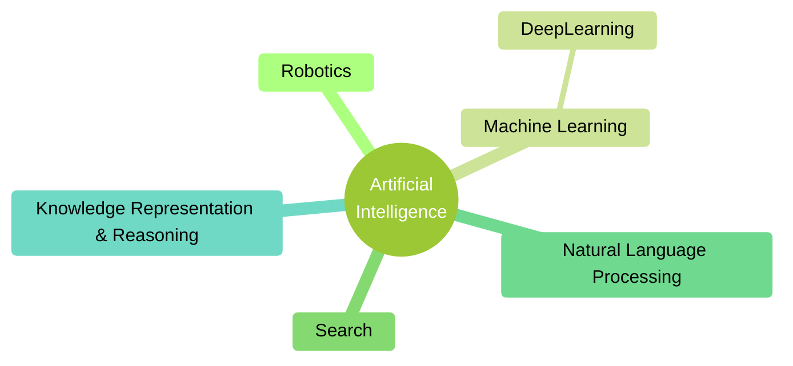

# [Week 1] Introduction to KRR

# Defining Knowledge, Representation, and Reasoning

> OBJECTIVE: Explain basic principles of knowledge representation and reasoning

- Logic is the calculus of computer science - “plays a fundamental role in computer science, similar to that played by calculus in physical sciences and other engineering disciplines”
  - computer architecture (Boolean logic, digital gates, hardware verification)
  - software engineering (specification, verification)
  - programming languages (semantics, type theory, logic programming)
  - databases (relational algebra, database query language)
  - artificial intelligence (automated theorem proving, knowledge representation)
  - algorithms and theory of computation (complexity, computability, expressiveness), etc.
- Build on propositional logic, logic programming, and their applications in computer science
- Basics principles of KRR
  - Knowledge
  - Representation
  - Reasoning
  - Distinction between learning and knowledge

### Definition of “Intelligence”

- Capacity for:
  - Learning
  - Reasoning
  - Understanding
  - Mental activity
- Aptitude in grasping:
  - Truths
  - Relationships
  - Facts
  - Meanings, etc
- Ability to APPLY KNOWLEDGE to manipulate one’s environment or to THINK ABSTRACTLY as measured by objective criteria
- c.f. (confer) not animal intelligence - cognito ergo sum (I think, therefore I am)

### AI & KRR

- AI: study of INTELLIGENT BEHAVIOUR achieved through COMPUTATIONAL MEANS
- Knowledge representation: study of how to reason (compute) with knowledge in order to decide what to do:
  - Think about KNOWLEDGE rather than DATA
- KRR is the heart of the great challenge of AI:
  - Understand the nature of intelligence and cognition so that computers can be made to exhibit human-like abilities
- Before reasoning with knowledge, it must be represented

### Learning vs. Reasoning

- Learning: learn models/knowledge from data
- Reasoning: manipulate models/knowledge to derive new information
- Currently LARGE GAP between models learned by ML and knowledge required by KRR

#### AI without Knowledge?

- Suppose we train an ANN to recognize cats. When it recognizes a previously unseen cat in an image, it can’t explain to us why or how it did this. And if the ANN fails to recognize a spotted cat, it’s hard for us to fix the problem. We’re not going to tell it something like, “change element 341375’s value from 0.3265 to 0.4271, element 1954236’s value from 0.9218 to 0.8612, …
- When AI systems make bad decisions (as they’ve done before, and inevitably will again), we need to be able to understand why they made those decisions and communicate with them to fix the problem.
- Erik Muller, Wired, 11/13/2015

#### Advances in KRR

- Researchers have
  - Explored GENERAL METHODS of KRR, addressing fundamental issues that cut across application domain
  - Developed SPECIALIZED METHODS of KRR to handle core domains (e.g. time, space, causation, action)
  - Tackled IMPORTANT APPLICATIONS of KRR, including query answering, planning, and the semantic web

### What is Knowledge?

- All kinds of fats about the world
- Necessary for intelligent behaviour (humans, robots)
- Rather than trying to answer what is knowledge, consider REPRESENTATIONS OF KNOWLEDGE

### What is Representation?

- Symbols standing for things in the world

### What is Reasoning?

- Reasoning is a form of calculation over symbols standing for propositions rather than numbers
- While propositions are abstract objects, their representations are concrete objects and can be easily manipulated
- Analogy: arithmetic
- Example:
  - If the train arrives late and there are no taxis at the station, then Apple is late for the meeting
    $$H: TrainLate \land \lnot Taxi \rightarrow AppleLate$$
  - Apple is not late for the meeting
    $$\lnot AppleLate$$
  - Train did arrive late
    $$TrainLate$$
  - True or false? There was a taxi at the station
    $$T:Taxi$$
  - How does a machine know $T$?

### Why is KRR useful?

- Describes/understands the behaviour of systems in terms of the knowledge it has
- Generates the behaviour of a system:
- Declarative knowledge can be separated from its possible usages
- Understanding the behaviour of an intelligent system in terms of the represented knowledge makes debugging and understanding much easier
- Modifications and extensions are also much easier to perform

### Why Reasoning?

- Many facts will be there only implicitly
- Guide: use concept of entailment/logical implication
- Can we compute all implicit (all entailed) facts?
  - May be computationally too expensive

## Different Kinds of Reasoning Problems

> OBJECTIVE: Explain several different kinds of reasoning problems studied in KRR

### Role of Formal Logic

- Formal logic is the field of study of entailment relations, formal languages, truth conditions, semantics and inference
- All propositions are represented as formulas which have semantics according to the logic in question
- Formal logic provides framework to discuss different kinds of reasoning:
  - Deductive reasoning
  - Model finding
  - Abductive reasoning
  - Default reasoning
  - Epistemic reasoning

### Deductive Reasoning

- Usually interested in deriving implicit, entailed facts from a given collection of explicitly represented facts that are
  - Logically sound - derived proposition must be true, given that the premises are true
  - Logically complete - all true consequences can be derived
- Sometimes we want logically unsound derivations - e.g. reasoning based on assumptions, reasoning under uncertainty
- Sometimes we want to give up completeness - e.g. for efficiency reasons, computability/complexity
- Example: 3 boxes in order: A, B, C
  - A is green, C is blue, color of B unstated
  - Is there a green block next to a block that is not green?
    - Case 1: B is green - yes, B (green) next to C (blue, not green)
    - Case 2: B is not green - yes, A (green) next to B (not green)

### Model Finding and Satisfiability

- In planning and configuration tasks, often get a set of constraints and a goal specification
  - We then have to find a solution satisfying all the constraints
- Example:
  1. Either round or square
  2. Either red or blue
  3. If read and round, or if blue and square, then wood
  4. If blue then metallic
  5. If square then not metallic
  6. If red then square
- Which object is it?
  - Square/round
  - Metallic/wood
  - Red/blue
- Consider:
  - Round, wood, red - does not satisfy (vi), cannot be square
  - Square, wood, red - satisfies all constraints

### Abductive Reasoning

- Given a background theory, a set of explanations and an observation, find the most likely explanation
  - Earthquake implies alarm
  - Burglar implies alarm
  - {earthquake, burglar} is the set of abducibles
  - Alarm is observed
  - One explanation is earthquake
- There can be many possible explanation
- Not a sound inference

### Default Reasoning

- Jumping to conclusions
- Often we do not have enough information but nevertheless want to reach a conclusion (that is likely to be true)
- In absence of evidence to the contrary, we jump to a conclusion
  - Birds are USUALLY able to fly
  - Tweety is a bird
  - So, you’d expect that tweety is able to flow
- Unsound conclusion
- Might be necessary to withdraw conclusions when evidence to the contrary becomes available

### Epistemic Reasoning

- Reasoning about knowledge
- Example: muddy children puzzle
  1. 10 children playing together outside. After playing the come inside and their parent says to them, “At least one of you has mud on your forehead”
  2. Each child can see mud on others but cannot see his or her own forehead
  3. Parent asks “Do you know if you have mud on your forehead?”
  4. Children respond “No”
  5. Then they ask the same question again, then some children answer that they could tell.
  6. How many children answered?
- Consider:
  - If only 1 child, has mud forehead, this child would have been able to answer “yes” at step (iii) since:
    - This child can see that all other children do not have mud on their foreheads (ii)
    - This child knows at least one child has mud on their forehead (i)
  - If 2 children Apple and Banana have mud on forehead
    - Neither can answer at step (iii) since:
      - Apple can see Banana has mud on their forehead
      - Apple knows one (Banana) OR MORE children has mud on their forehead (i)
      - Apple does not know whether or not they have mud on their forehead
      - (vice versa for Banana)
    - Both children can answer at step (vi) since:
      - Apple can see Banana has mud on their forehead
      - Apple knows one (Banana) OR MORE children has mud on their forehead (i)
      - Apple knows Banana did not answer “yes” at step (iii) - meaning Banana also did not know to answer “yes” because Banana saw a child with mud on their forehead
      - Apple now knows there are at least 2 children with mud on their forehead: Banana, and the child that Banana saw with mud on their forehead
      - Since Apple does not see any children other than Banana with mud on their forehead, Apple knows their own forehead has mud
      - (vice versa for Banana)

### Many KRR Formalisms

- General methods
  - SAT
  - Description logics
  - Constraint programming
  - Conceptual graphs
  - Nonmonotonic logics
  - Answer set programming
  - Belief revision
- Specialized methods: time space causation, action
  - Temporal reasoning
  - Knowledge and belief
  - Action and formalisms
- Applications
  - Query answering
  - Semantic web
  - Planning
  - Cognitive robotics
  - Multiagent systems

# Introduction to Propositional Logic - Part 1

- Semantics and notions in propositional logic
  - Satisfiability
  - Tautology
  - Equivalence
  - Entailments and Reductions

## Propositional Logic: Syntax

> OBJECTIVE: Explain INTUITION behind the propositional logic and SYNTAX of propositional logic

### Propositional Logic and KR

- Propositional logic is the simplest mathematical logic
- Study of declarative sentences, statements about the world which can be given a truth value
- Deals well with sentence components like: not, and, or, if… then…
- Compositional - meaning of $F \land G$ derived from meaning of $F$ and meaning of $G$
- Satisfiability in propositional logic is NP-complete
- Many efficient SAT solvers developed and actively used in many real-world problems

#### Rough Idea of Propositional Logic

- In propositional logic, an atom represents a proposition, which is either true or false
  - Sum of numbers 3 and 5 equals 8
  - Apple reacted defensively to Banana’s accusations
  - Every even number greater than is the sum of two prime numbers (Goldbach’s conjecture)
- Examples where truth value cannot be assigned:
  - Could you please pass the salt
  - Ready, steady, go
  - May the force be with you
- Propositional connectives are used to compose the meaning
  - If number is divisible by 4, it is divisible by 2

#### Reasoning Example 1

- If the train arrives late and there are no taxis at the station, then Apple is late for the meeting
  $$H: TrainLate \land \lnot Taxi \rightarrow AppleLate$$
- Apple is not late for the meeting - $\lnot AppleLate$
- Train did arrive late - $TrainLate$
- True or false? There was a taxi at the station - $T:Taxi$

#### Reasoning Example 2

- If it is raining and Banana does not have an umbrella, then Banana will get wet
  $$H: Rain \land \lnot Umbrella \rightarrow Wet$$
- Banana is not wet - $\lnot Wet$
- It is raining - $Rain$
- True or false? Banana has an umbrella - $T: Umbrella$

#### Comparing the Two Examples

- Same structure:
  | Atom | Example 1 | Example 2 |
  |---|---|---|
  | $p$ | Train is late | It is raining |
  | $q$ | Taxis at the station | Banana has an umbrella |
  | $r$ | Apple late for meeting | Banana gets wet |
- Reasoning
  - If $p$ and not $q$, then $r$
  - Not $r$
  - $p$
  - Therefore, $q$
- It does not matter what $p$, $q$, $r$ stand for

### Alphabet of Propositional Logic

- Propositional SIGNATURE is set of symbols called ATOMS: $TrainLate$, $Taxi$, $AppleLate$, $p$, $q$, $r$
- Propositional CONNECTIVES
  - 2-place (binary): $\land$ (conjunction), $\lor$ (disjunction), $\rightarrow$ (implication)
  - 1-place (unary): $\lnot$ (negation)
  - 0-place: $\bot$ (bottom) and $\top$ (top)
- ALPHABET of propositional logic consists of
  - Atoms from the signature
  - Propositional connectives
  - Parentheses

### Definition of Propositional Formula

- Propositional formula for signature σ is defined recursively as follows:
  - Every atom is a formula
  - Both 0-place connectives ($\bot$ and $\top$ ) are formulas
  - If $F$ is a formula then $\lnot F$ is a formula
  - For any binary connective $\odot$ if $F$ and $G$ are formulas, then $(F \odot G)$ is a formula
  - Example: $((\lnot p \land q) \rightarrow (q \lor \lnot r))$

#### Subformulas

- Subformulas of $\phi$ are the formulas corresponding to the subtrees of the parse tree of $\phi$
- Q: Is formula a subformula of itself? yes
- Q: How many subformulas are there? many

#### Binding Precedence

- Allows us to avoid many parentheses
- In priority order: $\lnot$, $\land$, $\lor$, $\rightarrow$, $\leftrightarrow$

## Propositional Logic: Semantics

> OBJECTIVE: Explain the semantics of propositional logic

### Interpretation

- Propositional signature is a set of symbols called atoms, such as $p$, $q$, $r$
- Symbols $f$ and $t$ are called truth values
- Interpretation of a propositional signature $\sigma$ is a function from $\sigma$ into $\{f,t\}$
- If $\sigma$ is finite, an interpretation can be defined by the truth table
- How many interpretations for $\{p,q,r\}$? $2^3$
  | $p$ | $q$ | $r$ |
  |---|---|---|
  | $f$ | $f$ | $f$ |
  | $f$ | $f$ | $t$ |
  | $f$ | $t$ | $f$ |
  | $f$ | $t$ | $t$ |
  | $t$ | $f$ | $f$ |
  | $t$ | $f$ | $t$ |
  | $t$ | $t$ | $f$ |
  | $t$ | $t$ | $t$ |
- table for unary propositional connective
  | $p$ | $\lnot p$ |
  |---|---|
  | $f$ | $t$ |
  | $t$ | $f$ |
- table for binary propositional connectives
  | $p$ | $q$ | $\land (p, q)$ | $\lor (p, q)$ | $\rightarrow (p, q)$ | $\leftrightarrow (p, q)$ |
  |---|---|---|---|---|---|
  | $f$ | $f$ | $f$ | $f$ | $t$ | $t$ |
  | $f$ | $t$ | $f$ | $t$ | $t$ | $f$ |
  | $t$ | $f$ | $f$ | $t$ | $f$ | $f$ |
  | $t$ | $t$ | $t$ | $t$ | $t$ | $t$ |

### Evaluation of a Formula and Satisfaction

- For any formula $F$ and any interpretation $I$, the truth value $F^I$ that is assigned to $F$ by $I$ is defined recursively, as follows:
  - For any atom $F$, $F^I = I(F)$
  - $\bot^I = f$, $\top^I = t$
  - $(\lnot F^I) = \lnot (F^I)$
  - $(F \odot G)^I = \odot(F^I, G^I)$ for every binary connective $\odot$
- If $F^I = t$ then we say taht the interpretation $I$ SATISFIES $F$ (symbolically $I \vDash F$)
- Consider:
  - $p^I = I(p) = f$
  - $(\lnot p)^I = \lnot(p^I) = \lnot (f) = t$
  - $(p \land r)^I = \land(p^I, r^I) = \land (p \land (q \lor \lnot r))$
  - Truth value of the formula
    - If $I(p) = t$, $I(q) = t$, $I(r) = t$? yes
    - If $I(p) = f$, $I(q) = t$, $I(r) = f$? no

## Notions in Propositional Logic

> OBJECTIVE: Explain the concepts of satisfiability, tautology, equivalence, entailment in propositional logic and explain how they are related to each other

### Satisfiability

- Propositional formula $F$ is satisfiable if some interpretation satisfies $F$
- Which are satisfiable?
  - $(p \rightarrow (q \rightarrow p))$ - satisfiable for $p=f$, $q=f$
  - $(p \rightarrow (q \rightarrow p))$ - satisfiable for $p=f$, $q=t$
  - $(p \rightarrow q) \land (p \rightarrow \lnot q)$ - not satisfiable for any $p$, $q$
- A set of propositional formulas is satisfiable if some interpretation satisfies all formulas in the set
  - $\{p \lor q, \lnot p \lor \lnot q\}$

### Tautology

- Propositional formula $F$ is tautology if every interpretation satisfies $F$
- Which are tautology?
  - $(p \rightarrow q) \rightarrow (\lnot p \lor q)$ - tautology
  - $(p \rightarrow (p \rightarrow q))$ - tautology
  - $(p \rightarrow q) \land (p \land \lnot q)$ - not tautology, not satisfiable for $p=t$, $q=f$

<!-- ---------------------------------- COME BACK TO REVIEW THESE ---------------------------------- -->

### Equivalence

- $F$ is equivalent to $G$ (symbolically $F \leftrightarrow G$) if for every interpretation $I$, $F^I = G^I$
  - $F \leftrightarrow G$ is a tautology
- Which formulas are equivalent to each other?
  - $(p \rightarrow (q \rightarrow p))$ and $(p \lor \lnot p)$
  - $(p \rightarrow (p \rightarrow q))$ and $p$
  - $(p \rightarrow q)$ and $(q \rightarrow p)$
  - $(p \rightarrow q) \rightarrow (p \land \lnot q)$ and $\bot$
- More examples
  - $(p \rightarrow q) \Leftrightarrow (\lnot q \rightarrow \lnot p)$
  - $(p \rightarrow q) \Leftrightarrow (\lnot p \lor q)$
  - $\lnot (p \rightarrow q) \Leftrightarrow (p \land \lnot q)$
  - $(p \land q) \rightarrow r \Leftrightarrow p \rightarrow (q \rightarrow r)$
- Useful equivalence
  - $F \rightarrow G \Leftrightarrow \lnot F \lor G$
  - $F \leftrightarrow G \Leftrightarrow (F \rightarrow G) \land (G \rightarrow F)$
  - $\lnot \lnot F \Leftrightarrow F$
  - $\lnot (F \land G) \Leftrightarrow \lnot F \lor \lnot G$
  - $\lnot (F \lor G) \Leftrightarrow \lnot F \land \lnot G$
  - $(F \lor (G \land H)) \Leftrightarrow (F \lor G) \land (F \lor H)$
  - $(F \land (G \lor H)) \Leftrightarrow (F \land G) \lor (F \land H)$

### Entailment

- A set $\Gamma$ of formulas entails a formula $F$ (symbolically $\Gamma \vDash F$) if every interpretations that satisfies all formulas in $\Gamma$ also satisfies $F$
  - c. f. Entailment uses the same symbol as satisfaction, the difference being what appears on the left of $\vDash$
